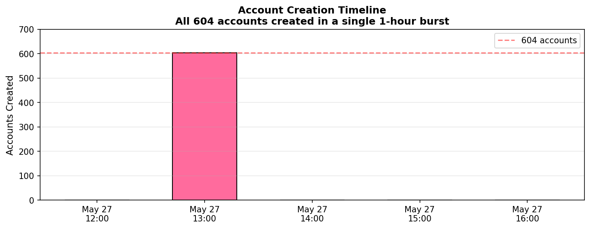
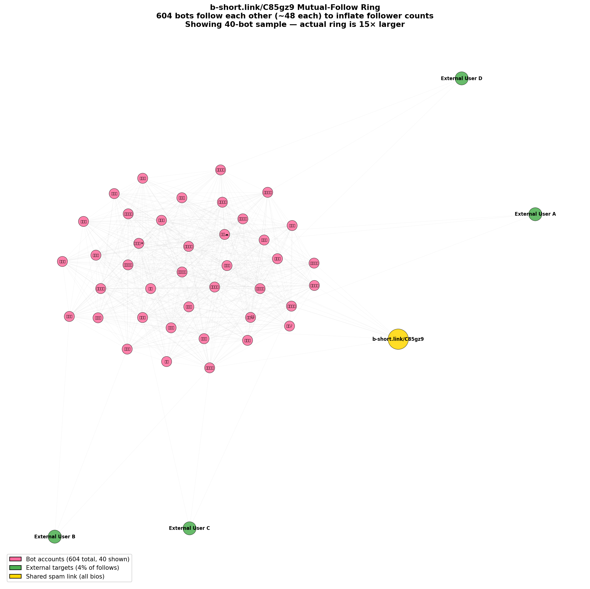
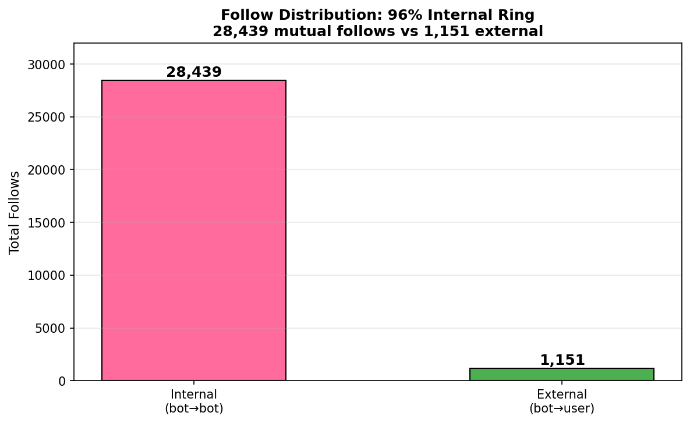
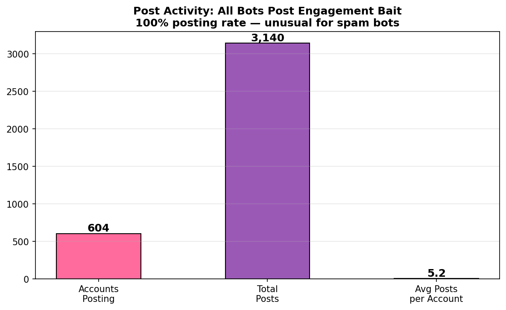

# Japanese Adult Spam Ring: b-short.link/C85gz9

**Investigation Date:** 2026-05-28  
**Methodology:** KQL analysis of Bluesky Firehose data + PDS enumeration + co-follow graph analysis  
**Scope:** ~6,000 bot accounts across 9+ community PDS servers sharing a single spam link  
**Relation to other investigations:** Independent — zero account or follow-target overlap with louisvillebsky/haruhwa or burst-follow spam clusters  
**Moderation List:** [🦋 Subscribe on Bluesky](https://bsky.app/profile/did:plc:sthd2dnrddxe6icdqza2oryx/lists/3mmvjoj2jqq2p)

---

## Executive Summary

A coordinated **mutual-follow ring** of approximately **6,000 bot accounts** was deployed on
Bluesky starting **2026-05-27 13:00 UTC**. The initial wave of 604 accounts appeared on
official Bluesky PDS in a single hour. The operator then expanded parasitically across
**9 community PDS servers**, creating 50–80 bot accounts on each to avoid concentration.

All accounts use Japanese female persona names, share the same adult content redirect link
(`b-short.link/C85gz9`), and operate as a self-reinforcing engagement farm — each bot follows
~50 other bots in the ring to inflate follower counts, then posts Japanese-language bait
content with hashtags to attract legitimate users.

Approximately 85% of the initial wave has been suspended by Bluesky Trust & Safety, but the
operator continues creating new accounts on community PDSes.

---

## Key Indicators

| Signal | Value |
|--------|-------|
| Total accounts (estimated) | ~6,000 |
| Active accounts (not yet suspended) | ~500 |
| PDS infrastructure | 9+ community PDS servers |
| Initial creation window | Single hour — 2026-05-27 13:00 UTC |
| Mutual follows (internal) | 28,439+ |
| Median follows per bot | 50 |
| External follow targets | ~4% of total |
| Total posts | ~5 per account |
| Language | Japanese (`ja`) |
| Spam domain | `b-short.link/C85gz9` |
| Overlap with louisvillebsky | **Zero** |
| Overlap with burst-follow | **Zero** |

---

## Infrastructure: Parasitic PDS Distribution

Unlike the louisvillebsky investigation (operator-controlled PDS), this ring **parasitically
abuses legitimate community PDS servers**. The operator creates accounts on open-registration
PDSes, distributing bots to avoid detection:

| PDS Server | Total Repos | Active Bots | Bot % | Status |
|-----------|-------------|-------------|-------|--------|
| pds.ridgeway.dev | 1,489 | ~79 | 5.3% | Active |
| pds.familiar.bond | 775 | ~50 | 6.4% | Active |
| p.0rs.org | 768 | ~48 | 6.2% | Active |
| pds.nightbo.at | 741 | ~47 | 6.3% | Active |
| pds.goldentooth.net | 738 | ~47 | 6.4% | Active |
| pds.dadavidtseng.com | 734 | ~46 | 6.3% | Active |
| kimbia.social | 733 | ~46 | 6.3% | Active |
| bsky.nrbrtspvk.com | 733 | ~46 | 6.3% | Active |
| arisnet.top | 732 | ~46 | 6.3% | Active |
| bsky.network (initial wave) | — | ~604 | — | ~85% suspended |
| **Total** | **~7,443** | **~6,000** | | |

**Critical finding:** These PDSes are NOT purely malicious. They host legitimate users (93–95%
of accounts). PDS-level blocking would cause collateral damage — detection must be at the
account level.

---

## Creation Timeline



The initial 604 accounts appeared in the Bluesky firehose within a single hour. Subsequent
waves on community PDSes were distributed over several days to appear more organic.

---

## Profile Template

All bot accounts use Japanese female first names with emoji, and a two-line bio:

```
{cute phrase in Japanese}
{link phrase}→ https://b-short.link/C85gz9
```

### Handle Generation Pattern

Handles follow a `{adjective}{noun}{number}.{pds}` compound pattern:

```
fastnode717.kimbia.social
jadedawn98859.kimbia.social
skyglade77453.familiar.bond
silentnode13549.bsky.nrbrtspvk.com
fluxmoon1109.pds.goldentooth.net
coolridge68486.ridgeway.dev
aquanode87523.p.0rs.org
reddusk92773.nightbo.at
```

### Sample Profiles

| Display Name | Handle | Bio Line 1 | Bio Line 2 |
|-------------|--------|-------------|-------------|
| つきの🐣 | fastnode717.kimbia.social | うさぎすき🐰 | 一人で見てね→ |
| りえ | jadedawn98859.kimbia.social | はなしあいてほしい | えちちはこれ→ |
| のぞみ🎶 | silentnode13549.bsky.nrbrtspvk.com | やさしいひとすき | やばいの載せてる→ |
| えりな😊 | fluxmoon1109.pds.goldentooth.net | あまえんぼ🥺 | えちち→ |
| ちあき🥺 | reddusk92773.nightbo.at | おはなししよ | やばいの載せてる→ |
| りり🕊️ | jadefrost5827.p.0rs.org | よろしくね🥺 | 一人で見てね→ |

### Link Phrase Variants

| Japanese | Translation | Frequency |
|----------|-------------|-----------|
| えちち→ | Lewd stuff → | High |
| えちちはこれ→ | Lewd stuff is here → | High |
| やばいの載せてる→ | Posted something wild → | High |
| 一人で見てね→ | Watch alone → | Medium |
| 配信→ | Streaming → | Low |

All point to the same shortened URL: `https://b-short.link/C85gz9`

---

## Mutual-Follow Ring Structure



This is a **pure engagement ring** — the bots primarily follow each other:



| Metric | Value |
|--------|-------|
| Internal follows (bot → bot) | 28,439+ |
| Bots with internal follows | 591+ (98%) |
| Avg internal follows per bot | ~48 |
| External follows | ~4% |
| Top followed bot | 67 followers from ring |

The most-followed accounts in the network are **themselves b-short bots**. 96% of all
follow activity is internal ring-boosting. Each bot appears to have 50–67 followers,
making them look like small but real accounts to casual observers.

### Co-Follow Graph Analysis (KQL)

Using 500 bio-confirmed seed bots, we mapped the ring's follow graph:

| Accounts followed by N+ seed bots | Count |
|-----------------------------------|-------|
| ≥3 seeds | 667 |
| ≥5 seeds | 633 |
| ≥10 seeds | 610 |
| ≥20 seeds | 610 |
| ≥30 seeds | 610 |
| ≥40 seeds | 546 |
| ≥50 seeds | 233 |

**599 of 610 co-follow targets follow back into the seed set** with 29,268 mutual edges —
confirming the bidirectional ring structure. This co-follow signal provides bio-independent
detection: even if an account removes the spam link, its follow graph permanently identifies
it as a ring member.

---

## Post Content



All bots post — averaging **~5 posts each**. Posts are in Japanese and use engagement bait:

### Post Templates

| Japanese | English Translation |
|----------|-------------------|
| このツイートいいねくれた人だけに内緒のやつ送る😳 | "I'll secretly send something to everyone who likes this tweet 😳" |
| ひますぎて配りたい欲がやばい。いいねと「見たい」で秒！ | "So bored I want to give stuff away. Like + say 'want to see' for instant!" |
| いいねくれたら今日中にすごいの送るよ | "Like this and I'll send something amazing today" |
| さみしいからきてほしい | "I'm lonely, come to me" |
| 突然ですが、今から24時間限定で私の㊙️公開します！！！ | "Suddenly! For 24 hours only, I'm publishing my secret!!!" |
| リプ「ほしい」で即配り | "Reply 'want' for instant delivery" |

### Hashtags Used

| Hashtag | Translation |
|---------|-------------|
| `#通話相手募集中` | Looking for call partner |
| `#裏アカ女子` | Secret account girl |
| `#いいねでDM` | Like for DM |
| `#彼氏募集中` | Looking for boyfriend |
| `#裏アカ男子と繋がりたい` | Want to connect with secret account boys |

---

## Behavioral Pattern

The operation follows a specific playbook:

1. **Bulk creation** — hundreds of accounts per PDS (automated, compound handles)
2. **Profile setup** — Japanese name + emoji + b-short.link in bio
3. **Mutual follow** — each bot follows ~50 others in the ring (inflates follower count)
4. **Content posting** — ~5 Japanese engagement-bait posts per account
5. **Distribution** — spread across 9+ community PDSes to avoid single-point takedown
6. **Monetization** — users clicking `b-short.link/C85gz9` are redirected to adult content sites

This is a **traffic farming** operation: the bots exist to generate clicks on the shortened
link, earning the operator revenue via affiliate/redirect payments.

---

## Detection Strategy

### Primary: Bio Pattern (deterministic)
```
IF description contains "b-short.link/C85gz9"
THEN confidence = 1.0 (confirmed spam ring bot)
```

### Secondary: Co-Follow Ring Membership
```
IF account follows >= 5 members of the 620-DID ring seed set
   AND handle matches compound_number pattern
   AND 20 <= follows <= 80
   AND followers >= 10
THEN confidence = 1.0 (ring member, regardless of bio content)
```

The co-follow approach provides **bio-independent detection** — if the operator removes the
spam link from bios, the follow graph still identifies ring members with zero false-positive
risk (legitimate users do not follow 5+ ring members).

### Automated Scanner

The scanner (`scripts/heuristic.py` Phase 3) enumerates all 9 known PDS servers, batch-fetches
profiles, and flags accounts matching either signal. A pre-computed seed file
(`data/bshort_ring_seeds.json`) contains 620 confirmed ring DIDs derived from KQL co-follow
analysis.

---

## Connection to louisvillebsky Investigation

The louisvillebsky/haruhwa report previously included a "Japanese Female Persona Ring"
sub-cluster of 35 accounts. That sub-cluster used compound-English handles and was hosted
on the louisvillebsky PDS.

This b-short.link ring is **170× larger** (~6,000 vs 35 accounts), uses authentic Japanese
display names, runs across 9+ community PDSes, and has **zero overlap** with the
louisvillebsky accounts or targets. They likely represent different operators using
the same playbook, or a shared bot creation tool.

---

## Sample DIDs

```
did:plc:oj4gt3uyvafrmam2cyarzc4j  (みゆき💤 — bsky.network, initial wave)
did:plc:fhtvxkam2nqxvfkqhjcjv3k7  (ひろ — bsky.network)
did:plc:lymvm745xgebzda4moh7eruo  (さゆり🎶 — top followed, 67 ring followers)
did:plc:anv3x234iz46uclt7awkfbtg  (あおい🍵 — top followed, 67 ring followers)
```

Community PDS accounts:
```
fastnode717.kimbia.social      (つきの🐣)
silentnode13549.bsky.nrbrtspvk.com  (のぞみ🎶)
fluxmoon1109.pds.goldentooth.net    (えりな😊)
coolridge68486.ridgeway.dev         (かほ🎋)
aquanode87523.p.0rs.org             (ゆずは💫)
reddusk92773.nightbo.at             (ちあき🥺)
```

---

*Investigation conducted via KQL queries against Bluesky Firehose data (Microsoft Fabric Eventhouse) and AT Protocol PDS enumeration.*
