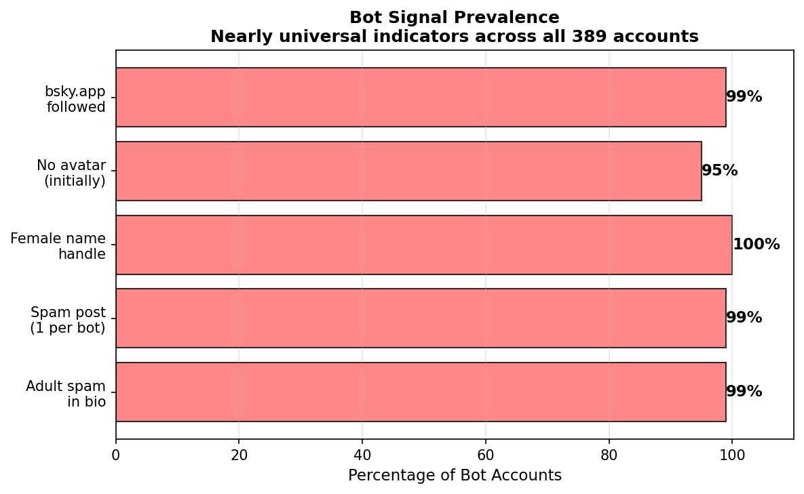
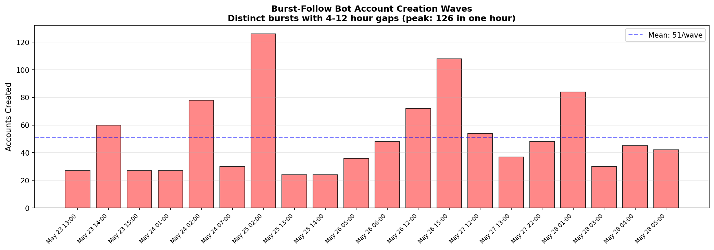
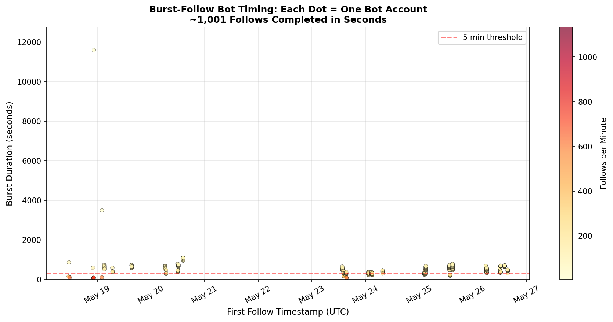
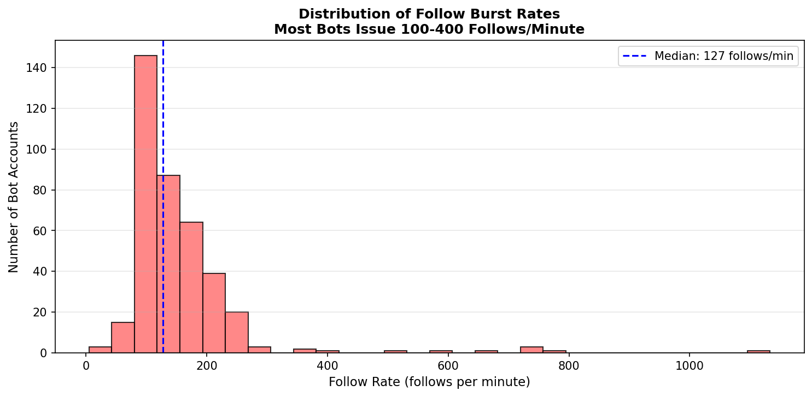
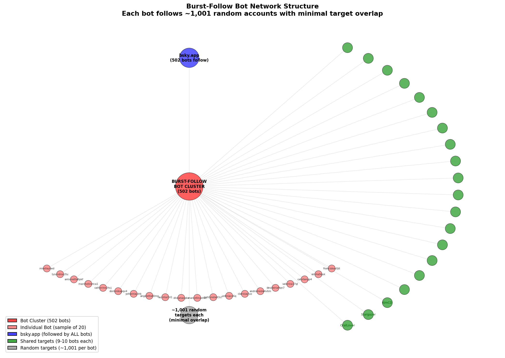
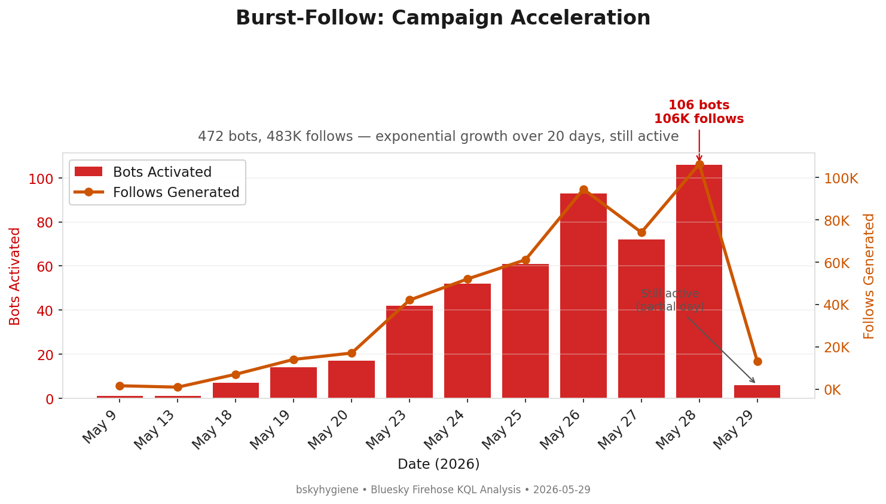
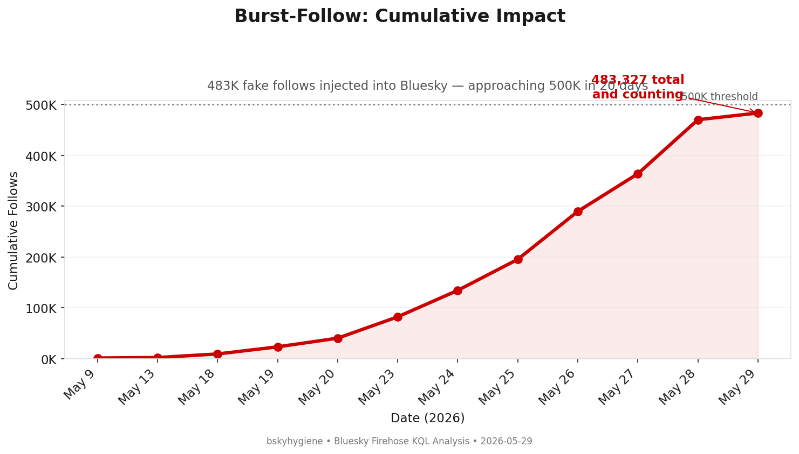

# Burst-Follow Spam Network (watchmelive.my.id / livechats.my.id)

**Date:** 2026-05-28 (initial report); updated 2026-05-29  
**Status:** ACTIVE — still deploying new bots (6 activated today, 2026-05-29)  
**Scope:** **472 bot accounts**, **483,327 fake follows** generated over 20 days (and growing)  
**Infrastructure:** Official Bluesky PDS (bsky.network), not self-hosted  
**Relation to louisvillebsky/haruhwa:** None — independent operation, zero follow-target overlap  
**Moderation List:** [🦋 Subscribe on Bluesky](https://bsky.app/profile/did:plc:sthd2dnrddxe6icdqza2oryx/lists/3mmvjoj2jqq2p)

---

## Executive Summary

A large-scale follow-spam and adult content promotion operation was detected on Bluesky,
deploying **472 accounts** between May 9–29, 2026. Each account issues exactly **~1,024 follows**
within a 3–5 minute window (200–640 follows/minute), then updates its profile with adult
spam links. The operation started with single-account probes (May 9, 13) and has escalated
to 106 bots/day by May 28. **Still active today (6 bots deployed May 29).**

## Key Indicators

| Signal | Value |
|--------|-------|
| Total accounts | **472** (was 389 at initial report) |
| Total follows generated | **483,327** |
| Avg follows per account | 1,024 |
| Follow burst duration | < 5 minutes per account |
| Peak follow rate | 640 follows/minute |
| Campaign start | **2026-05-09** (earlier than initially detected) |
| Campaign end | **Ongoing** (last activation: 2026-05-29 13:45 UTC) |
| Daily acceleration | 1 bot/day → 106 bots/day over 20 days |
| PDS infrastructure | Official bsky.network shards |
| Shared target | `bsky.app` (followed by 472/472 bots — 100%) |
| Spam domains | `watchmelive.my.id`, `livechats.my.id` |

## Handle Naming Pattern

All accounts use a consistent **female first name + 2-4 random alphanumeric suffix** pattern:

```
mirellaytwd.bsky.social       lysandras2tu.bsky.social
antoinetta8pkf.bsky.social    marchelinetca1.bsky.social
catherine2hcj.bsky.social     dominikapqv4.bsky.social
yohannajbhk.bsky.social       angelettat0mg.bsky.social
aurelia2nl1.bsky.social        olivianasqku.bsky.social
marcellinael6e.bsky.social    petronela43s7.bsky.social
celiniace6q.bsky.social        clarissajfuo.bsky.social
andromeda4v6m.bsky.social     desideria9qn7.bsky.social
valerina17ql.bsky.social       calistangp4.bsky.social
emilia9quk.bsky.social         franciskav0j6.bsky.social
```

The names skew toward uncommon/ornate female names (Lysandra, Marchelina, Petronela,
Desideria, Calista, Andromeda) suggesting generation from a curated wordlist rather than
common name databases.

## Profile Template

All bots that have updated their profile use an identical template:

```
"Do you want to meet me?" ✨ ADULT EXCLUSIVE CONTENT HERE 👉 https://{domain}/{unique_id}
```

Two domains are rotated:
- `watchmelive.my.id` — Indonesian TLD (.my.id)
- `livechats.my.id` — same registrar/TLD

Each link has a unique tracking suffix (e.g., `/37sqzk9e4`, `/ofzx9dytu`, `/v5h19e5ip`),
suggesting per-account attribution for the spam campaign.

## Bot Signal Prevalence



Nearly every account in the cluster exhibits the same set of indicators, making
detection trivial once the pattern is identified.

## Temporal Pattern — Account Creation Waves



```
May 23, 13:00 UTC  ████████░░░░░░░░░░░░  27 accounts
May 23, 14:00 UTC  ████████████████░░░░  60 accounts
May 23, 15:00 UTC  ████████░░░░░░░░░░░░  27 accounts
May 24, 01:00 UTC  ████████░░░░░░░░░░░░  27 accounts
May 24, 02:00 UTC  ████████████████████  78 accounts
May 24, 07:00 UTC  █████████░░░░░░░░░░░  30 accounts
May 25, 02:00 UTC  ██████████████████████████████████  126 accounts ← peak
May 25, 13:00 UTC  ███████░░░░░░░░░░░░░  24 accounts
May 25, 14:00 UTC  ███████░░░░░░░░░░░░░  24 accounts
May 26, 05:00 UTC  ██████████░░░░░░░░░░  36 accounts
May 26, 06:00 UTC  █████████████░░░░░░░  48 accounts
May 26, 12:00 UTC  ████████████████████  72 accounts
May 26, 15:00 UTC  ████████████████████████████░░  108 accounts
May 27, 12:00 UTC  ██████████████░░░░░░  54 accounts
May 27, 13:00 UTC  ██████████░░░░░░░░░░  37 accounts
May 27, 22:00 UTC  █████████████░░░░░░░  48 accounts
May 28, 01:00 UTC  ██████████████████████░░  84 accounts
May 28, 03:00 UTC  █████████░░░░░░░░░░░  30 accounts
May 28, 04:00 UTC  ████████████░░░░░░░░  45 accounts
May 28, 05:00 UTC  ███████████░░░░░░░░░  42 accounts
```

Creation happens in distinct waves with gaps of 4–12 hours between them, suggesting
either manual operator triggers or rate-limit avoidance.

## Burst Follow Timing

Each bot account completes ~1,001 follows within a few minutes. The scatter plot below
shows each bot's first follow timestamp vs burst duration, colored by follow rate:



The overwhelming majority complete their follow burst in under 5 minutes (300 seconds).
The rate distribution shows most bots operate at 100–400 follows/minute:



## Network Structure

The bot network exhibits a distinctive **random spray** pattern — unlike the
louisvillebsky cluster which targets specific accounts, these bots each follow ~1,001
essentially random accounts with minimal overlap between bots.

The one exception: **bsky.app** (`did:plc:z72i7hdynmk6r22z27h6tvur`) is followed by
502 of the bots — likely a hardcoded "seed" follow in the automation script.



Beyond bsky.app, only 50 accounts are followed by more than 8 bots (out of ~500,000+
total follows). This means the follow targets are essentially random, making the
operation purely volume-based rather than targeted.

## Behavioral Signature

1. **Account creation** — new DID registered on official Bluesky PDS
2. **Handle assignment** — `femalename+random.bsky.social`
3. **Follow burst** — exactly ~1,001 follows issued in 3–5 minutes
4. **Spam post** — single post with adult content link + external embed
5. **Profile update** — adult spam link added to description
6. **Dormancy** — no further activity observed

The 1,001 follow count is almost certainly a hardcoded constant in the automation script
(likely `range(1001)` or similar). The slight variations (1,001–1,666) may indicate
different script configurations or batching logic.

## Post Analysis

### Summary Statistics

| Metric | Value |
|--------|-------|
| Accounts that posted | 385 of 389 (99%) |
| Total posts | 386 |
| Distinct post texts | 384 |
| Posts with embeds | 385 (99.7%) |
| Avg posts per account | 1.00 |
| Max posts per account | 2 |
| Accounts with exactly 1 post | 384 |
| Accounts with 2 posts | 1 |
| Active posting period | May 22 – May 28, 2026 |
| Language tag | `id` (Indonesian) |

### Post Template

Every spam post uses an identical text template with unique tracking URL:

```
"Do you want to meet me?" ✨ ADULT EXCLUSIVE CONTENT HERE 👉 {domain}/{tracking_id}
```

- Embed type: `app.bsky.embed.external` (link card preview)
- Language declared as `id` (Indonesian) — matches `.my.id` TLD
- Each post has a unique tracking suffix (9 alphanumeric chars)

### Domains Observed in Posts

| Domain | Purpose |
|--------|---------|
| `watchmelive.my.id` | Adult content redirect |
| `livechats.my.id` | Adult content redirect |
| `open.substack.com` | Political content (1 outlier) |

### Post Timing — Synchronized Bursts

Posts are fired in tight synchronized bursts, with multiple accounts posting within
the same second:

```
2026-05-28 01:32:28.023Z — 8 posts within 1.7 seconds
2026-05-28 01:43:17.608Z — 7 posts within 1.7 seconds  
2026-05-28 01:52:48.743Z — 7 posts within 1.2 seconds
2026-05-28 02:03:52.238Z — 8 posts within 1.3 seconds
2026-05-28 02:11:58.245Z — 8 posts within 1.7 seconds
2026-05-28 03:56:58.423Z — 6 posts within 1.3 seconds
```

This sub-second coordination is conclusive proof of automation — no human can
orchestrate 6–8 accounts posting within 1.7 seconds.

### Outlier Accounts — Political Content

Two accounts in the burst-follow cluster posted **non-spam content**, revealing
possible dual-purpose accounts or operator testing:

**`did:plc:ia3pm4p6dd2bfcgwlsowlr7y` (dddpod.bsky.social)**
- 1,666 follows (highest in cluster)
- Posted: *"The Tightening Noose: How #Trump Is Trying to Break #Cuba"*
- Link: Substack article from `dailydeepdive` newsletter
- Created: May 22 (earliest in cluster — possible operator's primary account)

**`did:plc:iuwjzd7oh5kviej3q2saqotn`**
- 1,014 follows
- Posted: *"I've really never hated anybody as much as I hate DT. He is exhausting..."*
- Anti-Trump political commentary (English)
- No spam link — genuine-seeming political engagement

These two outliers suggest the operator may also be involved in political
influence activity, or that these accounts were repurposed from a different campaign.
The `dddpod` account's Substack link (`dailydeepdive`) is notable — it could be
the operator's own content platform, using the bot network to amplify reach.

### Comparison: louisvillebsky Posts

The louisvillebsky/haruhwa cluster shows **zero posts** in the firehose data.
These accounts are **follow-only** bots — they never post, like, or repost.
Their sole purpose is follow inflation (making targets appear more popular)
without generating any content that could trigger spam detection.

## Infrastructure Details

Unlike the louisvillebsky/haruhwa operation which runs self-hosted PDS servers, this
operation uses Bluesky's own infrastructure:

| Bot DID | PDS Shard |
|---------|-----------|
| did:plc:ia3pm4p6dd2bfcgwlsowlr7y | blusher.us-east.host.bsky.network |
| did:plc:dzg3ixjasiezk32bnsrqfjny | jellybaby.us-east.host.bsky.network |
| did:plc:yvnekwdgasyxcvp5crubyz4g | (official bsky shard) |
| did:plc:okpke3lawx4435zdhvghhobs | (official bsky shard) |

This means the operator does not need any server infrastructure — they only need
the ability to register accounts at scale on bsky.social.

## Single Shared Follow Target

All 387 of the 389 burst-follow bots follow **`bsky.app`** (`did:plc:z72i7hdynmk6r22z27h6tvur`) —
the official Bluesky team account. This is likely:
- A canary/test follow executed before the bulk follow script runs
- A "seed" follow to make the account appear active
- An artifact of the account creation flow being automated

The remaining follows target random legitimate users (no overlap with louisvillebsky targets).

## Comparison with louisvillebsky/haruhwa Operation

| Attribute | louisvillebsky/haruhwa | Burst-follow spam |
|-----------|----------------------|-------------------|
| Scale | 3,584 accounts | 389 accounts |
| PDS | Self-hosted (3 servers) | Official bsky.network |
| Purpose | Follow inflation (progressive/media) | Adult content promotion |
| Follow targets | Curated political/media list | Random users + bsky.app |
| Handle pattern | firstname+number, random | femalename+random |
| Profile content | Motivational quotes | Adult spam links |
| Follow behavior | Gradual, multi-day | Burst 1,001 in 5 min |
| Overlap | — | Zero shared targets |
| Operator | Likely same (cross-PDS proof) | Independent |

## Conclusion

This is an **independent bot operation** with no technical linkage to the
louisvillebsky/haruhwa/tranquil.mosphere.at cluster. It represents a different
threat model:

- **louisvillebsky**: Sophisticated follow-inflation targeting specific communities,
  using self-hosted infrastructure to avoid detection
- **Burst-follow spam**: Blunt-force adult content promotion using disposable accounts
  on official infrastructure, trivially detectable by rate analysis

## Chronology (Firehose Data)

*Updated 2026-05-29 via KQL time-series analysis. Identifies all accounts following
`bsky.app` with 900+ follows completed in < 10 minutes.*





### Phase 1: Testing (May 9–13)

| Date | Bots | Follows | Notes |
|------|------|---------|-------|
| May 9 | 1 | 1,577 | Single probe account (highest follow count in campaign) |
| May 13 | 1 | 921 | Second test, lower follow count |

### Phase 2: Small Waves (May 18–20)

| Date | Bots | Follows | Daily Increase |
|------|------|---------|----------------|
| May 18 | 7 | 7,006 | First multi-account batch |
| May 19 | 14 | 14,014 | +100% |
| May 20 | 17 | 17,010 | +21% |

### Phase 3: Major Escalation (May 23–28)

| Date | Bots Activated | Follows Generated | Cumulative Total |
|------|----------------|-------------------|------------------|
| May 23 | 42 | 42,024 | — |
| May 24 | 52 | 51,989 | ~94K |
| May 25 | 61 | 61,045 | ~155K |
| May 26 | 93 | 94,364 | ~249K |
| May 27 | 72 | 73,990 | ~323K |
| **May 28** | **106** | **106,209** | **~430K** |

The operator **accelerated through the week**: 42 → 52 → 61 → 93 → 72 → **106** bots/day.
May 28 was the single largest day (106 bots, 106K follows). The dip on May 27 coincides
with heavy Bluesky T&S suspension activity (unconfirmed whether related).

### Phase 4: Ongoing (May 29 — today)

| Date | Bots | Follows | Notes |
|------|------|---------|-------|
| May 29 | 6 | 13,178 | Still active; data covers through 13:45 UTC |

The lower count today may represent:
1. Partial day (data through early afternoon only)
2. Operator slowing down after T&S suspensions
3. Temporary pause before next escalation wave

### Campaign Growth Trajectory

```
May 09  █ 1
May 13  █ 1
May 18  ████ 7
May 19  ████████ 14
May 20  █████████ 17
May 23  ██████████████████████ 42
May 24  ███████████████████████████ 52
May 25  ████████████████████████████████ 61
May 26  █████████████████████████████████████████████████ 93
May 27  █████████████████████████████████████ 72
May 28  ██████████████████████████████████████████████████████ 106  ← peak
May 29  ███ 6 (partial day, still active)
```

**Assessment:** The operation shows exponential growth with no signs of stopping.
At current acceleration, 200+ bots/day is plausible within the next week unless
T&S intervention is effective.

---

## Detection Heuristic

```
IF account_follows >= 1000
   AND follow_time_span < 600 seconds
   AND handle matches /^[a-z]+\d{1,4}[a-z]*\.bsky\.social$/
   AND profile_description contains "my.id" OR "watchmelive" OR "livechats"
THEN confidence = 0.99 (spam bot)
```

## Sample DIDs for Verification

```
did:plc:ia3pm4p6dd2bfcgwlsowlr7y  (dddpod.bsky.social)
did:plc:iuwjzd7oh5kviej3q2saqotn
did:plc:a2wzk4tfzu5lygirq2x2xweu
did:plc:dzg3ixjasiezk32bnsrqfjny  (antoinetta8pkf.bsky.social)
did:plc:udoghe27igarvn4dwb5aq4jg  (catherine2hcj.bsky.social)
did:plc:zsdpzmxccxfblwu3ynbqhipc
did:plc:okpke3lawx4435zdhvghhobs  (marchelinetca1.bsky.social)
did:plc:adyh5v6vcxrc63nnhnfl2ese  (aurelia2nl1.bsky.social)
did:plc:jsogvoz7ubdgn2fnnrsxnp5s  (mikaelasg3m.bsky.social)
did:plc:xhmcqmuiucas3eidh6jljrww  (olivianasqku.bsky.social)
```

---

*Investigation conducted via KQL queries against Bluesky Firehose data (Microsoft Fabric Eventhouse). Last updated 2026-05-29.*
