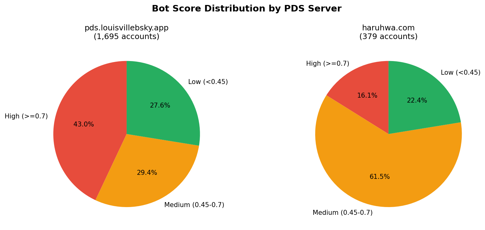
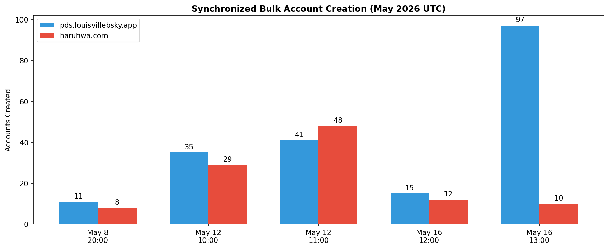
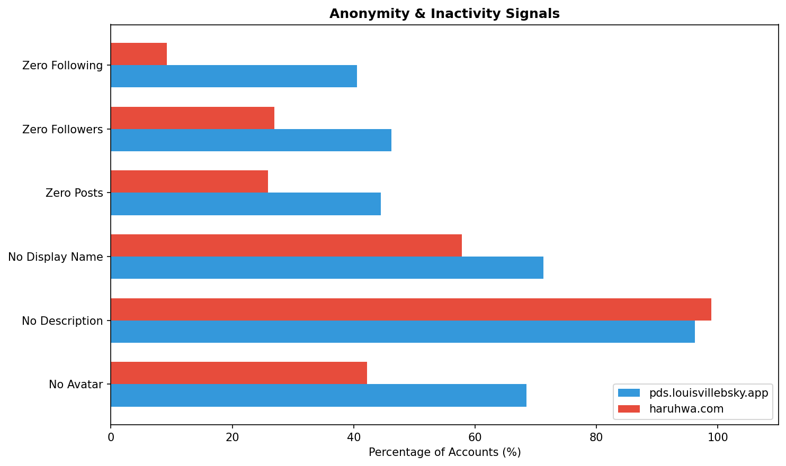
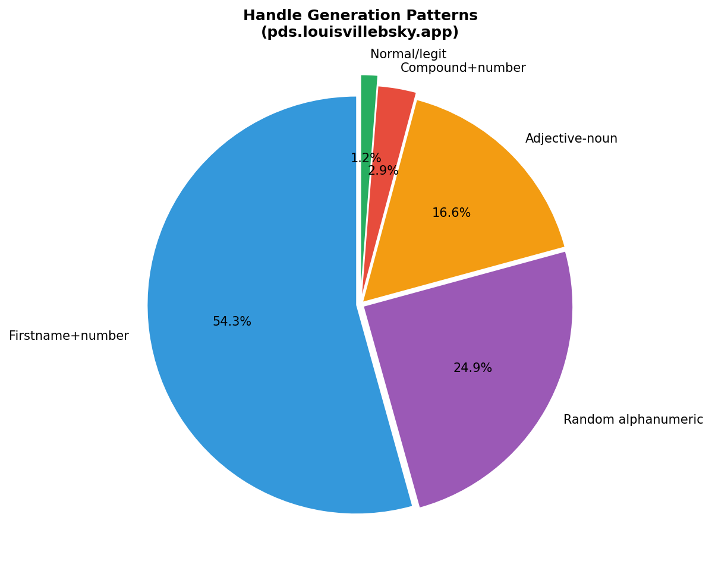
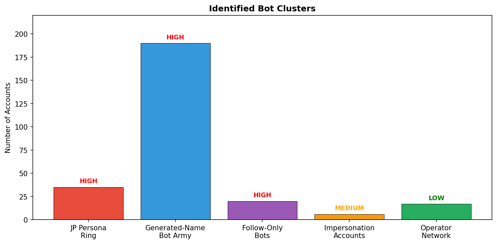

# 🔍 Bluesky Bot Hunt: pds.louisvillebsky.app & haruhwa.com

**Investigation Date:** 2026-05-28  
**Methodology:** KQL analysis of Bluesky Firehose data (profiles, follows, posts, blocks)  
**Scope:** All accounts hosted on or referencing these two self-hosted PDS servers

---

## Executive Summary

Both `pds.louisvillebsky.app` and `haruhwa.com` are **self-hosted Bluesky PDS (Personal Data Server) instances** operated by the **same entity**, running a multi-purpose bot infrastructure with **3,584 combined accounts**. The operation appears to be in an active **testing/scaling phase** with bulk account creation, follow inflation bots, engagement rings, and impersonation testing.

---

## 1. Infrastructure Overview

| Metric | pds.louisvillebsky.app | haruhwa.com |
|--------|----------------------|-------------|
| **Total DIDs on PDS** | 2,882 | 702 |
| **Resolved via API** | 1,695 | 379 |
| **Active accounts** | 2,881 | 701 |
| **Server DID** | `did:web:pds.louisvillebsky.app` | `did:web:haruhwa.com` |
| **Available domain handles** | `.pds.louisvillebsky.app` | `.haruhwa.com` |
| **Invite required** | No | No |

---

## 2. Proof of Same Operator

**Irrefutable evidence** that both PDS servers are controlled by the same entity:

1. **Shared test accounts**: Handle `rvtest31672` exists on **both** servers
2. **Shared prefix**: `chktest*` automation test handles on both
3. **Simultaneous creation**: `SyncTest` (Louisville) created at 20:55:56 and `HaruhwaTest796901` (Haruhwa) created at 20:55:10 on 2026-05-07 — **46 seconds apart**
4. **13 synchronized creation hours** where both PDS had simultaneous bulk registrations
5. **12 shared display names** including "Om jameel", "Mohemad A. Ei-Eiran", "Anderw Lokenuath_Assistant"
6. **Identical handle generation templates** (`adjective-noun`, `word+number`, `xx####`)
7. **Same misspelled impersonation**: "Robret Reich_Assistant" on both

---

## 3. Bot Score Distribution

| Score Band | Louisville | Haruhwa |
|-----------|-----------|---------|
| **High (≥0.7)** — strong bot indicator | 729 (43.0%) | 61 (16.1%) |
| **Medium (0.45–0.7)** — suspect | 499 (29.4%) | 233 (61.5%) |
| **Low (<0.45)** — possibly legitimate | 467 (27.6%) | 85 (22.4%) |
| **Mean score** | 0.552 | 0.518 |

---

## 4. Bulk Creation Patterns

**Simultaneous bursts on both PDS:**

| Hour (UTC) | Louisville | Haruhwa | Total |
|-----------|-----------|---------|-------|
| 2026-05-12 11:00 | 41 | 48 | **89** |
| 2026-05-12 10:00 | 35 | 29 | **64** |
| 2026-05-16 13:00 | 97 | 10 | **107** |
| 2026-05-16 12:00 | 15 | 12 | 27 |
| 2026-05-08 20:00 | 11 | 8 | 19 |

- **Louisville peak**: 97 accounts in 1 hour with **median 19.9 seconds** between creations
- **Haruhwa peak**: 48 accounts in 1 hour with **median 39.2 seconds** between creations

---

## 5. Anonymity & Activity Signals

| Signal | Louisville | Haruhwa |
|--------|-----------|---------|
| No avatar | 68.5% | 42.2% |
| No description | **96.2%** | **98.9%** |
| No display name | 71.3% | 57.8% |
| Zero posts | 44.5% | 25.9% |
| Zero followers | 46.2% | 26.9% |
| Zero following | 40.5% | 9.2% |

---

## 6. Follow Cadence (Automation Proof)

- **Haruhwa bot** (`did:plc:pbpc6hcrqdeylrnphefhtsru`): **Median 2 seconds** between follows, P90 at 13s — unambiguously scripted
- **Louisville account** (`did:plc:3d6mnezh6exzs2smjv2tf2b7`): Median 51s within sessions, following 54 external targets
- **Haruhwa top 20 follow-only accounts**: 159–397 follows with ZERO posts

---

## 7. Handle Generation Patterns

| Pattern | Count | Examples |
|---------|-------|----------|
| Firstname+number | 654 | `laurareyes474`, `patriciareed406`, `aaronjones125` |
| Random alphanumeric | 300 | `n7uba880g`, `nxo8oqkccp`, `2m1g73200d`, `zwmu0pgig` |
| Adjective-noun | ~200 | `soft-deer`, `strong-core`, `true-lynx`, `calm-stack` |
| Compound-word+number | 35 | `mightybeam16344`, `happybeam4753`, `fluxwave2301` |
| Normal/legitimate | ~15 | `pocketbear`, `pb-afterdark`, `pupderp` |

---

## 8. Identified Clusters

### Cluster A: Japanese Female Persona Ring 🔴 HIGH THREAT
- **35 accounts** created on 2026-05-27 within seconds of each other
- All have exactly **60 follows**, 55–71 followers, 4–7 posts
- Handles: `mightybeam16344`, `happybeam4753`, `peachstar5301`, `rosesage4865`, etc.
- Display names: あすか🎀, ひめ, はな🐣, ゆきは🫧, えみな🌸, etc.
- **Assessment**: Coordinated mutual-follow ring, likely adult content engagement farming

### Cluster B: Generated-Name Bot Army 🔴 HIGH THREAT
- **190 accounts** (141 Louisville + 49 Haruhwa)
- Display names follow `FirstName + Letter/Number` template: "Ted A", "Iris P", "Cedar19", "Lyra91", "Vic62", "Juno9"
- Typically 0–1 posts, 3–9 follows
- **Assessment**: Botnet in early deployment phase, accounts being warmed up

### Cluster C: Follow-Only Haruhwa Bots 🔴 HIGH THREAT
- **20 accounts** with 100–400 follows but ZERO posts
- Random consonant-cluster handles: `kamsjz`, `amxnjdb`, `akbxbbc`, `mznxbcv`, `rtyunbm`, `jklkoka`
- **Targets**: Progressive/LGBTQ+ creators (FabForward 17K, SJones 7.6K, Haylie 6.9K, Meaf 4.3K, Raven Paine 3.4K)
- **Assessment**: Follow inflation bots, potentially TARN-style camouflage

### Cluster D: Impersonation Accounts 🟡 MEDIUM THREAT
- **6 accounts** using misspelled names "**Robret Reich_Assistant**" and "**Anderw Lokenuath_Assistant**"
- All created May 2026
- 2–6 posts each
- **Assessment**: Likely testing impersonation/engagement tactics

### Cluster E: Operator's Personal Network 🟢 LOW THREAT
- **17 accounts** with "jameel", "joud", "jamil" references
- Some have substantial activity (367–419 posts)
- Names: "Om jameel", "Eng abo jameel", "mahmood"
- **Assessment**: PDS operator's personal/family accounts

---

## 9. Key DIDs for Monitoring

### Haruhwa High-Volume Follow Bots (ZERO posts, 100+ follows)

| DID | Handle | Follows |
|-----|--------|---------|
| `did:plc:jg7vonhdg37iujah5hdmrebb` | kamsjz.haruhwa.com | 397 |
| `did:plc:ijugfjbyjeomu6tcsynh757d` | amxnjdb.haruhwa.com | 373 |
| `did:plc:suvv44lxx4442u2azvdhd74a` | jood2.haruhwa.com | 329 |
| `did:plc:ixxtgxx4equfeckkm7arrvpc` | akbxbbc.haruhwa.com | 281 |
| `did:plc:ekufkaqd3bhjb4tgjbeasqnm` | mznxbcv.haruhwa.com | 262 |

### Louisville Impersonation Accounts
- Multiple DIDs using "Robret Reich_Assistant" (×4) and "Anderw Lokenuath_Assistant" (×2)

---

## 10. Conclusion

This is a **coordinated bot infrastructure** operated from a single entity running two self-hosted Bluesky PDS servers:

| Finding | Evidence |
|---------|----------|
| **Industrial scale** | 3,584 accounts across both servers |
| **Automated creation** | Bulk registration at 20–40 second intervals |
| **Multiple purposes** | Follow inflation, engagement rings, impersonation testing |
| **Camouflage layer** | Generated names and minimal activity to appear legitimate |
| **Active deployment** | Major creation bursts in May 2026 (ongoing) |
| **Target profile** | Progressive/LGBTQ+ content creators receiving artificial follows |

The **"Jameel/Joud" family connection** and **Louisville, KY** geography in the PDS naming suggest a specific individual operator who has built this infrastructure on self-hosted PDS servers to bypass Bluesky's native rate limits and moderation.

---

*Generated by Bluesky Bot Hunter agent — querying Bluesky Firehose data via Microsoft Fabric Eventhouse*

