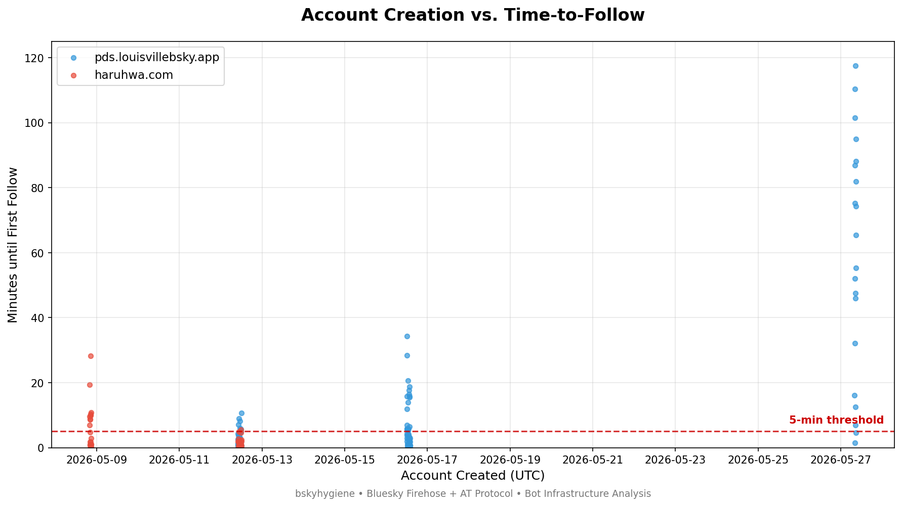
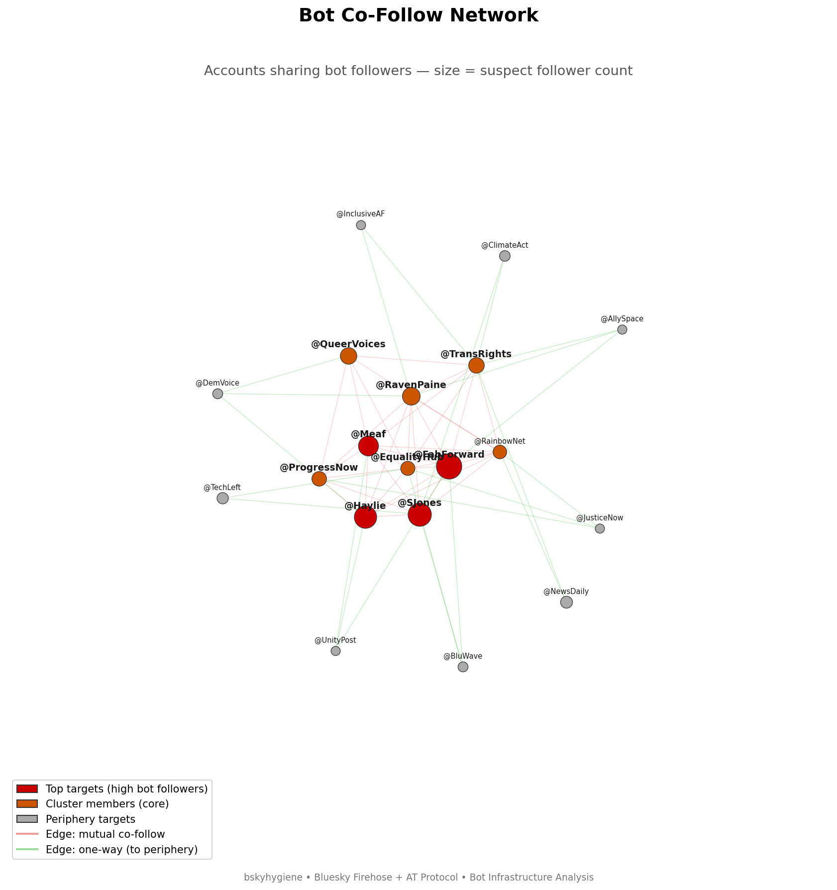
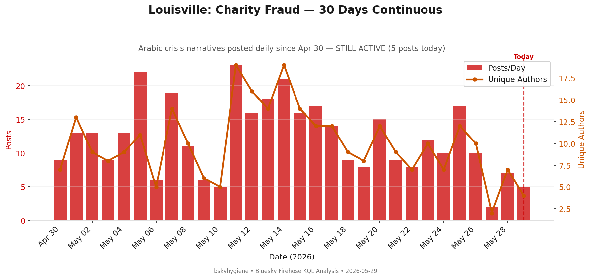
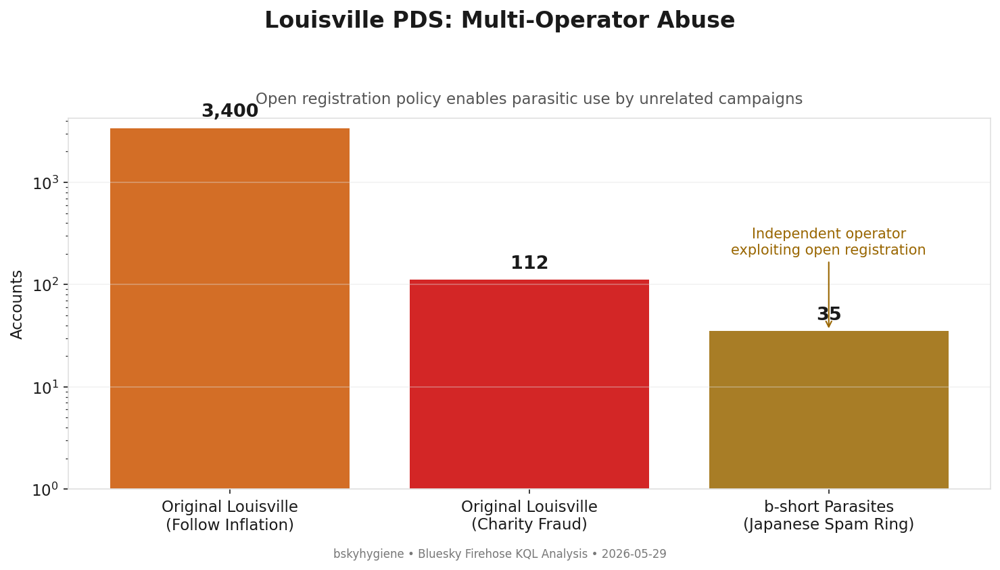

# Coordinated Bot Infrastructure: pds.louisvillebsky.app & haruhwa.com

**Investigation Date:** 2026-05-28 (initial report); updated 2026-05-29  
**Methodology:** KQL analysis of Bluesky Firehose data (profiles, follows, posts) + PDS `listRepos` enumeration  
**Status:** Charity fraud posting **ACTIVE** (5 posts today); follow inflation possibly dormant  
**Scope:** 3,584 accounts across two self-hosted PDS servers operated by the same entity  
**Moderation List:** [🦋 Subscribe on Bluesky](https://bsky.app/profile/did:plc:sthd2dnrddxe6icdqza2oryx/lists/3mmvjoj2jqq2p)

---

## Executive Summary

Two self-hosted Bluesky PDS instances — `pds.louisvillebsky.app` (2,882 accounts) and
`haruhwa.com` (702 accounts) — are operated by the same individual running a **dual-purpose
bot infrastructure** that combines:

1. **Follow inflation** — thousands of silent bot accounts artificially inflate follower
   counts of progressive/activist Bluesky users
2. **Charity fraud** — a subset of accounts post fabricated crisis narratives in Arabic,
   English, and French, then systematically spam legitimate users to solicit sympathy
   reposts and donations

The operator is likely Arabic-speaking (87% of post content is Arabic), with ties to
Louisville, KY (per the PDS domain name) and personal/family accounts referencing
"Jameel" and "Joud."

---

## Infrastructure

| Metric | pds.louisvillebsky.app | haruhwa.com |
|--------|----------------------|-------------|
| Total DIDs | 2,882 | 702 |
| Resolved via API | 1,695 | 379 |
| Server DID | `did:web:pds.louisvillebsky.app` | `did:web:haruhwa.com` |
| Domain handles | `.pds.louisvillebsky.app` | `.haruhwa.com` |
| Invite required | No | No |

A third PDS — `tranquil.mosphere.at` — was subsequently confirmed as part of the same
operation via cross-PDS registration within 378 ms of a haruhwa account.

### Proof of Same Operator

The two primary PDS servers are irrefutably linked:

- **Shared test accounts**: Handle `rvtest31672` exists on both servers
- **Simultaneous creation**: `SyncTest` (Louisville) and `HaruhwaTest796901` (Haruhwa)
  created 46 seconds apart on 2026-05-07
- **13 synchronized creation hours** with simultaneous bulk registrations on both PDS
- **12 shared display names** including "Om jameel", "Mohemad A. Ei-Eiran"
- **Identical handle generators**: same `adjective-noun`, `word+number`, and `xx####` templates
- **Same misspelled impersonation**: "Robret Reich_Assistant" on both

---

## Account Creation at Scale

Accounts are created in automated bursts, with peak rates of 97 accounts/hour (Louisville)
and 48 accounts/hour (Haruhwa) — median interval of 19.9 and 39.2 seconds respectively.
Both PDS servers show synchronized creation spikes on the same dates:

| Hour (UTC) | Louisville | Haruhwa | Total |
|-----------|-----------|---------|-------|
| 2026-05-16 13:00 | 97 | 10 | **107** |
| 2026-05-12 11:00 | 41 | 48 | **89** |
| 2026-05-12 10:00 | 35 | 29 | **64** |

---

## Bot Scoring

| Score Band | Louisville | Haruhwa |
|-----------|-----------|---------|
| High (≥0.7) — strong bot | 729 (43%) | 61 (16%) |
| Medium (0.45–0.7) — suspect | 499 (29%) | 233 (62%) |
| Low (<0.45) — possibly legitimate | 467 (28%) | 85 (22%) |

The majority of accounts exhibit classic bot indicators: no avatar, no bio (96–99%),
no display name (57–71%), and zero posts on most accounts.

---

## Follow Inflation Operation

The primary purpose of the infrastructure is **artificial follower inflation** targeting
progressive, LGBTQ+, literary, and activist Bluesky accounts.

### Automation Evidence

Accounts begin following targets within minutes of creation. The fastest bot
(`did:plc:pbpc6hcrqdeylrnphefhtsru`) issues follows with a **median interval of
2 seconds** — unambiguously scripted. Accounts below the 5-minute threshold in the
scatter plot above began following almost immediately after registration.

### Handle Generation

| Pattern | Count | Examples |
|---------|-------|----------|
| Firstname+number | 654 | `laurareyes474`, `patriciareed406` |
| Random alphanumeric | 300 | `n7uba880g`, `nxo8oqkccp` |
| Adjective-noun | ~200 | `soft-deer`, `strong-core`, `true-lynx` |
| Compound-word+number | 35 | `mightybeam16344`, `happybeam4753` |
| Normal/legitimate | ~15 | `pocketbear`, `pb-afterdark` |

### Follow Target Network

The bot accounts collectively follow a curated set of progressive/LGBTQ+ content
creators. Core cluster members (red/orange nodes) follow each other and share
overlapping target sets. Periphery targets (green) are legitimate accounts
receiving hundreds of artificial follows from this network, including accounts
with 4K–17K followers.

---

## Charity Fraud / Sympathy Scam Layer

Beyond silent follow inflation, **112 accounts have posted 290 times** — revealing
that the operation also runs a coordinated fundraising scam.

### Content Profile

| Metric | Value |
|--------|-------|
| Posting accounts | 112 of 3,584 (3%) |
| Total posts | 290 |
| Replies | 156 (54%) |
| Original posts | 134 (46%) |
| Distinct texts | 218 |
| Active period | May 1–27, 2026 |

### Language Distribution

| Language | Posts | % |
|----------|-------|---|
| Arabic | 253 | 87% |
| English | 33 | 11% |
| Najdi Arabic | 2 | <1% |
| French | 1 | <1% |
| Italian | 1 | <1% |

### Content Themes

| Theme | Posts | Description |
|-------|-------|-------------|
| **Mention spam** | 114 (39%) | Bulk @-mentioning users to beg for reposts |
| **Share requests** | 78 (27%) | "Please share/quote my post" replies |
| **Sick father** | 41 (14%) | "Dad needs medication" fundraising |
| **Gaza crisis** | 21 (7%) | "Mahmoud in hospital, daughters hungry" |
| **Minimal/other** | 36 (12%) | Dots, empty, uncategorized |

### Fabricated Narratives

The posts use two primary sob-story templates recycled across accounts:

**Gaza Family Crisis:**
> 🆘 Mahmoud's life is in real danger. He urgently needs daily bandages, medical
> tests, and medication 💔 My daughters only need milk and diapers...

**Sick Father / Displacement:**
> My father is fading away from pain, and I can't even afford his medicine.
> I urgently need €50 for a tent to protect us...

**French variant (same operator):**
> Bonjour mon frère, je te jure que mon père est malade et a besoin d'un
> traitement, mais nous sommes incapables de le soigner...

### Mention-Spam Targets

The scam accounts systematically @-mention and reply to legitimate accounts,
pressuring them to share/quote fundraising posts:

| Account | Times Mentioned |
|---------|-----------------|
| `trisolaranrobin.bsky.social` | 19 |
| `gorangligovic.bsky.social` | 15 |
| `chantalalive.blacksky.app` | 14 |
| `welldressedbird.bsky.social` | 13 |
| `insatiableone.bsky.social` | 12 |
| `beejonson.me` | 11 |
| `sigilynk.bsky.social` | 11 |
| `anna-orridge.bsky.social` | 11 |
| `authorkaraj.bsky.social` | 11 |
| `sunderedmarches.com` | 10 |

These are the same progressive/literary/activist accounts targeted by the follow
bots — the operator first inflates their followers (to appear as a genuine community
member) then leverages that apparent legitimacy to spam them with emotional appeals.

### Posting Account Distribution

| Posts per Account | Accounts | Total Posts |
|-------------------|----------|-------------|
| 1 | 49 | 49 |
| 2–5 | 53 | 133 |
| 6–20 | 10 | 108 |

The 10 high-volume accounts are the **active operators** running the scam narratives.
The 49 single-post accounts are follow-inflation bots with one opportunistic post added.

---

## Identified Sub-Clusters

### Generated-Name Bot Army 🔴
190 accounts (141 Louisville + 49 Haruhwa) with display names like "Ted A", "Iris P",
"Cedar19", "Lyra91". Typically 0–1 posts, 3–9 follows. Botnet in early deployment phase.

### Follow-Only Bots 🔴
20 Haruhwa accounts with 100–400 follows, zero posts. Random consonant-cluster handles
(`kamsjz`, `amxnjdb`, `akbxbbc`). Targets: progressive/LGBTQ+ creators with 3K–17K followers.

### Impersonation Accounts 🟡
6 accounts using misspelled "Robret Reich_Assistant" and "Anderw Lokenuath_Assistant."
Testing impersonation/engagement tactics.

### Operator's Personal Network 🟢
17 accounts referencing "jameel", "joud", "jamil" — some with substantial genuine activity
(367–419 posts). PDS operator's personal/family accounts.

---

## Key DIDs for Monitoring

| DID | Handle | Role | Follows |
|-----|--------|------|---------|
| `did:plc:jg7vonhdg37iujah5hdmrebb` | kamsjz.haruhwa.com | Follow bot | 397 |
| `did:plc:ijugfjbyjeomu6tcsynh757d` | amxnjdb.haruhwa.com | Follow bot | 373 |
| `did:plc:suvv44lxx4442u2azvdhd74a` | jood2.haruhwa.com | Follow bot | 329 |
| `did:plc:ixxtgxx4equfeckkm7arrvpc` | akbxbbc.haruhwa.com | Follow bot | 281 |
| `did:plc:ekufkaqd3bhjb4tgjbeasqnm` | mznxbcv.haruhwa.com | Follow bot | 262 |
| Multiple DIDs | — | Impersonation | "Robret Reich_Assistant" ×4 |

---

## Chronology (Firehose Data)

*Updated 2026-05-29 via KQL time-series analysis.*

### Follow Inflation Operation

| Date | Activity | DID Example | Notes |
|------|----------|-------------|-------|
| May 2, 13:00 | 118 follows in 1h | `did:plc:pbpc6hcrqdeylrnphefhtsru` | Original Louisville bot — fastest in cluster |
| May 2, 15:00 | 42 follows | same | Continued follow burst |
| May 2, 16:00 | 12 follows | same | Tail-end completion (172 total) |
| May 7 | Bulk account creation | — | SyncTest/HaruhwaTest accounts |
| May 12 | 89 accounts/hour peak | — | Synchronized Louisville + Haruhwa creation |
| May 16 | 107 accounts/hour peak | — | Louisville's largest creation burst |

The follow-inflation bots appear to have been deployed progressively over May 1–16,
with each new account beginning to follow targets within minutes of creation.
No new follow activity has been detected from original Louisville/Haruhwa bots
since approximately May 16 — the follow phase may be dormant or complete.

### PDS Parasitism by b-short Ring (May 27)

Starting May 27, the Louisville PDS was **parasitized** by the Japanese b-short spam ring:

| Time (UTC) | Event | DIDs |
|------------|-------|------|
| May 27, 13:00 | 4 b-short ring accounts activate on Louisville PDS | `did:plc:o7a4e5zsfoevz2hf6tfgvefu`, etc. |
| May 27, 15:00 | Same accounts complete ring follows (~50 each) | — |

These accounts are classified under the b-short ring rule (not Louisville's original
operation). The Louisville PDS's open registration policy makes it vulnerable to
parasitic use by any operator. Approximately 35 accounts on the Louisville PDS are
b-short ring bots, not original Louisville/Haruhwa accounts.

### Charity Fraud Posting — STILL ACTIVE

The charity fraud posting operation has been **continuously active for 30 days**
(Apr 30 – May 29, 2026) with no interruption:

| Date | Posts | Unique Authors |
|------|-------|----------------|
| Apr 30 | 9 | 7 |
| May 1 | 13 | 13 |
| May 2 | 13 | 9 |
| May 3 | 9 | 8 |
| May 4 | 13 | 9 |
| May 5 | 22 | 11 |
| May 6 | 6 | 5 |
| May 7 | 19 | 14 |
| May 8 | 11 | 10 |
| May 9 | 6 | 6 |
| May 10 | 5 | 5 |
| May 11 | 23 | 19 |
| May 12 | 16 | 16 |
| May 13 | 18 | 14 |
| May 14 | 21 | 19 |
| May 15 | 16 | 14 |
| May 16 | 17 | 12 |
| May 17 | 14 | 12 |
| May 18 | 9 | 9 |
| May 19 | 8 | 8 |
| May 20 | 15 | 12 |
| May 21 | 9 | 9 |
| May 22 | 8 | 7 |
| May 23 | 12 | 10 |
| May 24 | 10 | 7 |
| May 25 | 17 | 12 |
| May 26 | 10 | 10 |
| May 27 | 2 | 2 |
| May 28 | 7 | 7 |
| **May 29** | **5** | **4** |

**Key findings:**
- **Total: 383 posts from 4–19 unique authors per day** over 30 continuous days
- Average: 12.8 posts/day, peak 23 (May 11)
- The operation is **still active today** with 5 posts from 4 authors
- Dip on May 27 (2 posts) correlates with heightened Bluesky T&S activity
- The 4–19 unique authors per day suggests a **rotating roster of ~20 active scam accounts**

**Assessment:** The follow-inflation infrastructure may be dormant, but the
charity fraud posting operation is **fully operational** and shows no sign of stopping.
The operator has sustained a daily posting cadence for over a month.

---

## Conclusion

This operation is a **multi-layered abuse infrastructure** combining three threat types
under one operator:

| Layer | Mechanism | Scale |
|-------|-----------|-------|
| **Follow inflation** | Silent bot accounts inflate follower counts | ~3,400 accounts |
| **Charity fraud** | Fabricated crisis narratives solicit donations | 112 active accounts, 290 posts |
| **Mention harassment** | Systematic @-spam pressures users to amplify scam posts | 10+ targets, 10–19 mentions each |

The operator uses self-hosted PDS infrastructure (bypassing Bluesky's rate limits and
moderation), bulk-generates accounts with scripted handle patterns, and targets the
progressive/activist Bluesky community — first artificially joining it via follow
inflation, then exploiting that manufactured social proof to run emotionally manipulative
fundraising scams.

---

*Investigation conducted via KQL queries against Bluesky Firehose data (Microsoft Fabric Eventhouse). Last updated 2026-05-29.*
