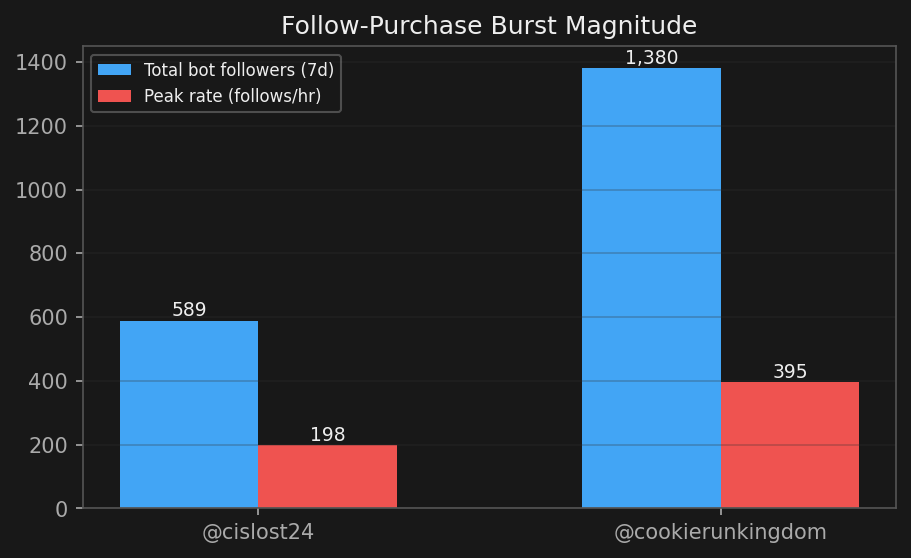
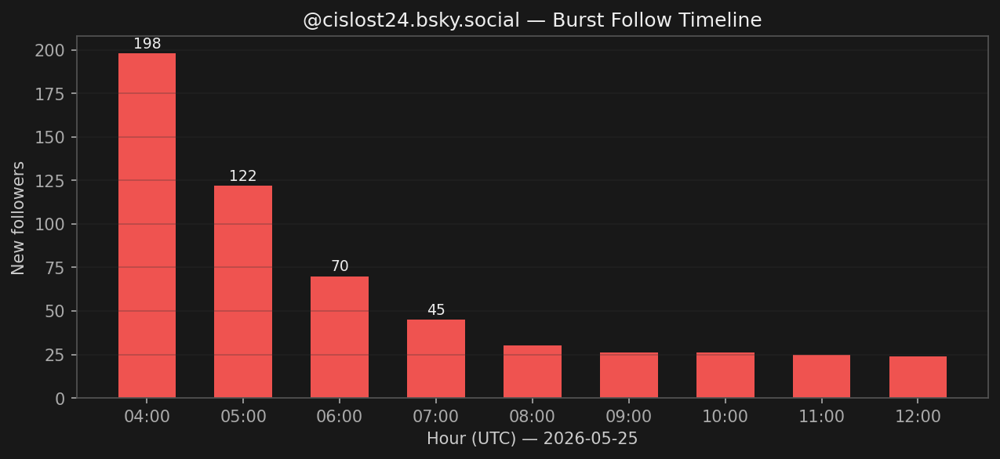
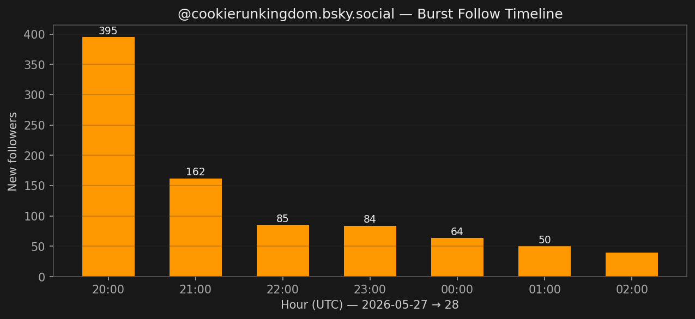
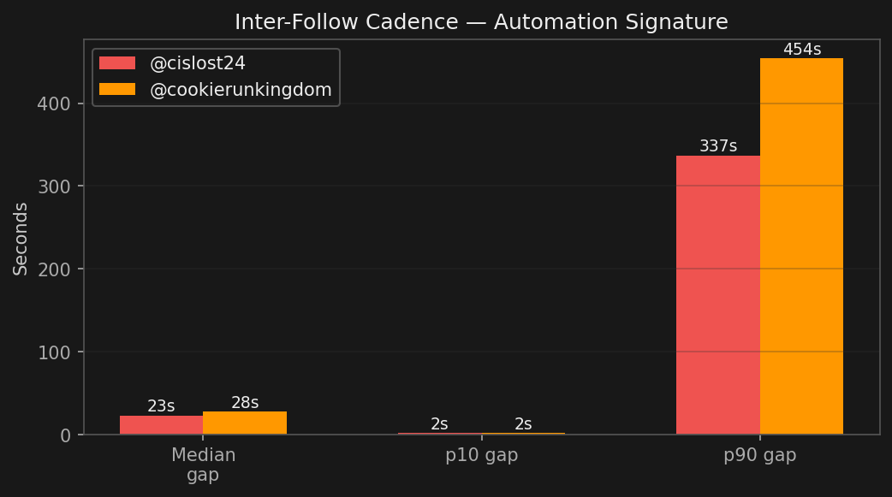
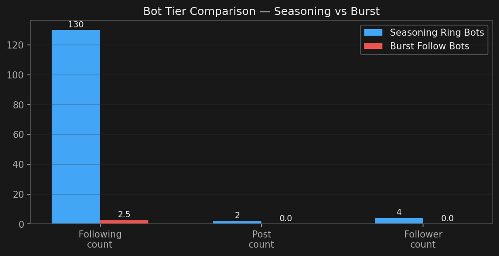

# Follow-Purchase Burst Attacks: cislost24 & cookierunkingdom

**Investigation Date:** 2026-05-30  
**Methodology:** Temporal burst detection via KQL on Bluesky Firehose follow data; profile resolution via `app.bsky.actor.getProfile`  
**Status:** **ACTIVE** — new burst events observed as recently as 2026-05-29  
**Scope:** 2 confirmed follow-purchase targets receiving 589–1,380 fake followers within hours  
**Related:** [Seasoning Rings](../2026-05-30-seasoning-rings/README.md), [Burst Follow Spam (watchmelive.my.id)](../2026-05-28-burst-follow-spam/README.md)

---

## Executive Summary

Two Bluesky accounts received sudden, massive influxes of bot followers in concentrated
bursts — consistent with a **paid follow-purchase service** ("follow farm as a service").

| Target | Bot Followers (7d) | Peak Rate | Peak Time (UTC) |
|--------|-------------------|-----------|-----------------|
| @cislost24.bsky.social | 589 | 198/hour | 2026-05-25 04:00 |
| @cookierunkingdom.bsky.social | 1,380 | 395/hour | 2026-05-27 20:00 |

The bot accounts delivering these follows are **minimal throwaway accounts** — typically
0 followers, 2–3 following, 0 posts — distinct from the seasoning ring bots (which follow
100+ accounts). This suggests either a different tier of the same follow-farm operator or
a separate low-effort bot pool.

---

## Burst Magnitude



## Key Indicators

| Metric | @cislost24 | @cookierunkingdom |
|--------|-----------|-------------------|
| Target DID | `did:plc:rvoal7hdidgduflugbohykni` | `did:plc:5rwgthupzv6vcteaebpoa6zu` |
| Total followers (real) | 3,853 | 5,521 |
| Bot followers received (7d) | 589 | 1,380 |
| Peak burst rate | 198/hour | 395/hour |
| Peak burst time | 2026-05-25 04:00 UTC | 2026-05-27 20:00 UTC |
| Burst duration | ~4 hours | ~5 hours |
| Bot median inter-follow gap | 23 seconds | 28 seconds |
| Bot p10 inter-follow gap | 2 seconds | 2 seconds |
| Zero-gap follow pairs | 15 | 39 |
| Bot avg follow-set size | 2 follows | 5 follows |
| Target account created | 2024-10-17 | 2023-07-24 |
| Target posts | 45 | 153 |

---

## Burst Temporal Profiles

### @cislost24.bsky.social — 2026-05-25



```
04:00 UTC  ████████████████████████████████████████  198 follows
05:00 UTC  ████████████████████████                  122 follows
06:00 UTC  ██████████████                             70 follows
07:00 UTC  █████████                                  45 follows
12:00 UTC  █████                                      24 follows
```

Single concentrated burst starting at 04:00 UTC, decaying over 8 hours.
Total: 589 new followers delivered.

### @cookierunkingdom.bsky.social — 2026-05-27



```
20:00 UTC  ████████████████████████████████████████████████████████████████████████████████  395 follows
21:00 UTC  ████████████████████████████████                                                  162 follows
22:00 UTC  █████████████████                                                                  85 follows
23:00 UTC  █████████████████                                                                  84 follows
00:00 UTC  █████████████                                                                      64 follows
```

Massive single burst starting at 20:00 UTC, also decaying.
Total: 1,380 new followers delivered.

---

## Bot Follower Profile

The bots delivering these follows are **minimal-effort throwaways**, distinct from the
seasoning ring accounts:

| Handle | Followers | Following | Posts | Created |
|--------|-----------|-----------|-------|---------|
| @giangthu.bsky.social | 0 | 2 | 0 | 2026-05-25 |
| @ucgch.bsky.social | 0 | 2 | 0 | 2026-05-25 |
| @yuukomeow235.bsky.social | 0 | 3 | 0 | 2026-05-25 |
| @yuuahn.bsky.social | 0 | 3 | 0 | 2026-05-25 |
| @njeuuuu.bsky.social | 0 | 2 | 0 | 2026-03-08 |
| @tuet567.bsky.social | 0 | 2 | 0 | 2026-01-05 |
| @tum520.bsky.social | 0 | 2 | 3 | 2024-10-17 |
| @phuongtay2908.bsky.social | 11 | 6 | 3 | 2024-10-17 |

### Bot Fingerprint

- **Following count:** 2–3 accounts (target + possibly 1 other)
- **Posts:** 0 (pure follow-bots)
- **Followers:** 0
- **Handle naming:** Short randomized strings, some Vietnamese-influenced (giangthu, phuongtay, yuukomeow)
- **Creation timing:** Many created same day as the burst (just-in-time account creation)
- **Some older dormant accounts** reactivated (2024-10-17 cohort) mixed with fresh ones

---

## Inter-Follow Cadence Analysis



The timing between consecutive bot follows reveals automated batch submission:

| Metric | @cislost24 burst | @cookierunkingdom burst |
|--------|-----------------|-------------------------|
| Median gap | 23 seconds | 28 seconds |
| p10 gap | 2 seconds | 2 seconds |
| p90 gap | 337 seconds | 454 seconds |
| Average gap | 889 seconds | 428 seconds |
| Zero-gap pairs | 15 | 39 |

The **2-second p10 gap** proves batch API submission — human users cannot follow accounts
at 2-second intervals. The **zero-gap pairs** (multiple follows in the same second) indicate
parallel bot threads hitting the API simultaneously.

---

## Assessment: Purchased vs. Organic

Both targets are **likely purchasers** (not victims):

- **@cislost24.bsky.social** — 3,853 followers but only 45 posts and 5 following.
  Follower-to-post ratio of 85:1 is extremely inflated.
- **@cookierunkingdom.bsky.social** — 5,521 followers, 153 posts.
  Follower-to-post ratio of 36:1. A branded gaming community account that may
  have purchased followers to boost credibility.

Neither account shows any content that would organically attract 200–400 new followers
per hour.

---

## Comparison with Seasoning Ring Bots



| Property | Seasoning Ring Bots | Burst Follow Bots |
|----------|--------------------|--------------------|
| Following count | 62–182 | 2–3 |
| Posts | 0–8 (some light posting) | 0 |
| Followers | 1–8 | 0 |
| Purpose | Long-term asset prep | One-shot delivery |
| Handle style | English plausible names | Vietnamese/random |
| Reuse pattern | Held for future use | Burned immediately |
| Creation date | 2026-05-29/30 | Mixed (some old, some fresh) |

These are **different tiers of the same ecosystem** — the seasoning farm produces inventory
for eventual resale, while the burst bots are cheap throwaways for immediate delivery.

---

## Detection Methodology

1. Detect accounts receiving ≥ 20 new followers/hour (abnormal for non-viral accounts)
2. Profile the delivering accounts: check follower/following/post counts
3. Measure inter-follow cadence (p10 < 5 seconds = automation)
4. Classify bot pool by follow-set size and handle patterns
5. Correlate burst timing with target account post history (no viral post = purchased)

---

## Relation to Other Investigations

- **Seasoning Rings (2026-05-30):** Different bot tier from the same ecosystem. Seasoning
  bots build 100+ follow lists; burst bots follow only 2–3 accounts.
- **watchmelive.my.id / livechats.my.id (2026-05-28):** Similar delivery mechanism (mass
  follows in bursts) but different bot pool (those used domain-name handles and followed
  more accounts per bot).
- **b-short.link ring (2026-05-27):** Different operator entirely (self-hosted PDS,
  Japanese-language content spam).
