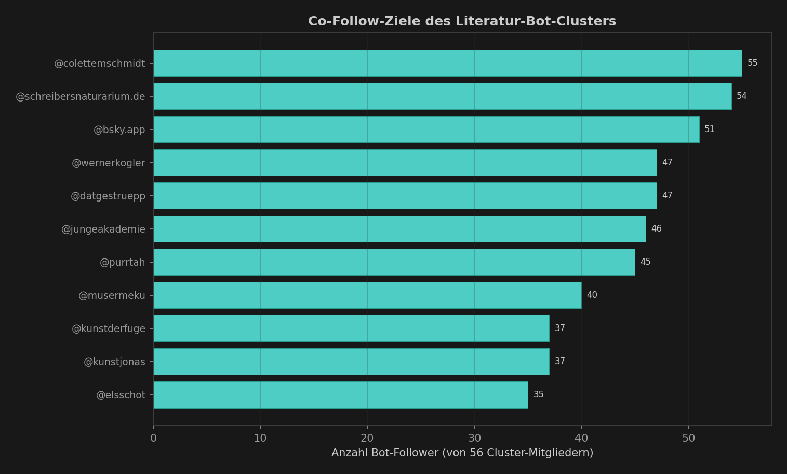
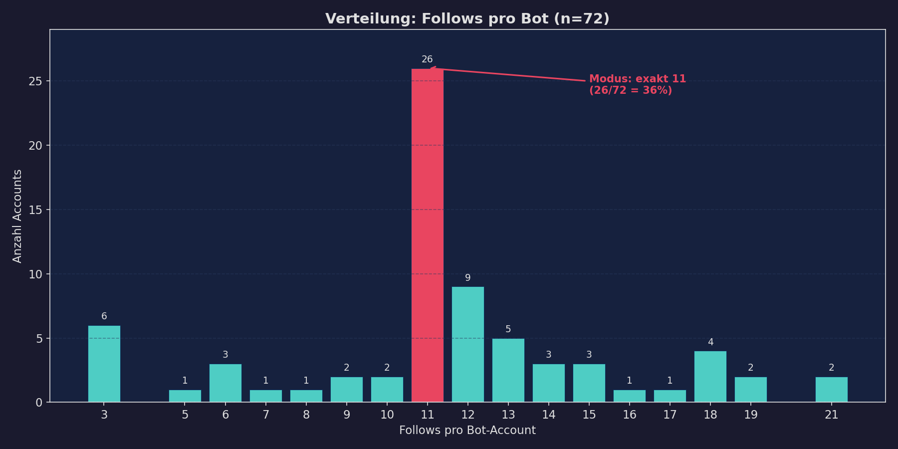
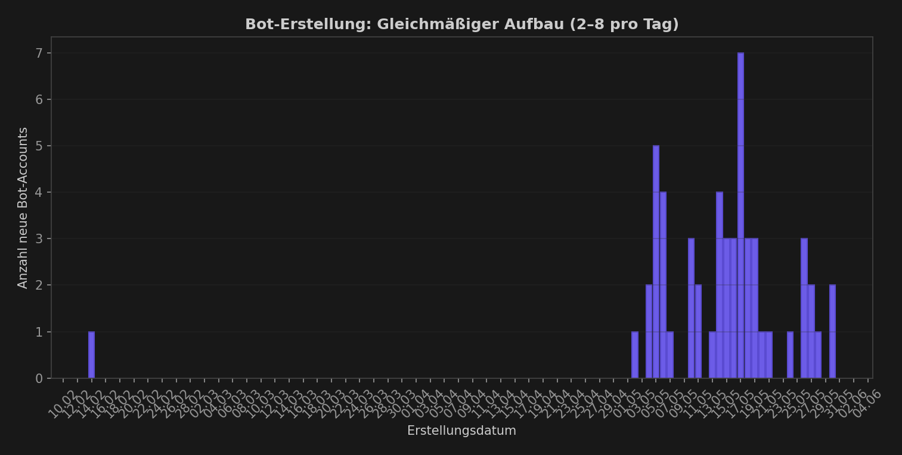
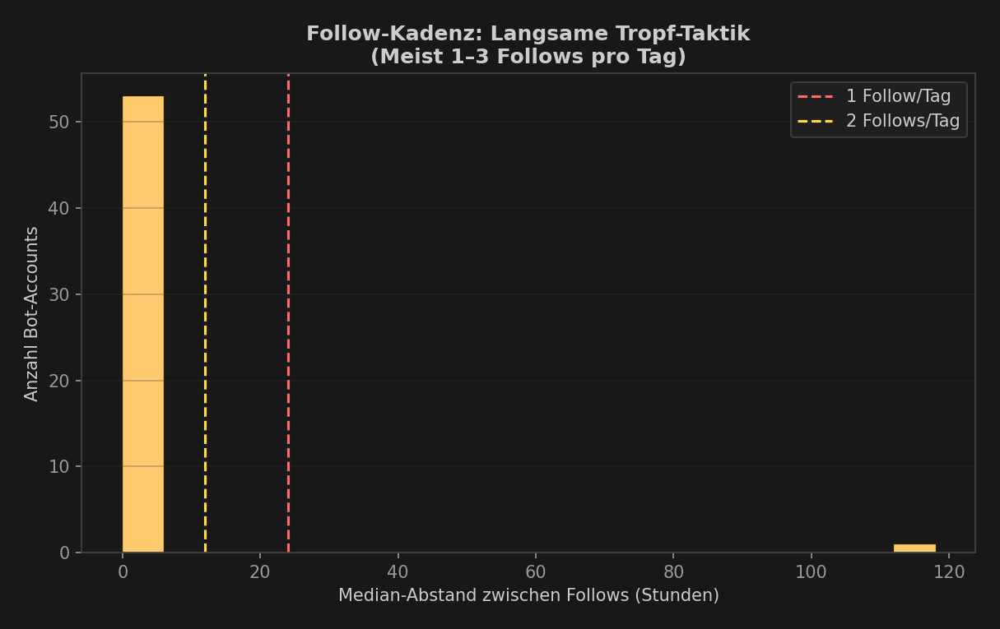
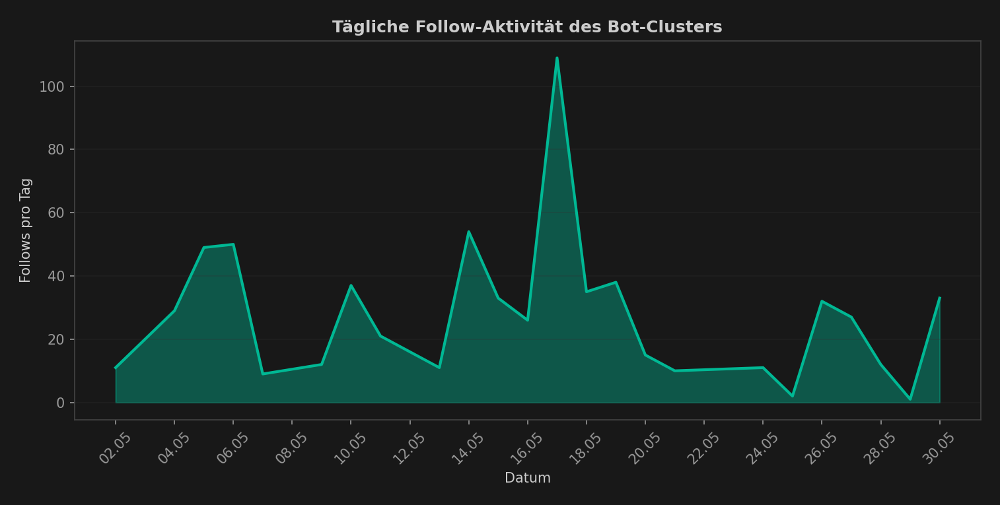

# Deutschsprachiges Literatur-Bot-Netzwerk auf Bluesky

**Datum:** 30. Mai 2026 (aktualisiert: Runde 3 — False-Positive-Prüfung)  
**Status:** RUHEND — keine neuen Bots in den letzten 48 Stunden  
**Umfang:** **70 bestätigte Bot-Accounts** (2 False Positives entfernt), ~750 Fake-Follows an 11 Kern-Ziele  
**Infrastruktur:** Offizielle Bluesky-PDS (bsky.network)  
**Hinweisgeber:** [@schreibersnaturarium.de](https://bsky.app/profile/schreibersnaturarium.de) (Autorin Jasmin Schreiber)  
**Verwandt mit anderen Clustern:** Nein — eigenständige Operation, kein Overlap mit Seasoning Rings, Burst-Follow-Spam oder cislost24-Netzwerk  
**Suspendierungen:** 0 von 70 — alle Accounts weiterhin aktiv

---

## Zusammenfassung

Ein subtiles Bot-Netzwerk wurde identifiziert, das gezielt deutschsprachige Kultur- und
Literatur-Accounts auf Bluesky mit Fake-Followern versorgt. Im Gegensatz zu den bekannten
Burst-Follow-Netzwerken (die 1.000+ Follows in Minuten abfeuern) arbeitet dieses Cluster
mit einer **gestaffelten Aktivierung**: Jeder Bot folgt nur **3–20 Accounts** (Modus: exakt 11)
und feuert seine Follows in einem schnellen Burst ab (Median: 128 Sekunden). Der Effekt
der „2–3 neuen Follower pro Tag" entsteht, weil **jeden Tag neue Bots aktiviert werden** —
nicht weil einzelne Bots langsam agieren.

Die Autorin Jasmin Schreiber (@schreibersnaturarium.de) bemerkte das Muster am 30. Mai 2026:

> „Hab gerade so so viele von diesen Accounts hier geblockt... die sind recht unauffällig,
> weil da vielleicht 2–3 am Tag reinfolgen, sehr unter dem Radar. Summiert sich aber auch.
> Interessant: Die folgen nicht untereinander, allerdings immer so zwischen 9 und 14 Accounts,
> extrem oft exakt 11."

**Korrektur (Runde 2):** Die „2–3 pro Tag"-Wahrnehmung entsteht nicht durch langsame
Auslieferung pro Bot, sondern durch **tägliche Aktivierung neuer Bots**. Jeder einzelne Bot
feuert alle Follows in unter 2 Minuten ab (Median).

## Kern-Indikatoren

| Signal | Wert |
|--------|------|
| Bestätigte Bot-Accounts | **70** (72 initial, 2 FP entfernt) |
| Follows pro Bot | 3–20 (Modus: **exakt 11**, 40%) |
| Geschätzte Fake-Follows | ~750 |
| Kampagnenstart | **2. Mai 2026** (erster Follow im Graph) |
| Letzte Aktivität | **30. Mai 2026** |
| Posts pro Bot | **0–17** (19 Bots mit Posts, davon 2 mit >10) |
| Follow-Burst-Dauer (Median) | **128 Sekunden** |
| Bots folgen einander | **Nein** |
| Kern-Ziele | 11 Accounts (deutsch + international) |
| Spam-Accounts im Mix | 9 „Goth Girl"-Lockvogel-Profile |
| Avatare | **58/66** (88%) haben ein Profilbild |
| Suspendiert/Gelöscht | **0** |

## Ziel-Accounts (Co-Follow-Analyse)

Die Bots folgen fast ausschließlich denselben ~11 Accounts. Die Kern-Ziele sind
deutschsprachige Autor:innen, Kulturinstitutionen, Journalist:innen und Politiker:



| Rang | Account | Bots | Follower | Beschreibung |
|------|---------|------|----------|--------------|
| 1 | @schreibersnaturarium.de | 70/70 | 20.514 | Autorin (Hinweisgeberin) |
| 2 | @colettemschmidt.bsky.social | 70/70 | 11.619 | Journalistin |
| 3 | @bsky.app | 64/70 | 33.484.526 | Bluesky-Standard-Follow |
| 4 | @wernerkogler.bsky.social | 57/70 | 9.318 | Österreichischer Politiker |
| 5 | @datgestruepp.bsky.social | 51/70 | 6.065 | Kultur-Account |
| 6 | @jungeakademie.bsky.social | 51/70 | 2.774 | Junge Akademie |
| 7 | @purrtah.bsky.social | 50/70 | 4.902 | Kultur/Illustration |
| 8 | @musermeku.bsky.social | 44/70 | 3.203 | Museumskultur |
| 9 | @kunstderfuge.bsky.social | 41/70 | 3.537 | Kunst/Kultur |
| 10 | @kunstjonas.bsky.social | 41/70 | 2.394 | Kunst |
| 11 | @elsschot.bsky.social | 38/70 | 9.861 | Literatur |

**Sekundärziele (gelegentlich mitgenommen):** @kattascha (40.098 Follower),
@golod (24.151), @islieb (15.464), @faznet (19.497), @afelia/Marina Weisband (75.904),
@spdfraktion.de (14.741), @suhrkamp.de (8.370), @krajamine (8.491), @mareicares (4.737).

### Spam-/Lockvogel-Accounts

9 „Goth Girl"-Spam-Profile mit je 4–7 Bot-Followern — offenbar die
Monetarisierungs-Ziele des Operators (Instagram-/Telegram-Weiterleitung):

| Account | Bots | Follower | Beschreibung |
|---------|------|----------|--------------|
| @gothgirlvanesssa.bsky.social | 7 | 14 | „19 · Miami · The girl from your nightmares" |
| @redheadfurry.bsky.social | 7 | 14 | „Redhead 🧡 · 19 · Your favorite Fury" |
| @gothgirlrumi.bsky.social | 7 | 12 | „19 · IG + TG: @gothgirlrumi" |
| @rileygothvampire.bsky.social | 7 | 13 | „19 · From the darkness" |
| @gothgirlrileyy.bsky.social | 7 | 12 | „Hi 🖤 I am Riley · 19 · LA" |
| @itssophiierose.bsky.social | 5 | 11 | „It's Sophie Rose · 19 · Los Angeles" |
| @rileyraygoth.bsky.social | 4 | 9 | „Hi, I am Riley · 19 · New York" |
| @sophierosegoth.bsky.social | 4 | 11 | „🖤 Can you fix me? 🖤" |
| @itsvanessabeckerr.bsky.social | 4 | 9 | „19 · Looking for the one · Digital Creator" |

Alle „Goth Girl"-Accounts verweisen auf Instagram/Telegram — klassisches Social-Engineering.

## Follow-Verteilung

Die extrem enge Verteilung um 11 Follows ist ein starker Bot-Indikator, wobei Runde 2
eine breitere Streuung (3–20) zeigt als initial angenommen:



| Follows | Accounts |
|---------|----------|
| 3 | 6 |
| 5 | 1 |
| 6 | 3 |
| 7 | 1 |
| 8 | 1 |
| 9 | 2 |
| 10 | 3 |
| **11** | **29** (40%) |
| 12 | 7 |
| 13 | 5 |
| 14 | 2 |
| 15 | 3 |
| 16 | 1 |
| 17 | 1 |
| 18 | 5 |
| 19 | 1 |
| 20 | 1 |

**40% der Bots folgen exakt 11 Accounts** — ein eindeutiges Fingerprint-Muster.
Die niedrigeren Zahlen (3–6 Follows) sind vermutlich Bots, die noch nicht alle Ziele
abgearbeitet haben oder deren Follow-Operationen teilweise fehlschlugen.

## Bot-Erstellungs-Timeline

Die Accounts werden über den gesamten Mai 2026 aktiviert — erste Graph-Aktivität
am 2. Mai, letzte am 30. Mai:



## Follow-Timing: Burst pro Bot, gestaffelt pro Ziel

**Korrektur gegenüber Runde 1:** Jeder einzelne Bot feuert alle seine Follows in einem
schnellen Burst ab — nicht über Stunden oder Tage verteilt.



| Metrik | Wert |
|--------|------|
| Median Burst-Dauer | **128 Sekunden** |
| Abgeschlossen in < 1 Minute | 27/70 (39%) |
| Abgeschlossen in < 5 Minuten | 40/70 (57%) |
| Abgeschlossen in < 1 Stunde | 48/70 (69%) |
| Nahm > 1 Stunde | 22/70 (31%) |

Die Bots mit langer Gesamtdauer (Stunden/Tage) wurden für **mehrere Wellen** reaktiviert:
Erst folgten sie den initialen 11 Kern-Zielen, Tage später wurden die Goth-Girl-Spam-
Accounts hinzugefügt. Die Dauer misst first-to-last-follow, nicht kontinuierliche Aktivität.

**Warum Jasmin Schreiber „2–3 pro Tag" beobachtete:** Nicht weil einzelne Bots langsam
ausliefern, sondern weil jeden Tag 2–7 NEUE Bots aktiviert werden, die jeweils sofort
alle Follows abfeuern.

## Tägliche Aktivität

Die Gesamtaktivität des Clusters zeigt Wellen, mit einem Peak um den 17. Mai 2026:



## Bot-Profil-Muster (API-verifiziert)

Die Bot-Accounts zeigen ein überraschend hohes Profil-Ausstattungsniveau:

| Merkmal | Anteil |
|---------|--------|
| Profilbild (Avatar) | **58/66** (88%) |
| Display-Name | 22/66 (33%) |
| Beschreibung/Bio | 12/66 (18%) |
| Mindestens 1 Post | 19/66 (29%) |
| Suspendiert/Gelöscht | **0/70** (0%) |

### Zwei Bot-Populationen im selben Cluster

**Population A — „Deutschsprachige Tarnbots":**
- Plausible deutsche Handles: `miahungrigesherz`, `fraurollmops`, `fckafdemail`
- Manche mit echtwirkenden Bios: „Fußgängerin, Serienkuckerin"
- Einige mit realen Posts (bis zu 7)
- Avatare vorhanden, aber generisch

**Population B — „Goth Girl"-Spam:**
- Englische Handles: `gothgirlrileyy`, `rileyraygoth`, `sophierosegoth`
- Standardisierte Bios: „19 | [City] | IG + TG: @handle"
- Immer genau 1–2 Posts
- Alle verweisen auf Instagram/Telegram (Social-Engineering → Krypto-/Romance-Scam)

**Bemerkenswerte Bots mit Posts:**
- `fckafdemail.bsky.social` — 5 Posts (10 Follows im selben Millisekunden-Burst → Bot)
- `derrechtenutzer.bsky.social` — 7 Posts (14 Follows in 91 Sekunden → Bot)
- `fraurollmops.bsky.social` — 3 Posts, plausible Bio (10 Follows im selben Millisekunden-Burst → Bot)
- `sylveev2justexists.bsky.social` — 1 Post, „Pokemon Nerd" (10 Follows im selben ms → Bot, hat nachträglich alle Targets entfolgt)

**Entfernte False Positives** (siehe Abschnitt unten):
- `jens-kessler.bsky.social` — 17 Posts, echte Person (Lehrkraft)
- `alerta93.bsky.social` — 14 Posts, echte Person (politischer Account)

## Hypothese: Geschäftsmodell

```
┌─────────────────────────────────────────────────────┐
│  OPERATOR erstellt 2-7 Bot-Accounts pro Tag         │
│  (mit Avatar, manchmal Bio — nicht triviale Bots)   │
│  ↓                                                  │
│  Jeder Bot feuert ~11 Follows in < 2 Minuten:      │
│    • 6-11 echte deutsche Kultur-Accounts (Tarnung)  │
│    • 0-5 Spam-/Goth-Girl-Accounts (Monetarisierung) │
│  ↓                                                  │
│  Tägliche Staffelung neuer Bots erzeugt „Tropf"-    │
│  Effekt bei den Zielen (2-3 neue Follower/Tag)      │
│  → Unter dem Radar der Moderation                   │
│  ↓                                                  │
│  Spam-Accounts zielen auf Instagram/Telegram ab     │
│  → Krypto-Scam oder Romance-Scam-Pipeline           │
└─────────────────────────────────────────────────────┘
```

Die echten Kultur-Accounts dienen als **Tarnung**: Ein Account der @schreibersnaturarium.de,
@wernerkogler und @elsschot folgt, sieht auf den ersten Blick aus wie ein deutschsprachiger
Neuankömmling. Die eigentlichen Kunden sind die „Goth Girl"-Spam-Profile.

## Handle-Muster (vollständige Liste)

Alle 64 über API aufgelösten Bot-Handles (alphabetisch):

```
a-hmadsaleem        adr46              anianina            avawilander
bennymy             berger51           boogibomber         casimiruua
catzastrophe        derglsndb          derrechtenutzer     drabons
dro36               ella-aust          fckafdemail         fraurollmops
gothgirlrileyy      gothgirlrumi       guidohoes           haasbarbara
hasipups            heinerthiel        hiep54              holgergollnast61
improvisando        iskanderfrancis    itssophiierose      itsvanessabeckerr
jajhahja            janhoekema         jokon84             kaatvndveld
knight-of-justice   knut44             kopprene566-83      kuchenzahn-club
lisamarinna         lobsi              mafabuh             malte161
martin-daniel       matthes-young      miahungrigesherz    moebes
ni-els              nittsmav           nornadim2320-90     pilot-747-check
rileyraygoth        rudi62             scarredfury         sergiusch
skunny22            sophierosegoth     sophierosenurse     sylveev2justexists
timo1980            tobias-namenlos    vanessabeckrr       veraenderung
veraltetgianni      whitewinterowl     willykaufmann       zoeymyheart
```

**Muster:**
- 64/70 rein lowercase (6 nicht auflösbar)
- 16/64 enthalten Ziffern (25%)
- 5/64 englische Spam-Pattern (`gothgirl*`, `riley*`, `sophie*`)
- Rest: plausible deutsche/niederländische Personennamen

## Abgrenzung zu anderen Netzwerken

| Merkmal | Dieses Cluster | Seasoning Rings | Burst-Follow-Spam |
|---------|----------------|-----------------|-------------------|
| Follows/Bot | 3–20 (Modus 11) | 62–182 | ~1.024 |
| Burst-Dauer/Bot | Median 128s | Sekunden | 3–5 Min |
| Staffelung | 2–7 Bots/Tag | 50–100 Bots/Tag | 10–106 Bots/Tag |
| Posts | 0–17 | 0 | 0 (dann Spam) |
| Avatare | 88% | ~0% | ~30% |
| Bots folgen einander | Nein | **Ja** (Ring-Muster) | Nein |
| Ziel-Sprache | Deutsch | Japanisch | Englisch |
| Handle-Muster | Deutsch/generisch | Japanisch | Ornate weibliche Namen |

## Erkennungsmethodik

Dieses Cluster ist besonders schwer zu erkennen, weil:

1. **Geringe Follow-Zahl:** 11 Follows ist im Normalbereich eines neuen Nutzers
2. **Keine Inter-Follows:** Keine Ring-Struktur sichtbar
3. **Gestaffelte Aktivierung:** Kein plötzlicher Follower-Spike beim Ziel
4. **Plausible Profile:** Deutsche Handles, 88% mit Avatar, manche mit Posts
5. **Mischnutzung:** Echte Kultur-Accounts als Tarnung neben Spam-Zielen

**Erkennung gelang durch:**
- Co-Follow-Analyse: 70/70 Bots folgen @schreibersnaturarium.de UND @colettemschmidt → statistisch unmöglich zufällig
- Fixed follow count: 40% folgen exakt 11 Accounts
- Burst-Timing: Alle Follows eines Bots in < 2 Minuten (Median)
- Community-Hinweis (Jasmin Schreiber)
- API-Verifizierung: Kein einziger Bot ist suspendiert oder gelöscht

## False-Positive-Prüfung (Runde 3)

Alle 72 Cluster-Accounts wurden systematisch auf False Positives untersucht:

**Methodik:**
1. Scoring: Posts, Follower, Follows, Bio-Qualität, Account-Alter
2. Deep-Dive: Vollständige Follow-Listen der verdächtigen Accounts über API
3. Timing-Analyse: Burst-Muster vs. organisches Verhalten (Kusto)
4. Starter-Pack-Prüfung: Ob Targets in gemeinsamen Starter Packs erscheinen

### Entfernte Accounts (bestätigte False Positives)

| Account | Grund | Timing | Evidenz |
|---------|-------|--------|----------|
| @jens-kessler.bsky.social | Echte Lehrkraft | 13,9h Gesamtdauer mit 9,6h Nachtpause | 17 Posts, 7 organische Follows (dt. Lehrer:innen), nur 3/11 Targets |
| @alerta93.bsky.social | Echter politischer Account | 1,7s-Median natürlicher Klickrhythmus | 14 Posts, 8 diverse Non-Cluster-Follows, nur 3/11 Targets |

**@jens-kessler** folgte am 19.05. um 04:19 Uhr morgens — burst-artig 8 Accounts in 55s
(konsistent mit manuellem Onboarding), dann 4,3h und 9,6h Pausen vor den nächsten Follows.
Seine 7 Non-Cluster-Follows sind ausschließlich deutsche Lehrkräfte (HerrHeldt, Jessica Hilbert,
Jan-Martin Klinge) — kein Bot folgt gezielt dem deutschen #BlueLZ-Netzwerk.

**@alerta93** folgte die 2 Kern-Ziele + bsky.app am 05.05. mit natürlichem 1,7s-Rhythmus.
25 Tage später (30.05.) folgten 7 politische Accounts (Georg Diez, Kreativ gegen Rechts) —
typisches Verhalten eines gelegentlichen Nutzers, der in Wellen stöbert.

### Bestätigte Bots trotz hohem Score

| Account | Score | Bot-Beweis |
|---------|-------|------------|
| @sophierosenurse.bsky.social | 8 | 15 Follows in 503s, 10s-Takt — Goth-Girl-Spam-Node |
| @fckafdemail.bsky.social | 4 | 10 Follows im SELBEN Millisekunden-Timestamp (17:22:16.476–478) |
| @gothgirlrumi.bsky.social | 4 | Burst 21:46–21:50, 10,7s Median — Spam-Node |
| @fraurollmops.bsky.social | 3 | 10 Follows im SELBEN ms (13:44:29.197–199) trotz dt. Bio |
| @sylveev2justexists.bsky.social | 3 | 10 Follows im selben ms; hat alle Targets nachträglich entfolgt |
| @derrechtenutzer.bsky.social | 3 | 14 Follows in 91s (heute erstellt, 0 Non-Cluster-Follows) |

**Schlüssel-Erkenntnis:** Millisekunden-identische Timestamps (Δt < 1ms zwischen Follows)
sind unmöglich manuell — sie verraten API-Batch-Operationen. Accounts wie @fraurollmops
haben trotz authentisch wirkender deutscher Bios dieses harte Bot-Signal.

### Starter-Pack-Ausschluss

Eine alternative Erklärung für Co-Follows wäre ein gemeinsamer Starter Pack. Prüfung:

- **Starter Packs der Targets:** 3 von 10 Targets haben Packs erstellt, aber keiner
  enthält mehr als 1 anderes Target.
- **Bot-Profiles:** Keiner der 70 Bots zeigt eine `joinedViaStarterPack`-Markierung.
- **Community-Packs geprüft:** kattascha, suhrkamp.de, afelia, golod, 54books —
  keine enthalten die Target-Kombination.

→ **Ausgeschlossen:** Das Co-Follow-Muster ist nicht durch Starter Packs erklärbar.

## Nächste Schritte

- [x] Bot-DIDs exportiert (70 DIDs in `bot_dids.json`)
- [x] Timing-Daten exportiert (`assets/timing_data.json`)
- [x] False-Positive-Prüfung abgeschlossen (2 entfernt)
- [x] Starter-Pack-Hypothese ausgeschlossen
- [ ] Bot-DIDs zur Moderations-Blockliste hinzufügen
- [ ] Breitere Suche: Cluster-Erweiterung über Sekundärziele (kattascha, golod, islieb)
- [ ] Monitoring: Tägliche Erkennung neuer Accounts mit diesem Fingerprint
- [ ] Meldung an Bluesky Trust & Safety

---

*Analyse erstellt am 30. Mai 2026 auf Basis von Bluesky-Firehose-Daten (Kusto/Fabric)
und öffentlicher Bluesky-API-Abfragen. Runde 2: API-Profilauflösung und Timing-Korrektur.
Runde 3: False-Positive-Prüfung, Starter-Pack-Ausschluss, Cluster auf 70 Accounts bereinigt.*
