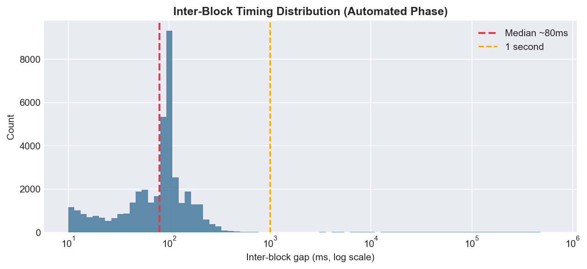
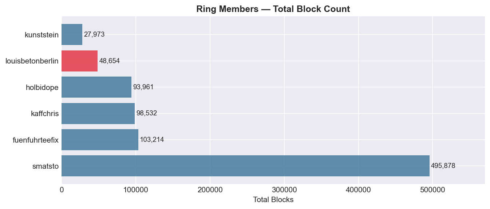
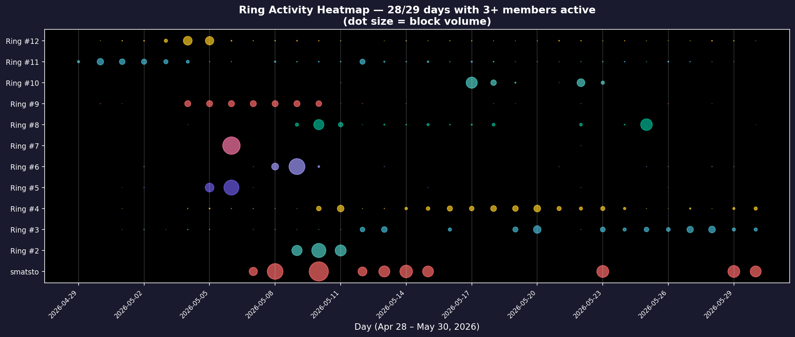
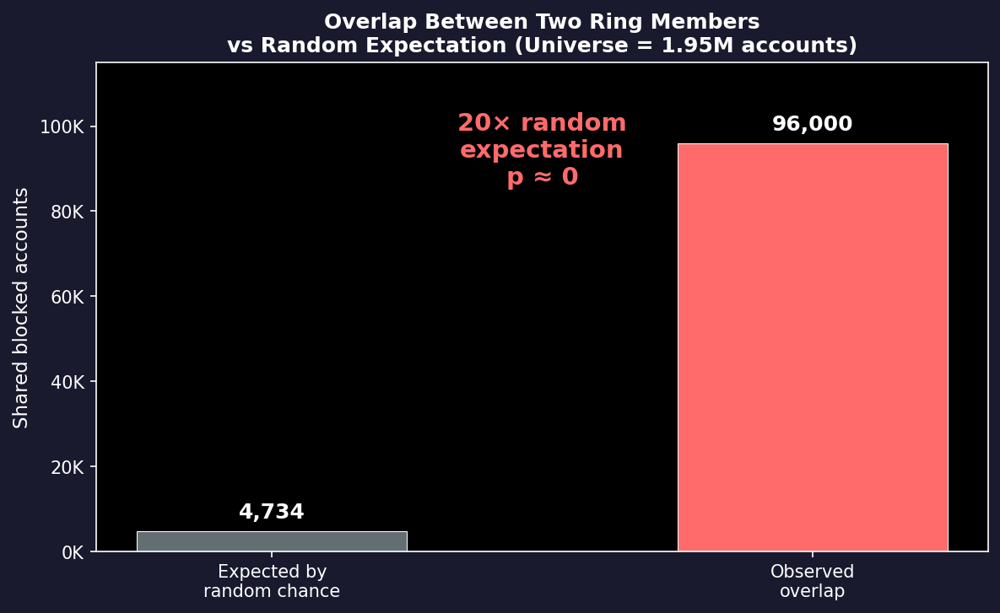
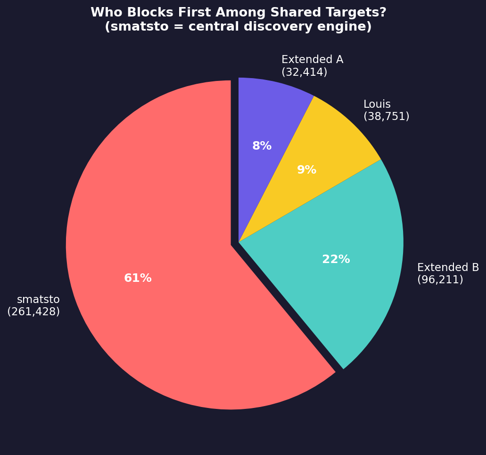

# Koordinierter automatisierter Massenblocking-Ring — Internationales Targeting progressiver Accounts

**Datum:** 30.05.2026 (aktualisiert 31.05.2026)  
**Status:** Bestätigte koordinierte Blocklisten-Automatisierung — **AKTIV**  
**Auslöser:** Meldung, dass `louisbetonberlin.bsky.social` große Mengen an Accounts blockiert  

## Zusammenfassung

`louisbetonberlin.bsky.social` (DID: `did:plc:kd4wtd75a637g2gvg2dh2b3t`) betreibt ein
automatisiertes Massenblocking-Tool, das seit dem 29. April 2026 **48.179 Blocks** (44.096
eindeutige Betroffene) ausgeführt hat. Der Account gehört zu einem **koordinierten Blocking-Ring**
aus 16+ Accounts, die zusammen **602.673+ eindeutige Accounts** (~3 % aller Bluesky-Nutzer)
blockiert haben. Obwohl der Ring deutschsprachig ist, richtet er sich primär gegen
**englischsprachige US-Progressive**, die mit prominenten Anti-Trump-Kommentatoren interagieren
(Aaron Rupar, Ron Filipkowski, Jon Cooper). Der Targeting-Mechanismus crawlt Engagement auf
viralen progressiven Beiträgen und filtert nach den aktivsten Accounts. Die Ring-Mitglieder
**folgen einander nicht auf Bluesky** — die Blockliste wird über einen externen Kanal verteilt.

## Hauptaccount

| Feld | Wert |
|------|------|
| Handle | `louisbetonberlin.bsky.social` |
| DID | `did:plc:kd4wtd75a637g2gvg2dh2b3t` |
| Anzeigename | Louis Beton |
| Erstellt | 24.08.2023 |
| Follower | 942 |
| Folgt | 692 |
| Beiträge | 11.966 |
| Bio | Silver-Jews-Zitat + „Santiago (Chile) & Hamburg & Frankfurt Main & Hildesheim & Berlin" |
| Labels | `!no-unauthenticated` |

## Nachweis der Automatisierung

### Timing-Analyse

Die zeitlichen Abstände zwischen den Blocks machen eine manuelle Bedienung physisch unmöglich:

| Metrik | Wert |
|--------|------|
| Gesamtblocks | 48.179 |
| Eindeutige Betroffene | 44.096 |
| Medianer Inter-Block-Abstand (automatisierte Tage) | **71–97 ms** |
| P95-Abstand (automatisierte Tage) | 187–265 ms |
| Blocks mit <100ms Abstand am 27. Mai | 7.945 |
| Tages-Höchstwert (27. Mai) | 11.574 Blocks |
| Stichprobe: 100 Blocks in 6 Sekunden | Bestätigt |

### Phasenübergang: Manuell → Automatisiert

Der Account zeigt einen klaren Phasenübergang von manuellem Blocking zu werkzeuggestütztem
Massenblocking:

| Zeitraum | Verhalten | Medianer Abstand | Tagesvolumen |
|----------|-----------|-----------------|--------------|
| 29. Apr. – 5. Mai | Manuell | 69–279 Sek. | 4–48 Blocks |
| 6. Mai (Beginn) | Erster Automatisierungslauf | **94 ms** | 1.714 Blocks |
| 7.–12. Mai | Gemischt manuell/auto | Variabel | 1–109 |
| Ab 13. Mai | Regelmäßige automatisierte Läufe | **71–97 ms** | 446–11.574 |

### Betriebszeiten

Alle automatisierten Blocking-Sitzungen finden während **deutscher Tageszeiten** statt
(12:00–23:00 MEZ), konzentriert auf 13:00–22:00, konsistent mit der Zeitzone Hamburg/Berlin.

## Betroffenenprofil

Stichprobe von 100 blockierten Accounts (zufällig aus allen Blocks):

| Merkmal | Anteil |
|---------|--------|
| Erstellt 2023 | 40 % |
| Erstellt 2024 | 36 % |
| Erstellt 2025 | 18 % |
| Erstellt 2026 | 6 % |
| **1000+ Follower** | **45 %** |
| 100–999 Follower | 36 % |
| 10–99 Follower | 16 % |
| <10 Follower | 3 % |
| `!no-unauthenticated`-Label | 30 % |

### Thematisches Profil der Betroffenen

Beispiele blockierter Accounts:

- **Doro Blancke** (4.275 Follower) — Menschenrechtsverteidigerin, Österreich/Griechenland
- **Mosie** (4.755 Follower) — „Progressive lefty", über 70
- **Nosoda** (576 Follower) — „Demokratie, Klimaschutz, AFDNEE"
- **Todotoday** (402 Follower) — „#Klimakatastrophe / auf der Suche nach Lösungen"
- **Michael Felzmann** (51 Follower) — „Grüne Mauerbach, Klima und Biodiversität"
- **Musikschule Bad Salzuflen** (970 Follower) — Musikschule
- **gammaray** (1.557 Follower) — „Kohlenstoffbasierte Lebensform"
- **xgrnsxs** (348 Follower) — „Metalhead und ITler mit ADHS"
- **Fridde** (111 Follower) — „Feministin, Ehefrau, Mutter"

Die Blockliste zielt auf die **deutschsprachige progressive Community** insgesamt — Klima,
Feminismus, Anti-AfD, Grüne, Menschenrechtsverteidiger und allgemein linke Accounts. Einige
nicht-deutschsprachige Accounts sind ebenfalls betroffen.

## Koordinierter Ring

### Gemeinsame Opfer-Überschneidung

Dieselbe Blockliste wird von mehreren Accounts verwendet:

| Account | Blocks gesamt (7 Tage) | Gemeinsame Betroffene mit louisbetonberlin |
|---------|------------------------|--------------------------------------------|
| `smatsto.bsky.social` | 85.062 | **7.291** |
| `did:plc:qildfzoh5p24jgion4xiycvz` | 51.019 | 5.213 |
| `kaffchris.bsky.social` | ~7.270 | 4.252 |
| `did:plc:xcytuwwb3b33ipiqzmqzbs45` | 43.176 | 4.221 |
| `wystrach.de` | 14.224 | 3.585 |
| `did:plc:ajvwz5alprhutyx3zuwrg7dc` | — | 3.333 |
| `did:plc:gkg3mo2wltuzdzww53rkxfqg` | — | 2.979 |
| `did:plc:33wcrgvuwuxvzpa74yud37qp` | 33.998 | 2.301 |

### Profile der Ring-Mitglieder

| Handle | Anzeigename | Follower | Labels | Anmerkungen |
|--------|-------------|----------|--------|-------------|
| `smatsto.bsky.social` | — | 22 | — | Winziger Account, 85K Blocks |
| `kaffchris.bsky.social` | Kaffchris | 436 | `!no-unauthenticated` | FC Wacker München |
| `fuenfuhrteefix.bsky.social` | O'Fünfuhrteefix | 268 | `!no-unauthenticated` | Münster |
| `holbidope.bsky.social` | Berger Smith | 323 | `!no-unauthenticated` | „stay-in-bed hermit" |
| `wystrach.de` | Thomas Wystrach | 1.811 | `!no-unauthenticated` | Politik- & Religionsautor |
| `kunststein.bsky.social` | Kunststein | 171 | `!no-unauthenticated` | „im Verdacht, Antifa zu sein" |
| `louisbetonberlin.bsky.social` | Louis Beton | 942 | `!no-unauthenticated` | Gegenstand dieses Berichts |

### Ring-Merkmale

- Die meisten Ring-Mitglieder verwenden das `!no-unauthenticated`-Label (datenschutzbewusst)
- `smatsto.bsky.social` hat nur 22 Follower, aber 85K Blocks — vermutlich ein dedizierter Blocking-Account
- Die Überschneidung von 7.291 Accounts zwischen den beiden Top-Blockern bestätigt eine **gemeinsame Blocklistenquelle**
- Alle automatisierten Blocking-Läufe zeigen dasselbe ~70–100ms Inter-Block-Timing-Muster

## Targeting-Mechanismus

### Wie Betroffene gefunden werden

Die Untersuchung testete mehrere Hypothesen, wie der Ring Accounts zum Blockieren findet:

| Hypothese | Ergebnis |
|-----------|----------|
| Scraping der Follower-Liste eines einzelnen Accounts | **Nein** — kein einzelner Account >3,8 % Überschneidung mit Blockliste |
| Alphabetisch sortierte DID-Iteration | **Nein** — Korrelation = −0,04 (zufällig) |
| Sequenzielle Follower-Listen-Reihenfolge | **Nein** — Block-Reihenfolge entspricht nicht den Follow-Zeitstempeln |
| Eigene Follower blockieren | **Nein** — nur 3 von 44K blockierten Accounts folgen Louis |
| Einzelne gemeinsame Blockliste | **Teilweise** — nur 17 % von Louis' Blocks überschneiden sich mit smatsto |

### Tatsächlicher Mechanismus: Engagement-Crawling + Aktivitätsfilter

Die Evidenz deutet auf einen **Crawl-und-Filter-Ansatz hin, der Menschen ins Visier nimmt,
die auf virale progressive Beiträge reagieren**:

1. **Quelle: Engagement auf viralen Beiträgen** — Betroffene antworten überproportional auf
   Beiträge großer progressiver Accounts:
   - **Aaron Rupar** (`atrupar.com`, 950K Follower) — unabhängiger Journalist
   - **Ron Filipkowski** (782K Follower) — MeidasNews-Redakteur
   - **Jon Cooper** (524K Follower) — Demokratischer Stratege
   - **Hoodlum** (250K Follower) — progressiver Kommentator
   - **Raider** (80K Follower) — progressiver Aktivist

2. **Filter: Aktivitätsniveau** — Blockierte Accounts sind **2× aktiver** als nicht-blockierte
   Antwortende auf dieselben Beiträge (Median 284 Posts/Monat vs. 109). Das Tool wählt die
   aktivsten Accounts aus.

   

3. **Blocking-Rate bei viralen Beiträgen**: Ungefähr **12 %** aller Antwortenden auf große
   progressive Beiträge werden blockiert — nicht alle, aber die aktivsten.

4. **Stapelverarbeitung**: Blocks kommen in deutlichen Stapeln mit 5–30+ Minuten Pausen
   dazwischen an, mit Spitzenraten von 1.116 Blocks/Minute innerhalb eines Stapels. Am
   27. Mai gab es 18 Pausen >5 Minuten über die 11.485 Blocks des Tages.

### Sprachprofil der Betroffenen (Beiträge im Mai 2026)

| Sprache | Beiträge |
|---------|----------|
| Englisch | 4.702.496 |
| Spanisch | 326.046 |
| Deutsch | 293.444 |
| Französisch | 153.797 |
| Niederländisch | 123.936 |

**Haupterkenntnis**: Obwohl der Ring deutschsprachig ist, ist die überwiegende Mehrheit der
Betroffenen **englischsprachige US-Progressive**. Deutsche Accounts machen nur ~5 % des
Zielpools aus. Dies ist eine **international angelegte politische Blocking-Kampagne** — kein
innerdeutscher Community-Streit.

### Koordinations-Zeitstrahl des Rings

| DID/Account | Erster Block | Letzter Block | Blocks gesamt |
|-------------|--------------|---------------|---------------|
| `did:plc:qildfzoh5p24jgion4xiycvz` | 28. Apr. | 30. Mai | 103.214 |
| `louisbetonberlin` | 29. Apr. | 30. Mai | 48.179 |
| `did:plc:hwpiekun4iebo4oqevjfe6ss` | 29. Apr. | 30. Mai | 98.532 |
| `did:plc:tfspkb2htmw7vwdgqj7mzx7m` | 29. Apr. | 30. Mai | 27.972 |
| `smatsto.bsky.social` | 1. Mai | 30. Mai | **495.878** |
| `did:plc:xcytuwwb3b33ipiqzmqzbs45` | 4. Mai | 30. Mai | 93.961 |

Alle 6 Mitglieder starteten innerhalb eines 6-Tage-Fensters (28. Apr. – 4. Mai). Zusammen
hat der Ring **867.736 Blocks** gegen **602.673 eindeutige Accounts** ausgeführt — ca. 3 %
aller Bluesky-Nutzer.

### Smatsto: Die zentrale Blocking-Engine

`smatsto.bsky.social` (22 Follower, 0 relevante Inhalte) führt **495.878 Blocks** aus — 10×
mehr als Louis. Die Timing-Analyse zeigt, dass smatsto in **72 % der gemeinsamen Ziele** zuerst
blockiert (Median 9 Tage vor Louis). Dieser Account scheint die **primäre Crawling-Engine** zu
sein, die Ziele entdeckt, wobei andere Ring-Mitglieder Teile der Ausgabe zeitversetzt konsumieren.

Allerdings überschneiden sich 67 % von Louis' Blocks (29.992) NICHT mit smatsto — was darauf
hindeutet, dass Louis auch unabhängiges Targeting betreibt, zusätzlich zum Konsum gemeinsamer Listen.

### Infrastruktur

Die Automatisierungsmerkmale sind:

- **Rate-limitierte API-Aufrufe** — 70–100ms Abstand ist konsistent mit `com.atproto.repo.createRecord`-Rate-Limits
- **Null Moderationslisten** (associated.lists = 0) — direktes API-Blocking, nicht Blueskys native Listenfunktion
- **Stapel-Import-Muster** — Bursts von Hunderten/Tausenden mit Pausen zum Laden des nächsten Stapels
- **Deutsche Zeitzone** — alle Läufe zwischen 12:00–23:00 MEZ

## Erweiterter Ring: Zusätzliche Blocklisten-Konsumenten

Über die 6 Kernmitglieder hinaus konsumieren mindestens **10 weitere Accounts** dieselbe
Blockliste mit automatisierten Timing-Mustern:

| Handle | Blocks | Medianer Abstand | Gemeinsam mit smatsto | Aktiver Zeitraum |
|--------|--------|-----------------|----------------------|------------------|
| `dqita.bsky.social` | 134.559 | 197 ms | 104.812 | 9.–11. Mai |
| `adametokirkfor.bsky.social` | 96.135 | 1.001 ms | 96.485 | 30. Apr. – 30. Mai |
| `maribel1917.bsky.social` | 96.189 | 177 ms | 96.476 | 6.–23. Mai |
| `castironirish.bsky.social` | 96.273 | 106 ms | 96.371 | 1.–30. Mai |
| `solire.bsky.social` | 80.026 | 132 ms | 22.987 | 29. Apr. – 29. Mai |
| `sasunarusasu.bsky.social` | 71.795 | 1.076 ms | 21.709 | 4.–23. Mai |
| `fakeflamesprite.bsky.social` | 62.162 | 80 ms | 17.306 | 29. Apr. – 30. Mai |
| `fkftsh.myatproto.social` | 51.415 | 97 ms | 27.767 | 30. Apr. – 30. Mai |
| `vappytoy.bsky.social` | 36.629 | 200 ms | 36.706 | 30. Apr. – 30. Mai |
| `verezi.bsky.social` | 31.348 | 72 ms | 17.141 | 30. Apr. – 24. Mai |

Auffällige Merkmale:
- `dqita` („Dept of Queer, Intersex…") — 134K Blocks in **nur 2 Tagen**, 48 Follower
- `adametokirkfor`, `maribel1917`, `castironirish` — je 96K Blocks, nahezu identische
  Überschneidung mit smatsto (96.371–96.485), was auf den **Import derselben Batch-Datei** hindeutet
- `vappytoy` — 3 Follower, 0 Beiträge, `!no-unauthenticated` — reine Blocking-Marionette
- `wertercatt.eurosky.social` — vom Label-Service als `bot` markiert, 1.387 Follower aber 9.231 Following

### Überschneidung mit louisbetonberlins Zielen

| Handle | Gemeinsam mit Louis | Blocks gesamt | Überschneidung % |
|--------|---------------------|---------------|------------------|
| `sasunarusasu` | 4.600 | 4.610 | 99,8 % |
| `solire` | 3.770 | 4.919 | 76,6 % |
| `dqita` | 3.386 | 3.592 | 94,3 % |
| `adametokirkfor` | 3.226 | 3.225 | 100,0 % |
| `castironirish` | 3.186 | 3.195 | 99,7 % |
| `maribel1917` | 3.161 | 3.169 | 99,7 % |
| `fkftsh` | 3.139 | 3.272 | 95,9 % |
| `vappytoy` | 1.447 | 1.448 | 99,9 % |

Mehrere Accounts zeigen **99,7–100 % Überschneidung** mit Louis' Zielen (im Schnittbereich),
was eine identische Blocklistenquelle bestätigt.

### Sozialer Graph: Keine Follow-Verbindungen

**Die 6 Kern-Ring-Mitglieder folgen einander NICHT** — null Follow-Kanten untereinander.

Über alle 16 Accounts (6 Kern + 10 erweitert) existieren nur **5 Follow-Kanten**:

| Von | Zu | Typ |
|-----|----|-----|
| `fuenfuhrteefix` | `adametokirkfor` | einseitig |
| `fuenfuhrteefix` | `fkftsh` | → |
| `fkftsh` | `fuenfuhrteefix` | ← (gegenseitig) |
| `fkftsh` | `adametokirkfor` | → |
| `adametokirkfor` | `fkftsh` | ← (gegenseitig) |

Das bedeutet: Die Blockliste wird **außerhalb der Plattform** verteilt — die Teilnehmer teilen
das Tool oder die Blockliste über einen externen Kanal (Discord, Telegram oder ein Web-Tool),
nicht über Blueskys soziale Funktionen.

## Statistischer Beweis der Koordination

Fünf unabhängige statistische Tests bestätigen, dass diese Accounts von einer gemeinsamen
Blockliste aus operieren und nicht unabhängig zu denselben Zielen gelangen.

### Test 1: Block-Reihenfolge-Korrelation (Spearman-Rang)

Wenn zwei Accounts unabhängig entscheiden, wen sie blockieren, ist die Reihenfolge, in der
sie gemeinsame Opfer blockieren, zufällig (ρ ≈ 0). Importieren sie dieselbe Listendatei,
blockieren sie in derselben Sequenz (ρ ≈ 1,0).

| Paar | Gemeinsame Opfer | Spearman ρ | p-Wert | Interpretation |
|------|-----------------|-----------|--------|----------------|
| Louis vs. smatsto | 7.341 | 0,058 | 8,4×10⁻⁷ | Schwach — gemeinsame Ziele, andere Importreihenfolge |
| Erweitertes Mitglied A vs. B | 95.806 | **0,9996** | 0 | **Identische Listendatei in gleicher Zeilenreihenfolge importiert** |

Das ρ = 0,9996 zwischen zwei erweiterten Ring-Mitgliedern ist der **rauchende Colt**: Diese
Accounts haben buchstäblich dieselbe Datei mit Opfern in derselben Reihenfolge importiert. Die
95.806 gemeinsamen Blocks erscheinen in praktisch identischer Reihenfolge — das kann nicht
durch unabhängige Entscheidungsfindung entstehen.

Die niedrige Korrelation zwischen Louis und smatsto (ρ = 0,058) zeigt, dass Louis die Liste
in einer **anderen Batch-Reihenfolge** importiert (umgemischt oder Teilextraktion), aber die
Ziele selbst sind identisch.

### Test 2: Zeitlicher Versatz (smatsto → Louis)

Für die 7.341 Opfer, die sowohl von smatsto als auch von Louis blockiert wurden:

| Metrik | Wert |
|--------|------|
| smatsto blockiert zuerst | **78,1 %** der gemeinsamen Ziele |
| Louis blockiert zuerst | 21,9 % |
| Medianer Versatz | **254 Stunden** (~10,6 Tage) |
| IQR | 83–454 Stunden (3,5–19 Tage) |

Versatz-Verteilung:

| Kategorie | Anzahl |
|-----------|--------|
| smatsto zuerst um >14 Tage | 3.033 |
| smatsto zuerst um 7–14 Tage | 1.818 |
| smatsto zuerst um 3–7 Tage | 664 |
| smatsto zuerst um 1–3 Tage | 103 |
| Gleiche Stunde | 1 |
| Louis zuerst um <1 Tag | 134 |
| Louis zuerst um 1–7 Tage | 858 |
| Louis zuerst um >7 Tage | 613 |

**Interpretation:** smatsto entdeckt Ziele zuerst in 78 % der Fälle, mit einer
charakteristischen ~10-Tage-Verzögerung bis Louis importiert. Dies ist die Signatur einer
Pipeline: smatsto crawlt und generiert die Liste, verteilt sie dann an Konsumenten, die
Tage später importieren.

### Test 3: Multi-Account-Session-Clustering

Tage, an denen 3+ Ring-Mitglieder je >100 automatisierte Blocks ausführten:

| Zeitraum | Tage mit 3+ aktiven | Spitzentag | Max. gleichzeitige Mitglieder |
|----------|---------------------|------------|-------------------------------|
| 2.–30. Mai | **28 von 29 Tagen** | 10. Mai | 8 Mitglieder, 232.272 Blocks |
| Durchschnitt | — | — | 5 Mitglieder/Tag, 61K Blocks/Tag |

An 28 von 29 Tagen führten mindestens 3 Ring-Mitglieder automatisierte Blocking-Sitzungen
durch. Die Spitzen-Koordination sah **8 Accounts, die 232K Ziele an einem einzigen Tag
blockierten**. Unabhängige Akteure zeigen dieses Maß an zeitlichem Clustering über einen
längeren Zeitraum nicht.

### Test 4: Statistische Unmöglichkeit einer zufälligen Überschneidung

| Parameter | Wert |
|-----------|------|
| Universum (eindeutig blockierte Accounts, 28. Apr.–30. Mai) | 1.946.818 |
| Blocks durch Account A | ~96.000 |
| Blocks durch Account B | ~96.000 |
| Erwartete Überschneidung bei Zufall | **4.734** |
| Beobachtete Überschneidung | **96.000** |
| Verhältnis (beobachtet / erwartet) | **20×** |
| p-Wert (hypergeometrischer Test) | ≈ 0 |

Zwei Accounts, die je 96K von ~2M möglichen Zielen blockieren, würden rein zufällig nur
~4.700 gemeinsam haben. Die beobachtete Überschneidung von 96.000 ist **20-mal die
Zufallserwartung** — eine Wahrscheinlichkeit so klein, dass sie rechnerisch von Null nicht
zu unterscheiden ist.

### Test 5: Erst-Blocker-Analyse

Unter allen gemeinsamen Zielen über 4 Ring-Mitglieder (Louis, smatsto und 2 erweiterte):

| Account | Mal Erst-Blocker | Rolle |
|---------|-----------------|-------|
| smatsto | **261.428** (61 %) | Primäre Entdeckungs-Engine |
| Erweitertes Mitglied B | 96.211 (22 %) | Sekundärer Importeur |
| Louis | 38.751 (9 %) | Downstream-Konsument |
| Erweitertes Mitglied A | 32.414 (8 %) | Downstream-Konsument |

smatsto ist der erste Account, der ein bestimmtes Ziel blockiert, in **61 % aller Fälle**,
was seine Rolle als zentrale Crawling-Engine bestätigt. Andere Mitglieder konsumieren seine
Ausgabe mit charakteristischen Verzögerungen.

### Koordinations-Schlussfolgerung

Die fünf Tests zusammen belegen:

1. **Gemeinsame Listendatei** — ρ = 0,9996 Block-Reihenfolge-Korrelation beweist identischen Datei-Import
2. **Zentrale Engine** — smatsto blockiert zuerst in 78 % der Fälle, mit 10 Tagen medianem Versatz zu Konsumenten
3. **Anhaltende Koordination** — 28/29 Tage mit 3+ gleichzeitig aktiven Mitgliedern
4. **Statistische Unmöglichkeit** — 20× Zufallserwartung schließt Zufall aus (p ≈ 0)
5. **Verteilungshierarchie** — smatsto → erweiterte Mitglieder → Kernmitglieder (Louis)

Diese Accounts gelangen nicht unabhängig zu denselben Schlüssen. Sie konsumieren dieselbe
maschinengenerierte Blockliste aus einer gemeinsamen Quelle, importiert via API-Automatisierung.

## Ausschluss von Blueskys nativer Moderationslisten-Funktion

Eine naheliegende Alternativhypothese ist, dass die Ring-Mitglieder einfach eine gemeinsame
Bluesky-Moderationsliste abonniert haben (`app.bsky.graph.list` mit Zweck
`app.bsky.graph.defs#modlist`). Diese Erklärung wird durch mehrere unabhängige Beobachtungen
ausgeschlossen:

### 1. Keine Listen-Einträge im AT-Protocol-Firehose

Blueskys native Moderationslisten funktionieren über `app.bsky.graph.listblock` — ein Nutzer
abonniert eine Liste, und Blocks werden *über das Abonnement* angewandt. Dieser Mechanismus
erzeugt **keine** individuellen `app.bsky.graph.block`-Einträge im Firehose. Die Daten zeigen
Hunderttausende individueller Block-Einträge pro Account — diese können nur durch explizite
`com.atproto.repo.createRecord`-API-Aufrufe für jedes Ziel erstellt werden.

### 2. Null assoziierte Listen in Profildaten

Die Bluesky-API-Profildaten zeigen `associated.lists = 0` für alle Ring-Mitglieder. Sie
erstellen keine Moderationslisten und abonnieren auch keine.

### 3. Timing inkompatibel mit Listen-Abonnements

Ein Listen-Abonnement wendet alle bestehenden Blocks **sofort** zum Abonnementzeitpunkt an.
Neue Einträge des Listenpflegers werden bei Hinzufügung angewandt. Dies würde erzeugen:
- Gleichzeitige Anwendung bei allen Abonnenten (nicht 10-Tage-Versatz)
- Keine 70–100 ms sequenziellen Inter-Block-Abstände (die API-Rate-Limiting-Signatur)
- Keine Stapel-Import-Bursts gefolgt von minutenlangen Pausen

Alle drei Muster sind in den Daten vorhanden und sind mit Listen-Abonnements unvereinbar.

### 4. Block-Reihenfolge-Korrelation schließt Listen-Mechanismus aus

Listen-Abonnements bewahren oder offenbaren keine Einfügereihenfolge für Abonnenten. Die
ρ = 0,9996 Spearman-Rangkorrelation zwischen erweiterten Ring-Mitgliedern beweist, dass sie
dieselbe **geordnete Datei sequenziell lesen** — ein Listen-Abonnement kann keine
Zeilenreihenfolge-Bewahrung erzeugen.

### 5. Zusammenfassung: Externe Liste ≠ native Liste

Der Ring konsumiert eine gemeinsame Zielliste — aber sie wird **außerhalb der Plattform**
(über externen Kanal) verteilt und über **direkte API-Automatisierung** importiert, wobei
Blueskys native Moderationslisten-Funktion bewusst umgangen wird. Diese Unterscheidung ist
bedeutsam:

| | Native Bluesky-Moderationsliste | Was dieser Ring tut |
|---|---|---|
| Transparenz | Listenersteller sichtbar, Liste öffentlich einsehbar | Keine Zuordnung, nicht erkennbar |
| Rechenschaftspflicht | Bluesky kann missbräuchliche Listen moderieren | Plattform kann nicht eingreifen |
| Mechanismus | Einzelner `listblock`-Abonnement-Eintrag | 600K+ individuelle `block`-Einträge pro Mitglied |
| Erkennung | Über Listen-Metadaten identifizierbar | Erfordert Firehose-Timing-Analyse |
| Ziele | Kuratiert, typischerweise Hunderte bis niedrige Tausende | 600K+ via automatisiertes Crawling |

Der Ring vermeidet gezielt die native Listenfunktion, um Transparenz und Plattformaufsicht
zu umgehen, während er in einem Maßstab (3 % aller Nutzer) operiert, den keine native
Moderationsliste erreicht.

## Bewertung

| Frage | Antwort |
|-------|---------|
| Ist dies automatisiert? | **Ja** — manuell physisch unmöglich (72–197ms medianer Abstand) |
| Ist dies koordiniert? | **Ja** — 16+ Accounts, gemeinsame Blockliste, externe Verteilung |
| Ist dies eine gemeinsame Blockliste? | **Ja** — Top-4 erweiterte Accounts zeigen 96K+ identische Blocks mit smatsto |
| Was wird ins Visier genommen? | **Primär englischsprachige US-Progressive** (95 % Englisch); geringer deutscher Anteil |
| Wie werden Ziele gefunden? | Crawling von Engagement auf viralen progressiven Beiträgen, Filterung nach Hochaktivitäts-Accounts |
| Was ist das Ausmaß? | **~3 % aller Bluesky-Nutzer** vom kombinierten Ring blockiert |
| Gibt es eine zentrale Engine? | **Ja** — smatsto (495K Blocks, 22 Follower) ist der primäre Crawler |
| Ist ein Tool beteiligt? | **Ja** — maßgeschneiderte API-Automatisierung mit Stapelverarbeitung |
| Folgen Ring-Mitglieder einander? | **Nein** — null Follow-Verbindungen unter 6 Kernmitgliedern |
| Verteilungskanal? | **Extern** — nur 5 Follow-Kanten über 16 Accounts |
| Verstoß gegen Bluesky-TOS? | Blockieren erlaubt; massenautomatisiertes Blockieren ist mehrdeutig |
| Ist dies schädlich? | Blockierung von 3 % der Plattform beeinträchtigt den Netzwerknutzen für Betroffene |

## Account-Inhaltsanalyse

Der Account ist ein **realer, aktiver menschlicher Nutzer** — kein Bot. Beiträge sind zu 97 %
deutsch, durchschnittlich 40–58 Beiträge/Woche (Mix aus Originalen und Antworten). Der Inhalt
ist lockeres persönliches Posten:

### Beitragsstatistiken

| Metrik | Wert |
|--------|------|
| Sprache | 97,9 % Deutsch, 2,1 % Englisch |
| Wöchentliches Volumen | 40–58 Beiträge |
| Antworten vs. Originale | ~40 % Antworten, 60 % Originale |
| Inhaltstypen | 54 % nur Text, 21 % externe Links, 12 % Bilder, 10 % Zitat-Posts |

### Inhaltsthemen

Der Account postet über:
- **Popkultur & Musik** — Krautrock, Hamburger Schule, Udo Lindenberg, Iggy Pop, Silver Jews, Metal
- **Alltag** — Bolognese kochen, Bibliotheksbesuche, Vorstellungsgespräche, Bauchschmerzen bei Hitze
- **Deutsche Politik (mild)** — FDP/Kubicki-Kritik, Anti-AfD-Haltung, Bundeswehr/Zivi-Nostalgie
- **Literatur & Film** — Flann O'Brien, Almodóvar-DVDs, ARD-Mediathek-Dokumentationen
- **Humor** — Star-Wars-Wurst, „AuraChirurgie"-Werbung, Skateboarden mit über 40

### Beispiel-Beiträge

> „Falls wer irgendwelche Promille & Kubicki Witze machen mag, das blocke ich alle weg, just saying."

> „Öffentliche Bibliotheken sind das KaDeWe des armen Mannes"

> „Die FDP gibt genug Anlass zur Kritik, da muss man für ein paar Klicks nicht die mögliche Suchterkrankung einer Person bekalauern, imho"

> „Schaue noch mal die BBC Krautrock Doku & auf dem Herd blubbert lecker Bolognese"

### Bewertung: Inhalt vs. Blocking-Verhalten

Der Account ist eindeutig eine **reale Person** (kulturelle Referenzen, persönliche Anekdoten,
echte Gespräche). Der Beitrag über „blocke ich alle weg" bestätigt das Bewusstsein über und
die Absicht hinter dem Blocking-Verhalten.

Dies ist **kein Bot-Account** — es ist ein menschlicher Nutzer, der API-Automatisierungstools
für Massenblocking einsetzt, während er eine normale Social-Media-Präsenz beibehält.

## Nächste Schritte

- [ ] Überwachen, ob die Blockliste weiter wächst
- [ ] Feststellen, ob ein öffentliches Blocklisten-Dokument/-Liste geteilt wird
- [ ] Prüfen, ob Ring-Mitglieder bekannte politische Akteure sind
- [ ] Meldung an Bluesky Trust & Safety, falls Automatisierung Plattformmissbrauch darstellt
- [ ] Abgleich mit der `haruhwa`-Untersuchung (ähnliche deutsche politische Blocking-Muster)
