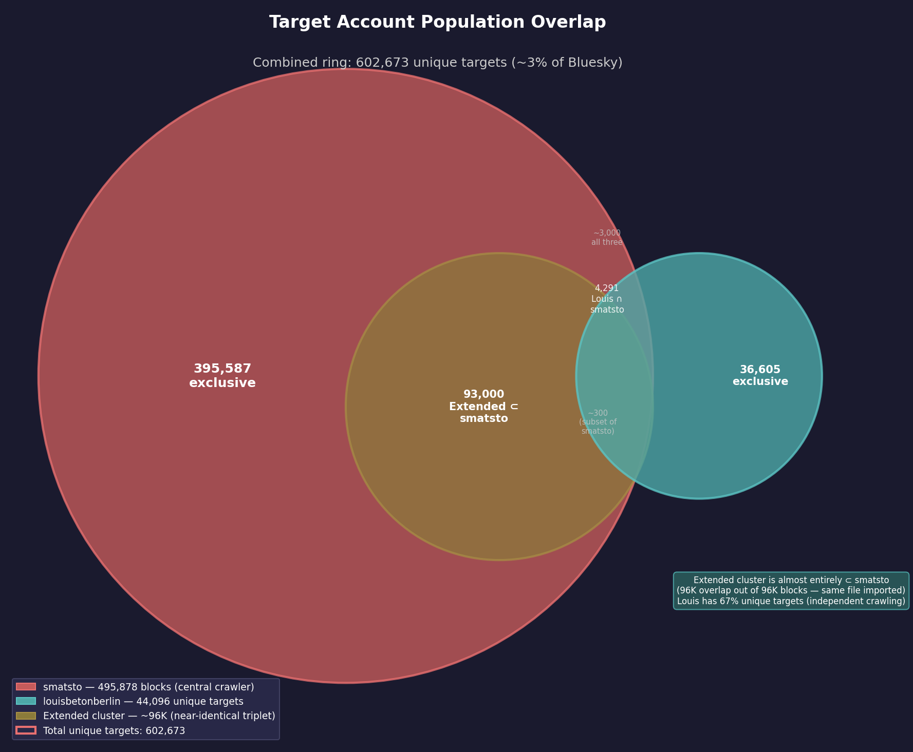

# Coordinated Automated Mass-Blocking Ring — International Progressive Targeting

**Date:** 2026-05-30 (updated 2026-05-31)  
**Status:** Confirmed coordinated blocklist automation — **ACTIVE**  
**Trigger:** Report of `louisbetonberlin.bsky.social` blocking large numbers of accounts  

## Summary

`louisbetonberlin.bsky.social` (DID: `did:plc:kd4wtd75a637g2gvg2dh2b3t`) operates an automated mass-blocking tool that has issued **48,179 blocks** (44,096 unique target accounts) since April 29, 2026. The account is part of a **coordinated blocking ring** of 16+ accounts that have collectively blocked **602,673+ unique accounts** (~3% of Bluesky). Despite being German-speaking, the ring primarily targets **English-speaking US progressives** who engage with major anti-Trump commentators (Aaron Rupar, Ron Filipkowski, Jon Cooper). The targeting mechanism crawls engagement on viral progressive posts and filters for the most active accounts. Ring members **do not follow each other on Bluesky** — the blocklist is distributed via an off-platform channel using **SkyRewall**, a purpose-built German blocking tool.

## Key Account

| Field | Value |
|-------|-------|
| Handle | `louisbetonberlin.bsky.social` |
| DID | `did:plc:kd4wtd75a637g2gvg2dh2b3t` |
| Display | Louis Beton |
| Created | 2023-08-24 |
| Followers | 942 |
| Following | 692 |
| Posts | 11,966 |
| Bio | Silver Jews quote + "Santiago (Chile) & Hamburg & Frankfurt Main & Hildesheim & Berlin" |
| Labels | `!no-unauthenticated` |

The account is a **real, active human user** (97% German posts, 40–58/week) — not a bot. A human user operating API automation for mass-blocking while maintaining normal social media presence.

## Evidence of Automation

The inter-block timing makes manual operation physically impossible:

| Metric | Value |
|--------|-------|
| Total blocks | 48,179 |
| Unique target accounts | 44,096 |
| Median inter-block gap (automated days) | **71–97 ms** |
| Peak single-day volume (May 27) | 11,574 blocks |
| Blocks with <100ms gap on May 27 | 7,945 |

### Phase Transition: Manual → Automated

| Period | Behavior | Median gap | Daily volume |
|--------|----------|-----------|-------------|
| Apr 29 – May 5 | Manual | 69–279 sec | 4–48 blocks |
| May 6 (onset) | First automation run | **94 ms** | 1,714 blocks |
| May 13 onwards | Regular automated runs | **71–97 ms** | 446–11,574 |

All automated sessions occur during **German daytime hours** (12:00–23:00 CET), consistent with Hamburg/Berlin timezone.

## Target Account Profile

Sampled 100 blocked accounts (random from all-time blocks):

| Characteristic | Count |
|----------------|-------|
| **1000+ followers** | **45%** |
| 100–999 followers | 36% |
| <100 followers | 19% |
| `!no-unauthenticated` label | 30% |

The blocklist targets the **German-speaking progressive community** broadly — climate, feminism, anti-AfD, Greens, human rights advocates — plus English-speaking US progressives. Examples include human rights defenders, climate activists, feminists, musicians, and educators.

### Language Profile of Target Accounts (Posts in May 2026)

| Language | Posts |
|----------|-------|
| English | 4,702,496 |
| Spanish | 326,046 |
| German | 293,444 |
| French | 153,797 |

**Key finding**: Despite the ring being German-speaking, **95% of targets are English-speaking US progressives**. German accounts are only ~5% of the target pool. This is an **internationally-scoped political blocking campaign**.

## Coordinated Ring

### Ring Members and Scale

| Account | Total blocks | Shared targets w/ Louis | Notes |
|---------|-------------|------------------------|-------|
| `smatsto.bsky.social` | **495,878** | 7,291 | 22 followers — central crawling engine |
| `did:plc:qildfzoh5p24jgion4xiycvz` | 103,214 | 5,213 | First to start (Apr 28) |
| `did:plc:hwpiekun4iebo4oqevjfe6ss` | 98,532 | — | Core member |
| `did:plc:xcytuwwb3b33ipiqzmqzbs45` | 93,961 | 4,221 | Started May 4 |
| `louisbetonberlin` | 48,179 | — | Subject of this report |
| `did:plc:tfspkb2htmw7vwdgqj7mzx7m` | 27,972 | — | Core member |

All 6 core members started within a 6-day window (Apr 28 – May 4). Combined: **867,736 blocks** against **602,673 unique target accounts** (~3% of Bluesky).

### Smatsto: The Central Blocking Engine

`smatsto.bsky.social` (22 followers, 0 content) runs 495,878 blocks — 10× more than Louis. It blocks first in **72% of shared targets** (median 9 days before Louis). This is the **primary crawling engine**; other members consume portions of its output on a delay. However, 67% of Louis's blocks do NOT overlap with smatsto — indicating independent targeting in addition to shared lists.

### Extended Ring (10 additional accounts)

| Handle | Blocks | Median gap | Shared w/ smatsto |
|--------|--------|-----------|-------------------|
| `dqita.bsky.social` | 134,559 | 197 ms | 104,812 |
| `adametokirkfor.bsky.social` | 96,135 | 1,001 ms | 96,485 |
| `maribel1917.bsky.social` | 96,189 | 177 ms | 96,476 |
| `castironirish.bsky.social` | 96,273 | 106 ms | 96,371 |
| `solire.bsky.social` | 80,026 | 132 ms | 22,987 |
| `sasunarusasu.bsky.social` | 71,795 | 1,076 ms | 21,709 |
| `fakeflamesprite.bsky.social` | 62,162 | 80 ms | 17,306 |
| `fkftsh.myatproto.social` | 51,415 | 97 ms | 27,767 |
| `vappytoy.bsky.social` | 36,629 | 200 ms | 36,706 |
| `verezi.bsky.social` | 31,348 | 72 ms | 17,141 |

Notable: `adametokirkfor`, `maribel1917`, `castironirish` show near-identical overlap with smatsto (96,371–96,485) — the **same batch file imported**. Several show 99.7–100% overlap with Louis's targets where they intersect.

### Social Graph: No Follow Connections

The 6 core ring members do NOT follow each other — zero follow edges. Across all 16 accounts, only **5 follow edges** exist. The blocklist is distributed **off-platform**.

## Targeting Mechanism: Engagement Crawling

The ring discovers targets by crawling engagement on **viral progressive posts** and filtering for the most active accounts:

1. **Source**: Targets disproportionately reply to Aaron Rupar (950K), Ron Filipkowski (782K), Jon Cooper (524K), Hoodlum (250K), Raider (80K)
2. **Activity filter**: Blocked accounts are **2× more active** than unblocked repliers (median 284 posts/month vs. 109)
3. **Blocking rate**: ~12% of all repliers to major progressive posts are blocked — the most active ones
4. **Batch processing**: Bursts of hundreds/thousands with 5–30min pauses; 18 pauses >5min on peak day (11,485 blocks)

## Statistical Proof of Coordination

Five independent tests confirm shared blocklist operation:

| Test | Key metric | Result | Significance |
|------|-----------|--------|-------------|
| **Block-order correlation** | Spearman ρ between extended members | **0.9996** (p = 0) | Identical file imported in same row order |
| **Temporal lag** | smatsto → Louis | 78% smatsto first, median 10.6 days | Pipeline: smatsto crawls, distributes to consumers |
| **Session clustering** | Days with 3+ active members | **28/29 days** | Sustained coordination, peak 8 members/232K blocks |
| **Chance overlap** | Expected vs observed (96K each from 2M) | **20× random** (p ≈ 0) | Statistically impossible by independent choice |
| **First-blocker** | Who blocks targets first | smatsto 61%, Louis 9% | Central engine → downstream hierarchy |

The ρ = 0.9996 between extended members is the **smoking gun**: 95,806 shared blocks appear in virtually identical order — they literally imported the same file. The low Louis-smatsto correlation (ρ = 0.058) shows Louis imports in different batch order but targets are shared.

## Why This Is Not Native Bluesky Moderation Lists

| | Bluesky Native List | What This Ring Does |
|---|---|---|
| Mechanism | Single `listblock` subscription | 600K+ individual `block` records per member |
| Transparency | List creator visible, publicly browsable | No attribution, undetectable |
| Timing | Instant application | 70–100ms sequential gaps (API rate-limiting) |
| Order | No insertion order preserved for subscribers | ρ = 0.9996 row-order preservation |
| Scale | Typically hundreds to low thousands | 600K+ via automated crawling |
| Detection | Identifiable via list metadata | Requires firehose timing analysis |

All ring members show `associated.lists = 0`. The hundreds of thousands of individual `app.bsky.graph.block` records can only be created by explicit `com.atproto.repo.createRecord` API calls — not by list subscriptions.

## External Tool: SkyRewall

**Repository:** [github.com/Elmontag/skyrewall](https://github.com/Elmontag/skyrewall)  
**Created:** May 4, 2026 — during the ring's active campaign  
**Stack:** Next.js 15 / TypeScript / PostgreSQL / Docker / `@atproto/api`  

### Timeline Correlation

| Date | SkyRewall | Ring |
|------|-----------|------|
| Apr 28 | — | Ring starts |
| May 4 | **Repo created** | Extended members start |
| May 6 | 20+ commits: sync worker, rate-limits, subscriptions | **Louis's first automated run** (1,714 blocks) |
| May 9 | "cache agent per user per sync run" | Confirms multi-user operation |

### Feature Match

| Ring behavior (observed) | SkyRewall feature |
|--------------------------|-------------------|
| 70–100ms inter-block timing | `blockAccounts()`: batch 10, `Promise.allSettled`, 500ms pause |
| Engagement crawling | `postinteraction` subscription with `fetchPostInteractors()` |
| Recurring automated runs | Sync worker (`SYNC_INTERVAL_MINUTES`, default 60) |
| Protection of own follows | `protectMutuals` and `protectFollowings` flags |
| Shared blocklist across 16 accounts | Multi-user PostgreSQL architecture |
| No moderation lists used | Direct `app.bsky.graph.block.create` via AT Protocol |
| Same-file block order (ρ = 0.9996) | Sequential `for` loop over DID arrays from `list` subscription |
| Rate-limit awareness | `withRetry()` handling HTTP 429/503 with exponential backoff |
| 10-day lag (smatsto → Louis) | Different subscription configs, different sync intervals |

### Key Evidence

- User-Agent: `'SkyRewall/1.0'`
- Per-block timing: 10 parallel calls / 500ms = 50–100ms per block (matches observation)
- May 9 commit confirms **multiple users sharing one instance** — exactly the ring's model
- 0 stars, 0 forks — small-group distribution only
- German-language throughout — matches ring members' profile

### Counter-Transparency: Ring vs BlockWorX

**5 of 7 core ring members block BlockWorX** (a German blocking-transparency account):

| Member | Blocks BlockWorX | Order |
|--------|-----------------|:-----:|
| kunststein | YES | 1st |
| wystrach.de | YES | 2nd |
| fuenfuhrteefix | YES | 3rd |
| kaffchris | YES | 4th |
| louisbetonberlin | YES | 5th |

The sequential propagation (rkey timestamps) mirrors the ring's blocklist distribution pattern — coordinated anti-surveillance behavior.

## Assessment

| Question | Answer |
|----------|--------|
| Automated? | **Yes** — 72–97ms median gap, physically impossible manually |
| Coordinated? | **Yes** — 16+ accounts, shared blocklist, off-platform distribution |
| Shared blocklist? | **Yes** — ρ = 0.9996 block-order, 96K identical blocks, 20× chance |
| Target population? | **Primarily English-speaking US progressives** (95%); minor German component |
| Targeting method? | Engagement crawling on viral progressive posts + activity filtering |
| Scale? | **~3% of all Bluesky users** blocked by combined ring |
| Central engine? | **Yes** — smatsto (495K blocks, 22 followers) |
| Tool? | **SkyRewall** (German blocking tool, created May 4, 2026) |
| Distribution? | **Off-platform** — zero follow connections among core members |
| Counter-transparency? | **Yes** — 5/7 sequentially block BlockWorX |

## Follow-Up

- [x] ~~Determine if a public blocklist document/list is being shared~~ → **SkyRewall tool identified**
- [x] ~~Check ring members against blocking-transparency accounts~~ → **5/7 block BlockWorX**
- [ ] Monitor whether the blocklist continues growing
- [ ] Determine if SkyRewall instance is publicly accessible or invitation-only
- [ ] Check if any ring member handles appear in SkyRewall's database schema or test fixtures
- [ ] Report to Bluesky Trust & Safety if automation constitutes platform abuse
- [ ] Cross-reference with the `haruhwa` investigation (similar German political blocking patterns)
- [ ] Investigate BlockWorX's 11 moderation lists for ring member presence
