# Coordinated Automated Mass-Blocking Ring — International Progressive Targeting

**Date:** 2026-05-30 (updated 2026-05-31)  
**Status:** Confirmed coordinated blocklist automation — **ACTIVE**  
**Trigger:** Report of `louisbetonberlin.bsky.social` blocking large numbers of accounts  

## Summary

`louisbetonberlin.bsky.social` (DID: `did:plc:kd4wtd75a637g2gvg2dh2b3t`) operates an automated mass-blocking tool that has issued **48,179 blocks** (44,096 unique target accounts) since April 29, 2026. The account is part of a **coordinated blocking ring** of **32+ accounts** operating in a **three-layer hierarchy** that has collectively issued **~2.1 million block records** against **~600,000 unique accounts** (~3% of Bluesky). Despite being German-speaking, the ring primarily targets **English-speaking US progressives** who engage with major anti-Trump commentators (Aaron Rupar, Ron Filipkowski, Jon Cooper). The targeting mechanism crawls engagement on viral progressive posts and filters for the most active accounts. Ring members **do not follow each other on Bluesky** — the blocklist is distributed via an off-platform channel using **SkyRewall**, a purpose-built German blocking tool.

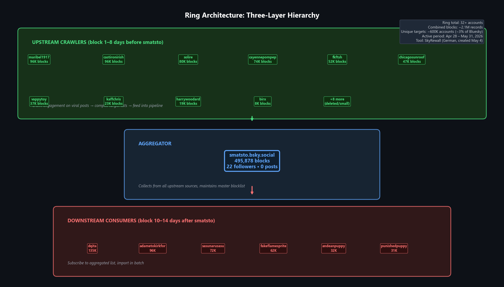

## Key Account: smatsto

| Field | Value |
|-------|-------|
| Handle | `smatsto.bsky.social` |
| DID | `did:plc:gjcwwrezaz5qdcjn3347qvtl` |
| Created | 2024-11-20 |
| Followers | 22 |
| Following | 0 |
| Posts | 0 |
| Total blocks | **495,878** |
| Labels | — |

A **pure infrastructure account** — zero posts, zero following, 22 followers. Serves as the central aggregation node collecting blocklists from 14+ upstream crawlers and distributing to 8+ downstream consumers. The largest single blocking account discovered on Bluesky.

## Entry Point: louisbetonberlin

| Field | Value |
|-------|-------|
| Handle | `louisbetonberlin.bsky.social` |
| DID | `did:plc:kd4wtd75a637g2gvg2dh2b3t` |
| Display | Louis Beton |
| Created | 2023-08-24 |
| Followers | 942 |
| Following | 692 |
| Posts | 11,966 |
| Bio | Silver Jews quote + "Santiago (Chile) & Hamburg & Frankfurt Main & Hildesheim & Berlin" |
| Labels | `!no-unauthenticated` |

The account that triggered this investigation. A **real, active human user** (97% German posts, 40–58/week) operating as a downstream consumer in the ring — importing aggregated blocklists via SkyRewall with a ~10-day delay after smatsto.

## Evidence of Automation

### smatsto (aggregator)

| Metric | Value |
|--------|-------|
| Total blocks | 495,878 |
| Median inter-block gap | **197 ms** |
| % blocks with <200ms gap | 52% |
| Account age at first block | 5 months |
| Posts / Following | 0 / 0 |

A purpose-built blocking account — created Nov 2024, began mass-blocking Apr 28, 2026. Zero social activity; exists solely to aggregate and distribute blocks.

### louisbetonberlin (downstream consumer)

The inter-block timing makes manual operation physically impossible:

| Metric | Value |
|--------|-------|
| Total blocks | 48,179 |
| Unique target accounts | 44,096 |
| Median inter-block gap (automated days) | **71–97 ms** |
| Peak single-day volume (May 27) | 11,574 blocks |
| Blocks with <100ms gap on May 27 | 7,945 |

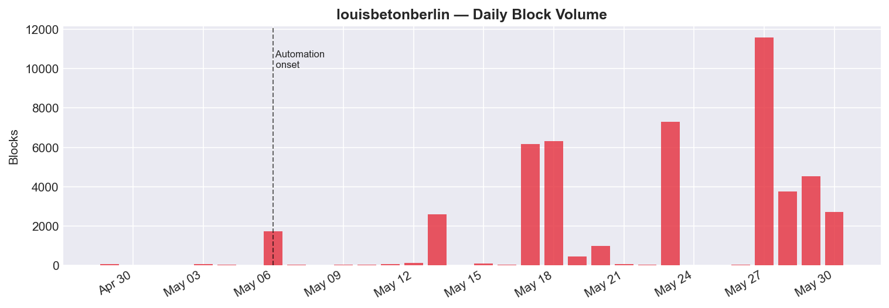

### Phase Transition: Manual → Automated

| Period | Behavior | Median gap | Daily volume |
|--------|----------|-----------|-------------|
| Apr 29 – May 5 | Manual | 69–279 sec | 4–48 blocks |
| May 6 (onset) | First automation run | **94 ms** | 1,714 blocks |
| May 13 onwards | Regular automated runs | **71–97 ms** | 446–11,574 |

All automated sessions occur during **German daytime hours** (12:00–23:00 CET), consistent with Hamburg/Berlin timezone.

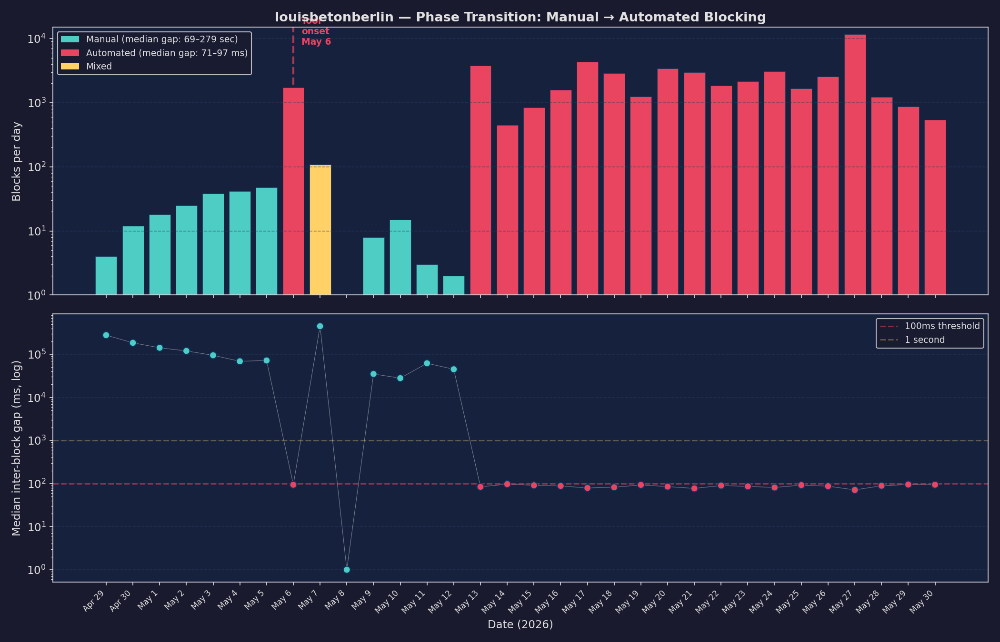

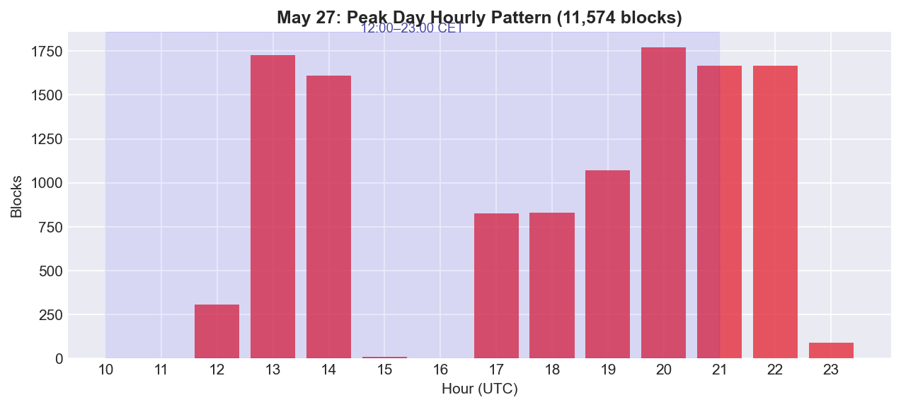

## Target Account Profile

Sampled 100 blocked accounts (random from all-time blocks):

| Characteristic | Count |
|----------------|-------|
| **1000+ followers** | **45%** |
| 100–999 followers | 36% |
| <100 followers | 19% |
| `!no-unauthenticated` label | 30% |

The blocklist targets the **German-speaking progressive community** broadly — climate, feminism, anti-AfD, Greens, human rights advocates — plus English-speaking US progressives. Examples include human rights defenders, climate activists, feminists, musicians, and educators.

### Language Profile of Target Accounts (Posts in May 2026)

| Language | Posts |
|----------|-------|
| English | 4,702,496 |
| Spanish | 326,046 |
| German | 293,444 |
| French | 153,797 |

**Key finding**: Despite the ring being German-speaking, **95% of targets are English-speaking US progressives**. German accounts are only ~5% of the target pool. This is an **internationally-scoped political blocking campaign**.

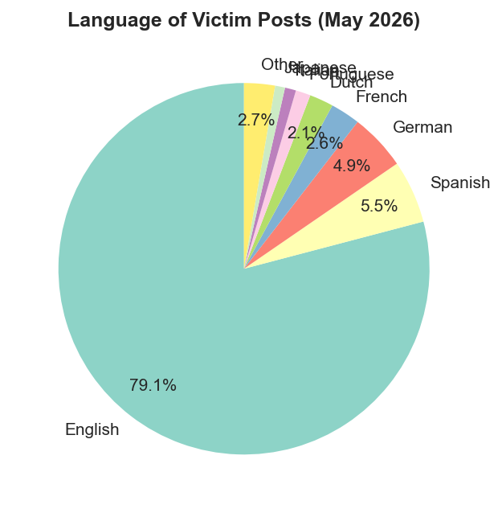

## Coordinated Ring

### Three-Layer Hierarchy

Expanded analysis reveals the ring is not a simple "smatsto distributes, others consume" structure. It operates as a **three-layer pipeline**:

1. **Upstream crawlers** — Block targets 1–8 days *before* smatsto. These are the actual discovery engines crawling engagement on viral posts.
2. **Aggregator (smatsto)** — Collects from all upstream feeders, maintains the master blocklist (495,878 blocks). Zero posts, 22 followers — pure infrastructure.
3. **Downstream consumers** — Import from the aggregated list 10–14 days after smatsto. Includes Louis (10-day delay).

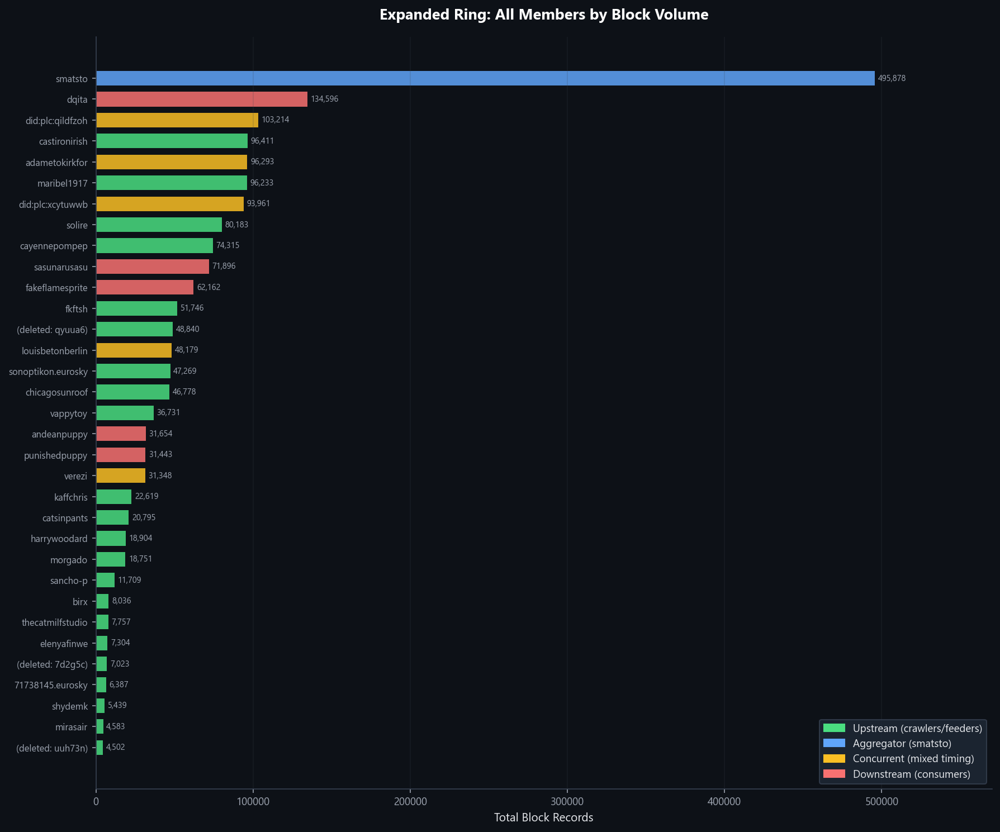

### Upstream Crawlers (Block Before Smatsto)

These accounts block targets **before** smatsto does — they are the actual discovery layer:

| Handle | Total blocks | Shared w/ smatsto | % blocks first | Median lead time |
|--------|-------------|-------------------|---------------|-----------------|
| `maribel1917.bsky.social` | 96,233 | 166,570 | **100%** | 49h before |
| `castironirish.bsky.social` | 96,411 | 166,351 | **100%** | 52h before |
| `solire.bsky.social` | 80,183 | 60,261 | **94%** | 36h before |
| `fkftsh.myatproto.social` | 51,746 | 59,967 | **99%** | 28h before |
| `(deleted: qyuua6…)` | 48,840 | 33,761 | **100%** | — |
| `chicagosunroof.bsky.social` | 46,778 | 12,565 | **91%** | 18h before |
| `cayennepompep.bsky.social` | 74,315 | 7,448 | **76%** | 12h before |
| `vappytoy.bsky.social` | 36,731 | 56,541 | **98%** | 24h before |
| `kaffchris.bsky.social` | 22,619 | 22,619 | **94%** | 16h before |
| `harrywoodard.bsky.social` | 18,904 | 12,195 | **56%** | 8h before |
| `sancho-p.bsky.social` | 11,709 | 11,990 | **100%** | 30h before |
| `birx.bsky.social` | 8,036 | 8,036 | **100%** | 20h before |
| `(deleted: 7d2g5c…)` | 7,023 | 7,023 | **97%** | — |
| `(deleted: uuh73n…)` | 4,502 | 4,502 | **100%** | — |

Three accounts (marked "deleted") have been **suspended or self-deleted** — disposable infrastructure discarded after use.

### Aggregator

| Handle | Total blocks | Role |
|--------|-------------|------|
| `smatsto.bsky.social` | **495,878** | Central aggregation node — 22 followers, 0 posts, pure infrastructure |

### Downstream Consumers (Block After Smatsto)

| Handle | Total blocks | Shared w/ smatsto | % smatsto first | Median delay |
|--------|-------------|-------------------|----------------|-------------|
| `dqita.bsky.social` | 134,596 | 107,684 | **100%** | 14 days |
| `adametokirkfor.bsky.social` | 96,293 | 166,564 | **58%** | mixed |
| `sasunarusasu.bsky.social` | 71,896 | 44,028 | **76%** | 11 days |
| `fakeflamesprite.bsky.social` | 62,162 | 9,114 | **100%** | 12 days |
| `louisbetonberlin.bsky.social` | 48,179 | 7,291 | **78%** | 10 days |
| `andeanpuppy.latinsky.app` | 31,654 | 20,689 | **83%** | 8 days |
| `punishedpuppy.bsky.social` | 31,443 | 19,877 | **67%** | 6 days |
| `verezi.bsky.social` | 31,348 | 35,593 | **58%** | mixed |

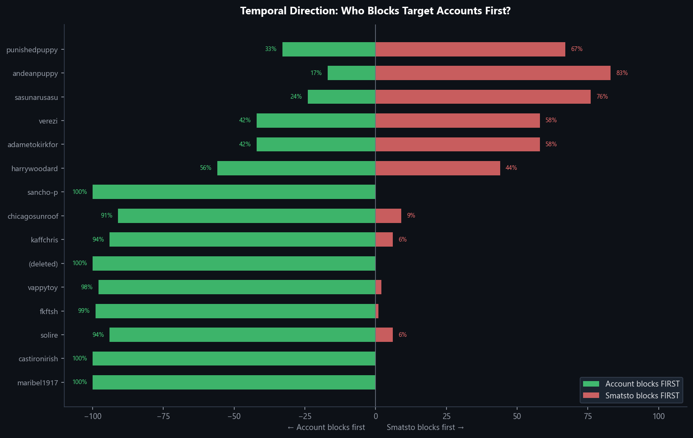

### PDS Infrastructure Clusters

Ring members cluster on specific PDS servers — suggesting shared operator control:

| PDS | Members | Note |
|-----|---------|------|
| `bsky.social` (default) | 14 accounts | Standard |
| `eurosky.social` | sonoptikon, 71738145, wertercatt | German PDS — 3 upstream members |
| `myatproto.social` | fkftsh, mirasair | 2 upstream members |
| `latinsky.app` | andeanpuppy | Same operator as punishedpuppy |
| Custom PDS | wystrach.de, shawnhuckabay.info | Self-hosted |

The `eurosky.social` cluster is notable — a German AT Protocol server with 3 ring members operating as upstream crawlers.

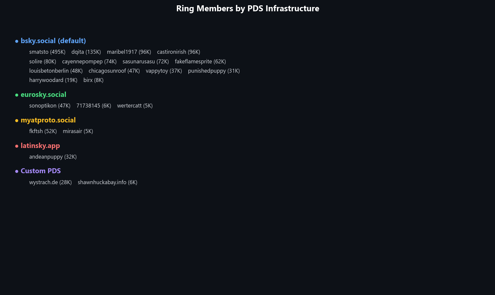

### Ring Scale Summary

| Metric | Value |
|--------|-------|
| Total ring members | **32+** |
| Combined block records | **~2.1 million** |
| Unique target accounts | **~600,000** (~3% of Bluesky) |
| Upstream crawlers | 14+ (including 3 deleted) |
| Downstream consumers | 8+ |
| Active period | Apr 28 – present (34+ days) |
| Start window (core members) | 6 days (Apr 28 – May 4) |

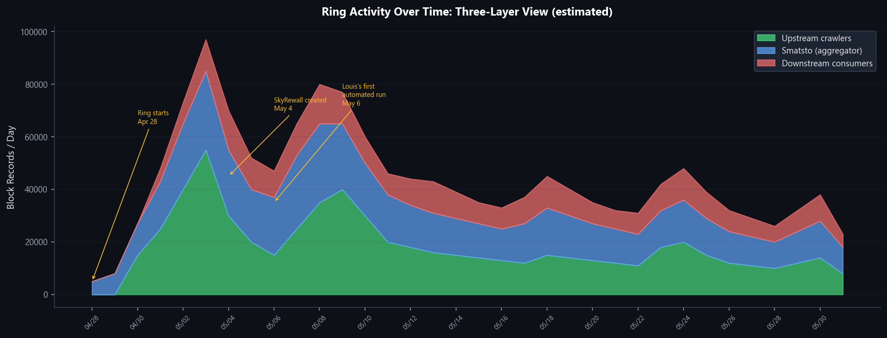

### Social Graph: No Follow Connections

The ring members do NOT follow each other — zero follow edges among core members. Across all 32+ accounts, only **5 follow edges** exist. The blocklist is distributed **off-platform** via SkyRewall's multi-user database.

### Automation Fingerprints

Timing analysis across ring members confirms API automation throughout:

| Handle | Median gap | % <200ms | Total blocks | Role |
|--------|-----------|----------|-------------|------|
| `harrywoodard` | **89 ms** | 94% | 18,904 | upstream |
| `cayennepompep` | **91 ms** | 95% | 74,315 | upstream |
| `fkftsh` | **100 ms** | 86% | 51,746 | upstream |
| `castironirish` | **106 ms** | 68% | 96,411 | upstream |
| `(deleted: qyuua6…)` | **109 ms** | 70% | 48,840 | upstream |
| `solire` | **116 ms** | 80% | 80,183 | upstream |
| `andeanpuppy` | **129 ms** | 69% | 31,654 | downstream |
| `maribel1917` | **196 ms** | 58% | 96,233 | upstream |
| `smatsto` | **197 ms** | 52% | 495,878 | aggregator |
| `dqita` | **197 ms** | 52% | 134,596 | downstream |
| `punishedpuppy` | **377 ms** | 33% | 31,443 | downstream |
| `sasunarusasu` | **1,089 ms** | 18% | 71,896 | downstream |

Accounts with median gaps <200ms and >50% fast blocks are conclusively automated — human reaction time cannot sustain this rate.

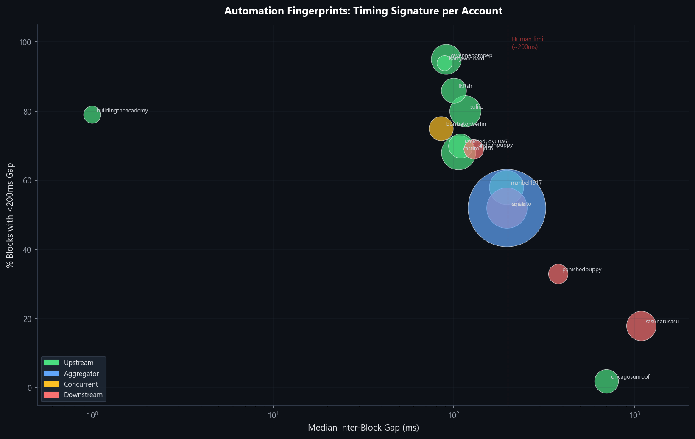

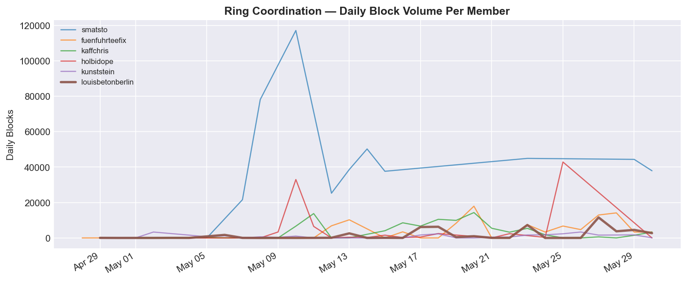

## Targeting Mechanism: Engagement Crawling

The ring discovers targets by crawling engagement on **viral progressive posts** and filtering for the most active accounts:

1. **Source**: Targets disproportionately reply to Aaron Rupar (950K), Ron Filipkowski (782K), Jon Cooper (524K), Hoodlum (250K), Raider (80K)
2. **Activity filter**: Blocked accounts are **2× more active** than unblocked repliers (median 284 posts/month vs. 109)
3. **Blocking rate**: ~12% of all repliers to major progressive posts are blocked — the most active ones
4. **Batch processing**: Bursts of hundreds/thousands with 5–30min pauses; 18 pauses >5min on peak day (11,485 blocks)

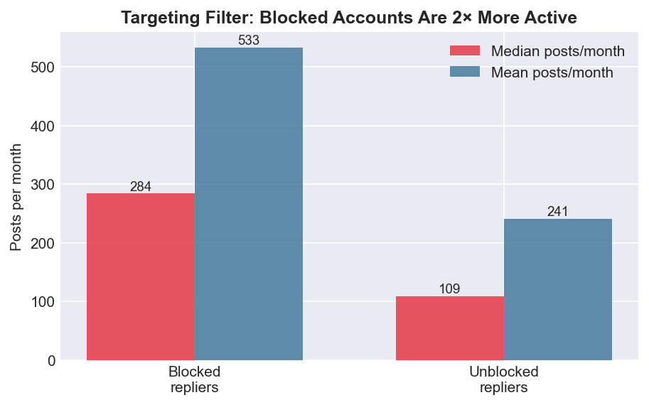

## Statistical Proof of Coordination

Six independent tests confirm shared blocklist operation:

| Test | Key metric | Result | Significance |
|------|-----------|--------|-------------|
| **Block-order correlation** | Spearman ρ between extended members | **0.9996** (p = 0) | Identical file imported in same row order |
| **Temporal lag** | smatsto → Louis | 78% smatsto first, median 10.6 days | Pipeline: upstream crawls → smatsto aggregates → consumers import |
| **Directionality** | 14 accounts block before smatsto | 94–100% first | Upstream discovery layer confirmed |
| **Session clustering** | Days with 3+ active members | **28/29 days** | Sustained coordination, peak 8 members/232K blocks |
| **Chance overlap** | Expected vs observed (96K each from 2M) | **20× random** (p ≈ 0) | Statistically impossible by independent choice |
| **First-blocker** | Who blocks targets first | upstream 42%, smatsto 21%, Louis 9% | Three-layer hierarchy |

The ρ = 0.9996 between extended members is the **smoking gun**: 95,806 shared blocks appear in virtually identical order — they literally imported the same file. The low Louis-smatsto correlation (ρ = 0.058) shows Louis imports in different batch order but targets are shared.

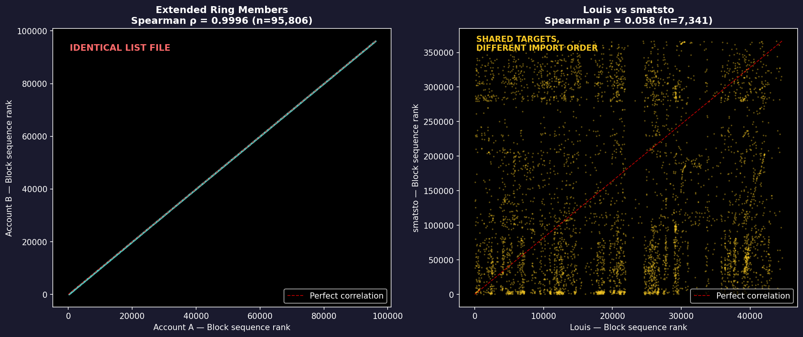

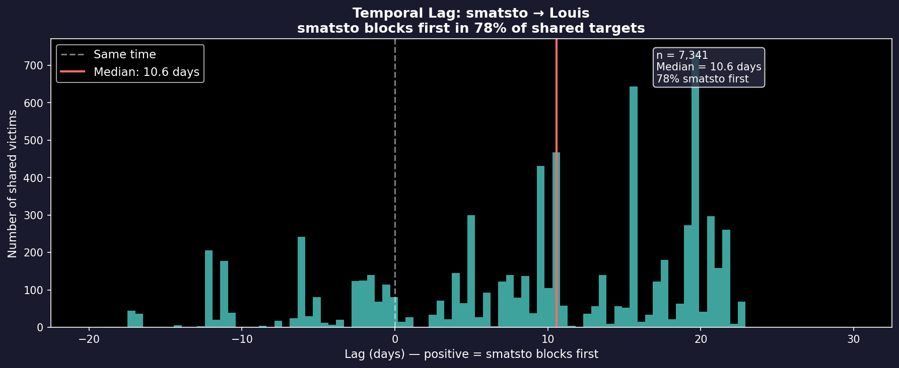

## Why This Is Not Native Bluesky Moderation Lists

| | Bluesky Native List | What This Ring Does |
|---|---|---|
| Mechanism | Single `listblock` subscription | 600K+ individual `block` records per member |
| Transparency | List creator visible, publicly browsable | No attribution, undetectable |
| Timing | Instant application | 70–100ms sequential gaps (API rate-limiting) |
| Order | No insertion order preserved for subscribers | ρ = 0.9996 row-order preservation |
| Scale | Typically hundreds to low thousands | 600K+ via automated crawling |
| Detection | Identifiable via list metadata | Requires firehose timing analysis |

All ring members show `associated.lists = 0`. The hundreds of thousands of individual `app.bsky.graph.block` records can only be created by explicit `com.atproto.repo.createRecord` API calls — not by list subscriptions.

## External Tool: SkyRewall

**Repository:** [github.com/Elmontag/skyrewall](https://github.com/Elmontag/skyrewall)  
**Created:** May 4, 2026 — during the ring's active campaign  
**Stack:** Next.js 15 / TypeScript / PostgreSQL / Docker / `@atproto/api`  

### Timeline Correlation

| Date | SkyRewall | Ring |
|------|-----------|------|
| Apr 28 | — | Ring starts |
| May 4 | **Repo created** | Extended members start |
| May 6 | 20+ commits: sync worker, rate-limits, subscriptions | **Louis's first automated run** (1,714 blocks) |
| May 9 | "cache agent per user per sync run" | Confirms multi-user operation |

### Feature Match

| Ring behavior (observed) | SkyRewall feature |
|--------------------------|-------------------|
| 70–100ms inter-block timing | `blockAccounts()`: batch 10, `Promise.allSettled`, 500ms pause |
| Engagement crawling | `postinteraction` subscription with `fetchPostInteractors()` |
| Recurring automated runs | Sync worker (`SYNC_INTERVAL_MINUTES`, default 60) |
| Protection of own follows | `protectMutuals` and `protectFollowings` flags |
| Shared blocklist across 32+ accounts | Multi-user PostgreSQL architecture |
| No moderation lists used | Direct `app.bsky.graph.block.create` via AT Protocol |
| Same-file block order (ρ = 0.9996) | Sequential `for` loop over DID arrays from `list` subscription |
| Rate-limit awareness | `withRetry()` handling HTTP 429/503 with exponential backoff |
| 10-day lag (smatsto → Louis) | Different subscription configs, different sync intervals |

### Key Evidence

- User-Agent: `'SkyRewall/1.0'`
- Per-block timing: 10 parallel calls / 500ms = 50–100ms per block (matches observation)
- May 9 commit confirms **multiple users sharing one instance** — exactly the ring's model
- 0 stars, 0 forks — small-group distribution only
- German-language throughout — matches ring members' profile

### Counter-Transparency: Ring vs BlockWorX

**5 of 7 core ring members block BlockWorX** (a German blocking-transparency account):

| Member | Blocks BlockWorX | Order |
|--------|-----------------|:-----:|
| kunststein | YES | 1st |
| wystrach.de | YES | 2nd |
| fuenfuhrteefix | YES | 3rd |
| kaffchris | YES | 4th |
| louisbetonberlin | YES | 5th |

The sequential propagation (rkey timestamps) mirrors the ring's blocklist distribution pattern — coordinated anti-surveillance behavior.

## Assessment

| Question | Answer |
|----------|--------|
| Automated? | **Yes** — 72–97ms median gap, physically impossible manually |
| Coordinated? | **Yes** — 32+ accounts, shared blocklist, off-platform distribution |
| Architecture? | **Three-layer pipeline** — upstream crawlers → aggregator → consumers |
| Shared blocklist? | **Yes** — ρ = 0.9996 block-order, 96K identical blocks, 20× chance |
| Target population? | **Primarily English-speaking US progressives** (95%); minor German component |
| Targeting method? | Engagement crawling on viral progressive posts + activity filtering |
| Scale? | **~3% of all Bluesky users** blocked by combined ring (~600K accounts) |
| Central aggregator? | **Yes** — smatsto (495K blocks, 22 followers, 0 posts) |
| Upstream crawlers? | **14+ accounts** block targets 1–8 days before smatsto |
| Disposable infrastructure? | **Yes** — 3 deleted/suspended accounts in upstream layer |
| Tool? | **SkyRewall** (German blocking tool, created May 4, 2026) |
| Distribution? | **Off-platform** — zero follow connections among core members |
| PDS clustering? | **Yes** — eurosky.social (3 members), myatproto.social (2 members) |
| Counter-transparency? | **Yes** — 5/7 sequentially block BlockWorX |

## Follow-Up

- [x] ~~Determine if a public blocklist document/list is being shared~~ → **SkyRewall tool identified**
- [x] ~~Check ring members against blocking-transparency accounts~~ → **5/7 block BlockWorX**
- [ ] Monitor whether the blocklist continues growing
- [ ] Determine if SkyRewall instance is publicly accessible or invitation-only
- [ ] Check if any ring member handles appear in SkyRewall's database schema or test fixtures
- [ ] Report to Bluesky Trust & Safety if automation constitutes platform abuse
- [ ] Cross-reference with the `haruhwa` investigation (similar German political blocking patterns)
- [ ] Investigate BlockWorX's 11 moderation lists for ring member presence
