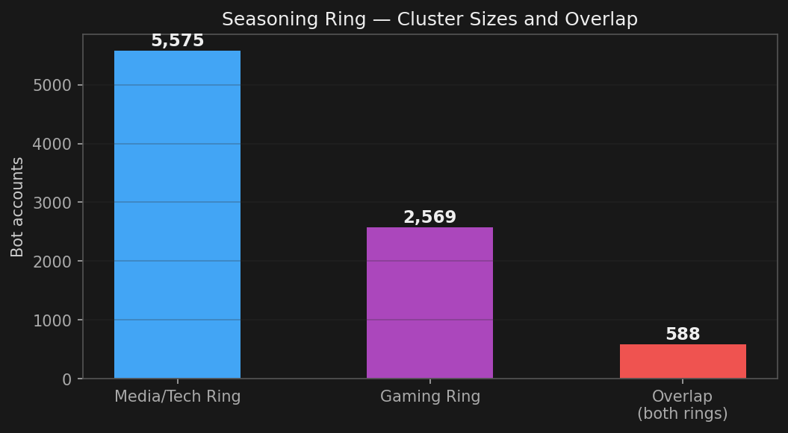
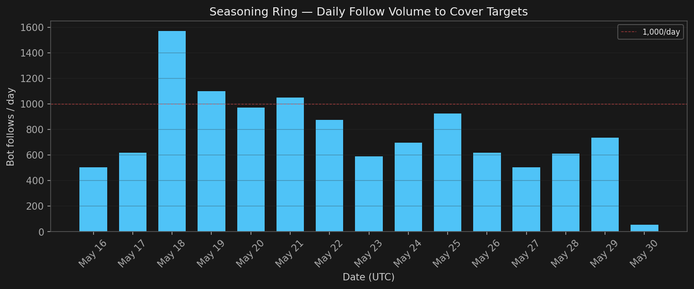
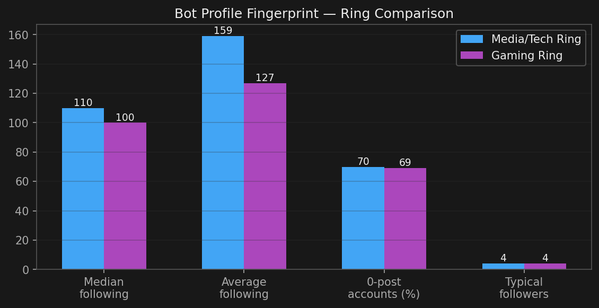
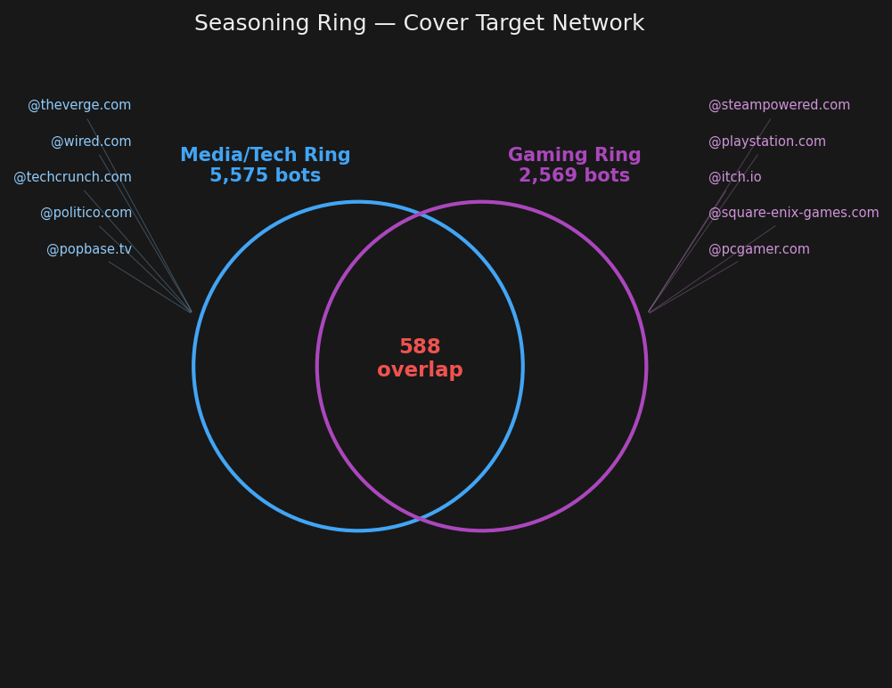

# Account Seasoning Farm: Media/Tech + Gaming Follow Rings

**Investigation Date:** 2026-05-30  
**Methodology:** Co-follow network analysis via KQL on Bluesky Firehose data; profile resolution via `app.bsky.actor.getProfile`  
**Status:** **ACTIVE** — new bot accounts being created and deployed daily  
**Scope:** 5,575 bot accounts (media/tech ring); 2,569 bot accounts (gaming ring); 588 accounts in both  
**Related:** [b-short.link Japanese Ring](../2026-05-27-bshort-japanese-ring/README.md), [Burst Follow Spam](../2026-05-28-burst-follow-spam/README.md)

---

## Executive Summary

A large-scale **account seasoning operation** is bulk-creating Bluesky accounts and immediately
having them follow curated sets of high-profile targets — media/tech outlets and gaming brands —
to make the accounts appear organic before they are repurposed for follow inflation, spam, or
resale.

Two overlapping follow rings were identified:

1. **Media/Tech ring** (5,575 bots) — follows The Verge, WIRED, TechCrunch, Politico, PopBase
2. **Gaming ring** (2,569 bots) — follows Steam, PlayStation, itch.io, Square Enix, PC Gamer, Alpha Beta Gamer

**588 accounts appear in both rings**, proving they are the same operator running a single
bot farm with topic-varied "seasoning" profiles.

---

## Cluster Overview

## Key Indicators

| Metric | Media/Tech Ring | Gaming Ring |
|--------|----------------|-------------|
| Cluster size | 5,575 | 2,569 |
| Overlap | 588 accounts in both |
| Median follows per bot | 110 | 100 |
| Average follows per bot | 159 | 127 |
| Accounts with 0 posts (30d) | 70% | 69% |
| Peak creation date | 2026-05-30 | 2026-05-29 |
| Typical follower count | 1–8 | 1–8 |
| Typical following count | 62–182 | 28–151 |

---

## Cover Targets

These are legitimate, high-profile accounts that the bots follow to appear organic.
They are **not** customers — they are unwitting cover for the seasoning operation.

### Media/Tech Targets

| Handle | DID | Role |
|--------|-----|------|
| @theverge.com | `did:plc:7exlcsle4mjfhu3wnhcgizz6` | Cover target |
| @wired.com | `did:plc:inz4fkbbp7ms3ixufw6xuvdi` | Cover target |
| @techcrunch.com | `did:plc:vtpyqvwce4x6gpa5dcizqecy` | Cover target |
| @politico.com | `did:plc:yf6hctt2ug3qyfty4in64yob` | Cover target |
| @popbase.tv | `did:plc:xlqcxpk53spbhlypj6wmvvke` | Cover target |

### Gaming Targets

| Handle | DID | Role |
|--------|-----|------|
| @steampowered.com | `did:plc:xg2szoxrojjdxkldbeoaader` | Cover target |
| @playstation.com | `did:plc:3nfshkzomgboapasu6amkhui` | Cover target |
| @itch.io | `did:plc:oy37ivqnriw6nx3lrbcht2u3` | Cover target |
| @square-enix-games.com | `did:plc:i75xsl45adumgtgakvbfns4d` | Cover target |
| @pcgamer.com | `did:plc:xfftitftvsd6ucolk4xwcrt4` | Cover target |
| @alphabetagamer.bsky.social | `did:plc:cfqt4n4zjdvt4ogrjvop6ggq` | Cover target |

---

## Temporal Pattern

The operation runs **continuously** at 50–250 follows/hour across the target set, with
activity observed around the clock since at least 2026-05-16.

### Peak Activity Windows

| Date | Peak Hour (UTC) | Follows/hour |
|------|-----------------|-------------|
| 2026-05-18 | 19:00 | 249 |
| 2026-05-18 | 20:00 | 244 |
| 2026-05-18 | 21:00 | 215 |
| 2026-05-18 | 18:00 | 191 |
| 2026-05-18 | 17:00 | 112 |
| 2026-05-19 | 14:00 | 110 |
| 2026-05-21 | 22:00 | 109 |
| 2026-05-18 | 12:00 | 105 |
| 2026-05-25 | 17:00 | 103 |
| 2026-05-19 | 13:00 | 101 |

The sustained, near-continuous output (almost every hour exceeds 50 follows) indicates
automated infrastructure running 24/7 — not human-driven activity.

---

## Bot Profile Template

All sampled bot accounts share these characteristics:

- **Account age:** Created 2026-05-29 to 2026-05-30 (< 2 days old)
- **Posts:** 0 (majority), occasionally 1–8 low-quality posts
- **Followers:** 1–8 (other bots in the same farm)
- **Following:** 28–182 (the seasoning targets)
- **Handle style:** Plausible English usernames on `bsky.social`
- **PDS:** Default `bsky.network` (no self-hosted PDS)

### Sample Bot Accounts (Media Ring)

| Handle | Followers | Following | Posts | Created |
|--------|-----------|-----------|-------|---------|
| @unpruned.bsky.social | 2 | 116 | 0 | 2026-05-30 |
| @prettyprincess4u.bsky.social | 3 | 182 | 32 | 2026-05-30 |
| @rossvillefaa.bsky.social | 6 | 158 | 0 | 2026-05-30 |
| @neocaesar.bsky.social | 2 | 182 | 0 | 2026-05-30 |
| @mariogalarza.bsky.social | 3 | 78 | 2 | 2026-05-30 |
| @ghostmanjackk.bsky.social | 6 | 158 | 0 | 2026-05-30 |
| @winffy.bsky.social | 5 | 74 | 1 | 2026-05-30 |
| @daphnemonroe.bsky.social | 2 | 154 | 0 | 2026-05-30 |
| @dansiggers.bsky.social | 2 | 62 | 0 | 2026-05-30 |
| @nexpilotfinance.bsky.social | 2 | 75 | 0 | 2026-05-30 |

### Sample Bot Accounts (Gaming Ring)

| Handle | Followers | Following | Posts | Created |
|--------|-----------|-----------|-------|---------|
| @53ld0rad0.bsky.social | 8 | 151 | 6 | 2026-05-29 |
| @franksback.bsky.social | 3 | 63 | 0 | 2026-05-29 |
| @toolazytomakegames.bsky.social | 8 | 66 | 5 | 2026-05-29 |
| @matmangio.bsky.social | 6 | 28 | 1 | 2026-05-29 |
| @captlda1.bsky.social | 29 | 99 | 0 | 2026-05-29 |
| @svenisgoodatrivals.bsky.social | 2 | 36 | 8 | 2026-05-29 |
| @muninamata.bsky.social | 3 | 92 | 0 | 2026-05-29 |
| @calamastre.bsky.social | 1 | 35 | 0 | 2026-05-29 |

---

## Purpose & Threat Model

**Account seasoning** is a preparatory phase in commercial bot operations. The lifecycle is:

1. **Creation** — bulk-register accounts on `bsky.network`
2. **Seasoning** — follow 50–200 high-profile legitimate accounts to build a "normal" follow graph
3. **Aging** — let accounts sit for days/weeks to accumulate reciprocal follows
4. **Deployment** — activate for follow inflation (selling followers), spam, astroturfing, or resale

The 5,575+ accounts in this farm represent inventory awaiting deployment. Once activated,
they will be used to artificially inflate follower counts of paying customers or to amplify
coordinated messaging campaigns.

---

## Network Structure

---

## Detection Methodology

1. Identify accounts receiving abnormally high co-follows from the same new-account cohort
2. Filter to accounts following 3+ of the curated target set within 14 days
3. Validate bot signals: 0 posts, < 10 followers, bulk creation date clustering
4. Confirm overlap between themed rings (588 shared accounts proves single operator)

---

## Relation to Other Investigations

- **b-short.link ring:** Different operator (self-hosted PDS, Japanese content), but same
  fundamental pattern of bulk account creation + follow-graph manipulation.
- **Burst follow spam (watchmelive.my.id):** Different delivery mechanism (burst follows to
  specific targets) but possibly the same upstream bot pool being resold after seasoning.
