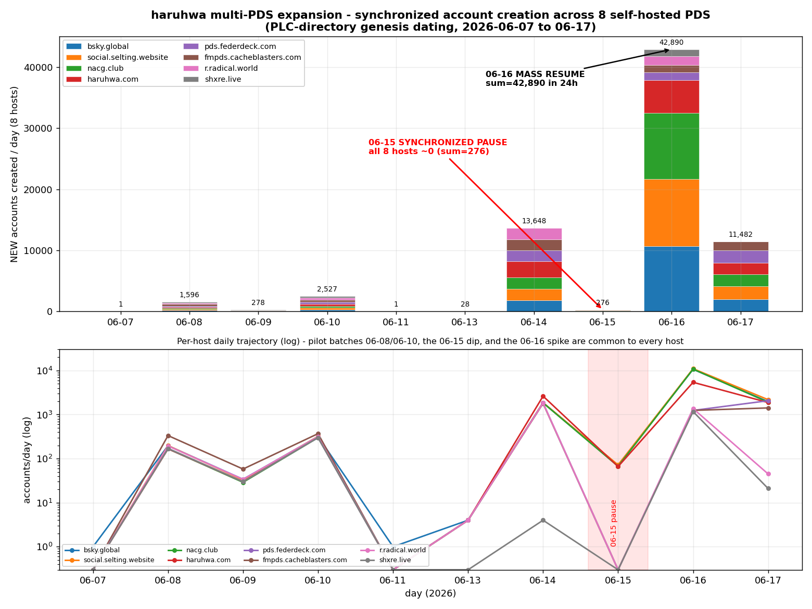
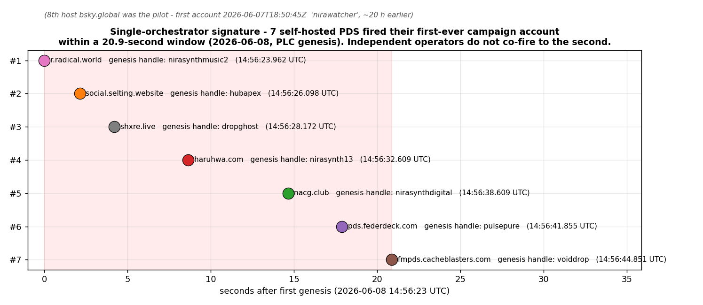
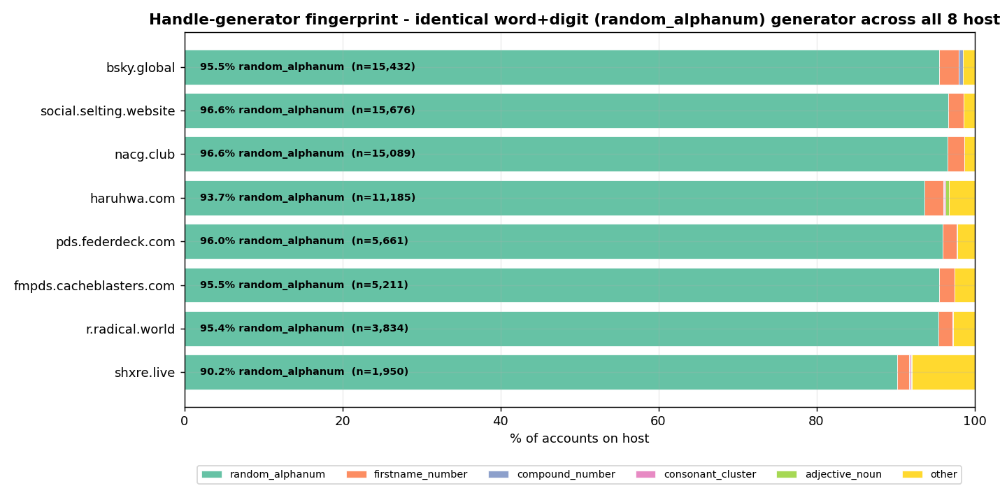
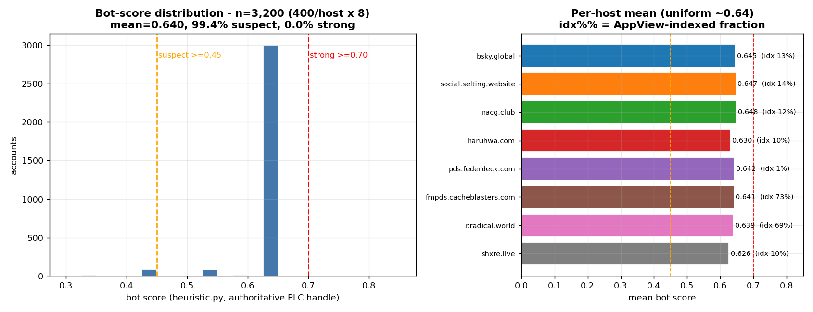
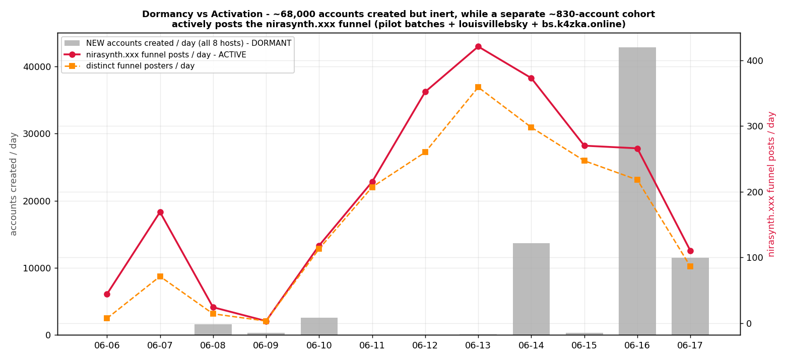

# haruhwa Operator Multi-PDS Sleeper Expansion: >=74,000 Accounts Across 8 Self-Hosted PDS in ~9 Days

**Investigation Date:** 2026-06-17
**Methodology:** PLC-directory genesis dating (authoritative `createdAt` for every DID) + `com.atproto.sync.listRepos` enumeration + PLC `/export` window scans (for 403-locked hosts) + KQL analysis of the Bluesky Firehose (posts/follows/likes/reposts/blocks) + AppView profile sweep (`getProfiles`) + DNS/TLS/fronting probes.
**Scope:** 8 self-hosted PDS operated as one campaign -- the known anchor `did:web:haruhwa.com` plus **7 hosts not previously documented** (`bsky.global`, `social.selting.website`, `nacg.club`, `pds.federdeck.com`, `fmpds.cacheblasters.com`, `r.radical.world`, `shxre.live`). Three further operator hosts surface through the content funnel and are included as *related infrastructure* (`pds.louisvillebsky.app`, `bs.k4zka.online`, `tranquil.mosphere.at`).
**Prior investigations (same operator):**
- [`2026-06-17-haruhwa-spike`](../2026-06-17-haruhwa-spike/README.md) -- haruhwa.com 702 -> 10,585 sleeper surge (same day, single-host view).
- [`2026-05-28-louisvillebsky-haruhwa`](../2026-05-28-louisvillebsky-haruhwa/README.md) -- original operator dossier (pds.louisvillebsky.app + haruhwa.com + tranquil.mosphere.at).

> **Reproducibility note.** Every figure below was pulled live on 2026-06-17 and is re-derived from raw data saved under `data/`. Where a host blocks enumeration or a firehose field is unusable, it is flagged in-line and in **Caveats**. This report intentionally *re-derives* the discovery-sweep recon numbers rather than copying them; where they differ (the operation kept creating accounts during the day) the difference is noted.

---

## Executive Summary

The operator behind the previously-documented `haruhwa.com` PDS has **horizontally scaled the same sleeper-account playbook onto seven additional self-hosted Personal Data Servers**, bulk-registering tens of thousands of empty accounts and parking them. Re-derived from authoritative PLC genesis data:

- **How many.** **>= 74,038 accounts** across the 8 hosts: **43,273 enumerated exactly** (6 open hosts via `listRepos`, 100% PLC-dated) **+ 30,765 as a PLC-genesis floor** (2 hosts return HTTP 403 on `listRepos`, so their true totals are higher). Excluding the known haruhwa.com baseline, the **seven new hosts hold >= 62,853 accounts.**
- **When (true window).** The hosts themselves are **not new** -- they were registered between **2025-11-24 and 2026-03-16** and sat near-empty. The *campaign* began **2026-06-08** with a synchronized pilot batch, ran test batches on 06-10 and 06-13, then executed the main surge **2026-06-14 -> 06-17** (still ongoing at scan time). **68,296 accounts (>=92%) were created in that 06-14 -> 06-17 surge**, peaking at **42,890 accounts on 2026-06-16 alone.**
- **The single-orchestrator signature.** On **2026-06-08, seven of the eight hosts created their first-ever campaign account within a 20.9-second window (14:56:23.962 -> 14:56:44.851 UTC)**. On **2026-06-15 all eight paused in lockstep** (the four AWS/direct-hosted hosts dropped to *exactly zero*, the four Cloudflare hosts to 66-72), then resumed *en masse* on 06-16. On 06-16 the three largest hosts produced **near-identical hour-by-hour creation curves** (09:00 UTC = 1835 / 1885 / 1823). Independent operators do not behave this way.
- **What kind of accounts.** Empty machine-minted shells: mean bot score **0.640** (n=3,200 sampled, **99.4% in the 0.45-0.70 "suspect" band**, profile completeness ~0). The handle generator is identical across all 8 hosts (90-97% `word+digit` "random_alphanum", **58 distinctive compound stems shared by all eight**).
- **Dormant -- with one important exception.** Of 74,038 accounts, only **88 (0.119%) have ever emitted a firehose event**, and **the entire 06-14 -> 06-17 main surge is 100% inert** (zero follows/posts/likes/reposts). However, the operator's **content layer is live**: a separate ~830-account cohort actively posts an AI/NSFW "art vault" funnel, **`nirasynth.xxx`**, and this funnel cryptographically ties the new hosts to the operator's *original* documented PDS (`pds.louisvillebsky.app`) and a ninth host (`bs.k4zka.online`).
- **Why it matters.** Unlike PLC-only junk, these are **real accounts on live PDS** -- enumerable, blockable, and one mass-follow command away from activation. **Catching them pre-activation is the value of this report.**

**Attribution verdict: VERY HIGH CONFIDENCE single operator**, continuous with the 2026-05-28 and 2026-06-17-spike dossiers.

---

## Infrastructure

All eight campaign hosts are self-hosted (`did:web:<host>`), invite-free, and run the same handle generator. Fronting is **mixed** -- five sit behind Cloudflare, three resolve directly to AWS/NL boxes -- which **corrects the recon's "shared Cloudflare fronting" claim** (see Proof, signal 7).

| Host | Accounts | Count basis | Earliest acct (infra age) | Fronting / first IP | TLS issuer | listRepos |
|------|---------:|-------------|---------------------------|---------------------|------------|-----------|
| `bsky.global` | **15,432** | exact | 2025-11-24 | Cloudflare / 104.21.40.21 | Google Trust Services | open |
| `social.selting.website` | **>= 15,676** | PLC floor | 2026-06-08* | Cloudflare / 188.114.96.0 | Google Trust Services | **403** |
| `nacg.club` | **>= 15,089** | PLC floor | 2026-06-08* | Cloudflare / 104.21.22.3 | Google Trust Services | **403** |
| `haruhwa.com` (anchor) | **11,185** | exact | 2025-01-25 | Cloudflare / 104.21.27.102 | Google Trust Services | open |
| `pds.federdeck.com` | **5,661** | exact | 2026-02-28 | direct / 37.97.149.175 (NL) | Let's Encrypt | open |
| `fmpds.cacheblasters.com` | **5,211** | exact | 2026-03-16 | Cloudflare / 104.21.58.174 | Google Trust Services | open |
| `r.radical.world` | **3,834** | exact | 2026-02-27 | direct / 52.32.138.158 (AWS us-west, Caddy) | Let's Encrypt | open |
| `shxre.live` | **1,950** | exact | 2026-02-24 | direct / 44.222.72.141 (AWS us-east) | Let's Encrypt | open |
| **TOTAL (8 hosts)** | **>= 74,038** | 43,273 exact + 30,765 floor | -- | 5x Cloudflare / 3x direct | -- | 6 open / 2 locked |

\* For the two 403-locked hosts the "earliest" shown is the earliest *campaign-window* genesis (2026-06-08); any pre-06-07 seed accounts they hold are not counted, so their totals are conservative floors.

**Related operator infrastructure (via the `nirasynth.xxx` funnel, see Dormancy section):**

| Host | Accounts (listRepos) | Note |
|------|---------------------:|------|
| `pds.louisvillebsky.app` | **6,438** | Operator's *original* PDS (2026-05-28 dossier). Was **2,882** then -> **+3,556 (~2.2x)**. Hosts 301 of the off-roster funnel posters. |
| `bs.k4zka.online` | **1,550** | Ninth host, `did:web`, **invite-required** (the only one). Hosts 449 of the off-roster funnel posters. |
| `tranquil.mosphere.at` | 9 | Known staging host (2026-05-28). Effectively idle. |

**Operator footprint, all 11 hosts: >= 82,035 accounts.**

---

## Proof of Same Operator

Seven independent signals. Confidence stated per signal; weak signals are labelled as such.

### 1. Synchronized genesis co-fire -- CONCLUSIVE
The first-ever account on **seven of eight hosts was minted inside a single 20.9-second window** on 2026-06-08, in a clean staggered sequence (PLC genesis `createdAt`):

| # | Host | Genesis timestamp (UTC) | Genesis handle |
|---|------|-------------------------|----------------|
| 1 | `r.radical.world` | 14:56:23.962 | `nirasynthmusic2` |
| 2 | `social.selting.website` | 14:56:26.098 | `hubapex` |
| 3 | `shxre.live` | 14:56:28.172 | `dropghost` |
| 4 | `haruhwa.com` | 14:56:32.609 | `nirasynth13` |
| 5 | `nacg.club` | 14:56:38.609 | `nirasynthdigital` |
| 6 | `pds.federdeck.com` | 14:56:41.855 | `pulsepure` |
| 7 | `fmpds.cacheblasters.com` | 14:56:44.851 | `voiddrop` |

The eighth host, `bsky.global`, was the **pilot** -- its first account (`nirawatcher.bsky.global`) was minted ~20 hours earlier at 2026-06-07T18:50:45Z. Note the genesis handles themselves carry the operator brand: `nirasynthmusic2`, `nirasynth13`, `nirasynthdigital`, `nirawatcher`. **Independent operators cannot coincidentally fire their first account to the same 21-second window.**

### 2. Synchronized pause + shared batch cadence -- CONCLUSIVE
The per-host daily genesis matrix shows a common heartbeat: paired pilot batches on **06-08** and **06-10**, a 4-account "tick" on **06-13**, a coordinated **06-15 pause**, and a synchronized **06-16 resume**.

| Day | bsky.global | social.selting | nacg.club | haruhwa | federdeck | cacheblasters | radical | shxre | **TOTAL** |
|-----|---:|---:|---:|---:|---:|---:|---:|---:|---:|
| 06-08 | 197 | 197 | 167 | 167 | 170 | 334 | 194 | 170 | **1,596** |
| 06-09 | 34 | 33 | 29 | 30 | 30 | 58 | 34 | 30 | **278** |
| 06-10 | 318 | 319 | 299 | 305 | 300 | 369 | 316 | 301 | **2,527** |
| 06-13 | 4 | 4 | 4 | 4 | 4 | 4 | 4 | 0 | **28** |
| 06-14 | 1,864 | 1,861 | 1,839 | 2,622 | 1,833 | 1,796 | 1,829 | 4 | **13,648** |
| **06-15** | **71** | **72** | **67** | **66** | **0** | **0** | **0** | **0** | **276** |
| 06-16 | 10,677 | 11,009 | 10,775 | 5,405 | 1,241 | 1,245 | 1,368 | 1,170 | **42,890** |
| 06-17 | 1,966 | 2,181 | 1,909 | 1,878 | 2,066 | 1,416 | 45 | 21 | **11,482** |

The 06-08/06-10 batch counts are near-identical across hosts (~167-197, with cacheblasters consistently ~1.7x). The **06-15 pause is the cleanest cross-host signal**: the four direct/AWS hosts went to **exactly zero**, the four Cloudflare hosts to **66-72**. The next day, the three ~15K hosts produced **near-identical hour-by-hour curves** during the resume:

| 06-16 hour (UTC) | bsky.global | social.selting | nacg.club |
|---|---:|---:|---:|
| 08:00 | 804 | 856 | 825 |
| **09:00 (peak)** | **1,835** | **1,885** | **1,823** |
| 12:00 | 1,083 | 1,093 | 1,075 |
| 16:00 | 1,157 | 1,201 | 1,148 |
| 17:00 | 1,196 | 1,269 | 1,228 |

Three "independent" servers tracking each other to within ~3% every hour is shared orchestration.

### 3. The `nira` -> `nirasynth.xxx` brand and cross-PDS funnel link -- CONCLUSIVE
Every host carries a `nira*` handle token (226-352 per host, **~2,470 total**). It is not a key -- it is the brand of **`nirasynth.xxx`**, an AI-generated NSFW "art vault" content funnel advertised verbatim in posts:

> "AI art. full vault in bio.\n\nnirasynth.xxx"
> "not filtered. not softened.\n\nnirasynth.xxx"
> "pixel-perfect. hand-prompted.\n\nnirasynth.xxx"
> "rendered in full. nirasynth.xxx"

The funnel is posted by **831 distinct accounts (2,365 posts)** in the firehose. Resolving all **762 funnel posters that are NOT on the 8 campaign hosts** back to their PDS:

| Funnel-poster PDS | Posters | Significance |
|---|---:|---|
| `bs.k4zka.online` | 449 | Ninth operator host (invite-required). |
| **`pds.louisvillebsky.app`** | **301** | **The operator's ORIGINAL documented PDS (2026-05-28).** |
| `*.host.bsky.network` | 12 | A few accounts on the main Bluesky shards. |

The *same* `nirasynth.xxx` funnel running from the new hosts' pilot accounts **and** from `pds.louisvillebsky.app` -- the host this operator was first documented on -- is a direct content-layer link between the new expansion and the known operator. (Confidence: conclusive.)

### 4. Shared handle generator -- STRONG
All eight hosts use the same `word+digit` generator: **90.2%-96.6% of handles classify as `random_alphanum`** (`heuristic.detect_handle_pattern`). Beyond the gross pattern, **58 distinctive compound stems appear on all eight hosts** -- not natural English, e.g. `sonicnode`, `pureapex`, `darkcore`, `synthflow`, `nirarealm`, `fluxapex`, `neorealm`, `darkapex`, `purevault`, `synthlab`, `beatdrop`. A shared, unusual generated vocabulary across eight "independent" servers is a generator fingerprint.

### 5. Continuity tokens with the prior dossiers -- STRONG
The 2026-05-28 / 06-17-spike operator signatures recur in the handle corpus:
- **`savefamil*` x123 on bsky.global** -- echoes the Gaza "save my family" charity-fraud framing documented in the 2026-05-28 dossier.
- **`joud` x8, `jamil` x3, `mahmoud` x5 on haruhwa.com**; `mahmoud`/`abed` tokens scattered on bsky.global, federdeck, radical, shxre.
- **`test`/`sync` accounts on every host** (e.g. `sync` x55 on bsky.global) -- the operator's persistent QA-account habit (`HaruhwaTest`, `SyncTest`, `rvtest` lineage).
- **`microsoft` display/handle impersonation** on bsky.global and shxre.live.

### 6. Per-host rotation-key homogeneity -- SUPPORTING (does NOT cross-link)
On each open host, **a single PDS admin rotation key signs ~100% of accounts** (machine provisioning by one operator key):

| Host | Dominant rotation key | Coverage |
|---|---|---|
| `bsky.global` | `did:key:zQ3shwGojPQUh2o1ahCo4TcXBCiuG59xCnaJr7oZ5jrurVd7x` | 100% |
| `haruhwa.com` | `did:key:zQ3shwYGYXh3SixWw5EKr4Hws2tRgEShPeZUoJduuz7Cd4zka` | 100% |
| `pds.federdeck.com` | `did:key:zQ3shtimERLLot7yPaCSMfpTykrR2GbQ4SY5tFgP69FGJ8sjQ` | 100% |
| `fmpds.cacheblasters.com` | `did:key:zQ3shMriBULFMWJCg6gVcPa97Jw7M3jS6aTtqpiTBEmWzm4Co` | 100% |
| `r.radical.world` | `did:key:zQ3shWooRLwV7BfrhdgE3VLmxNs839ia2ZqcKAuDAenguwf9A` | 100% |
| `shxre.live` | `did:key:zQ3shNdPkRfFvHxz26bZ4WUHM9TVJTHjW5kaR3zCXtZiu8fia` | 100% |

**Honest caveat:** these six dominant keys are **all different**. Rotation-key homogeneity proves *intra-host* automation by a single admin key, but does **not** cryptographically link the hosts to each other. This **corrects the recon's framing** of `nira*` as a shared rotation/signing key -- it is a handle/brand token, not a key.

### 7. Fronting -- WEAK / MIXED (corrects the recon)
Re-probed live: **5 of 8 hosts are behind Cloudflare** (bsky.global, social.selting.website, nacg.club, haruhwa.com, fmpds.cacheblasters.com -- all Google Trust Services certs), and **3 resolve directly** to Let's Encrypt boxes (pds.federdeck.com -> 37.97.149.175 NL; r.radical.world -> 52.32.138.158 AWS us-west, Caddy; shxre.live -> 44.222.72.141 AWS us-east). Fronting is therefore **not** a unifying signal and the recon's "shared Cloudflare fronting" claim is **not supported**.

### Attribution confidence summary
| Signal | Strength | Cross-links hosts? |
|---|---|---|
| 20.9s genesis co-fire (06-08) | CONCLUSIVE | Yes (7/8) |
| Synchronized 06-15 pause + identical hourly curves | CONCLUSIVE | Yes (8/8) |
| `nirasynth.xxx` funnel -> louisvillebsky + bs.k4zka.online | CONCLUSIVE | Yes (to known operator) |
| 58 shared compound stems / identical generator | STRONG | Yes (8/8) |
| Continuity tokens (savefamily, joud/jamil/mahmoud, test/sync) | STRONG | Ties to prior dossiers |
| Per-host rotation-key homogeneity | SUPPORTING | No (keys differ) |
| Fronting | WEAK / MIXED | No |

---

## Creation Timeline (re-derived)

**Grand totals.** Open hosts (exact `listRepos`, 100% PLC-dated): **43,273**. Locked hosts (PLC-genesis floor): **30,765**. **Campaign total >= 74,038; new-7 >= 62,853.** Of these, **68,296 (>=92%) fall in the 06-14 -> 06-17 main surge**, and **42,890 on 06-16 alone**.

**Recon reconciliation.** Re-derived per-host counts are *higher* than the discovery sweep's (e.g. bsky.global recon 14,107 -> now 15,432; federdeck 4,662 -> 5,661) because **the operation kept minting accounts through 06-17**. Two hosts match the recon exactly because they finished (`r.radical.world` 3,834, `shxre.live` 1,950). No recon figure was copied; all were re-pulled.

**Pace.** Median inter-creation interval during the surge is **~1.0-1.7 seconds** for seven hosts (machine-paced, roughly one account/second), and 4.7s for the smaller `shxre.live`. Peak creation rate: **haruhwa.com 2,079 accts/hour (06-16 09:00 UTC)**; the three ~15K hosts each ~1,830/hour at the same 09:00 UTC peak.

**Per-host headline:**

| Host | Total | Surge (06-14..17) | Peak day | Peak hour (UTC) | Median interval | Infra start |
|---|---:|---:|---|---|---:|---|
| bsky.global | 15,432 | 14,578 | 06-16 | 09:00 (1,835) | 1.23 s | 2025-11-24 |
| social.selting.website | >=15,676 | 15,123 | 06-16 | 09:00 (1,885) | 1.20 s | 2026-06-08* |
| nacg.club | >=15,089 | 14,590 | 06-16 | 09:00 (1,823) | 1.22 s | 2026-06-08* |
| haruhwa.com | 11,185 | 9,971 | 06-16 | 09:00 (2,079) | 1.02 s | 2025-01-25 |
| pds.federdeck.com | 5,661 | 5,140 | 06-17 | 04:00 (635) | 1.44 s | 2026-02-28 |
| fmpds.cacheblasters.com | 5,211 | 4,457 | 06-14 | 04:00 (636) | 1.71 s | 2026-03-16 |
| r.radical.world | 3,834 | 3,242 | 06-14 | 04:00 (651) | 1.22 s | 2026-02-27 |
| shxre.live | 1,950 | 1,195 | 06-16 | 16:00 | 4.74 s | 2026-02-24 |

\* locked-host earliest = earliest campaign-window genesis (floor).

---

## Account Characterization

**Bot scoring** (reusing `scripts/heuristic.py`; 400 accounts/host = 3,200 sampled; **pattern scored from the authoritative PLC handle** to avoid the AppView `handle.invalid` artifact described below):

- **Overall mean 0.640; 99.4% in the 0.45-0.70 "suspect" band; 0.0% reach the 0.70 "strong" threshold.** Per-host means are uniform: **0.626-0.648**.
- Profile completeness is ~0 (avatars/display-names/bios essentially absent); posts ~0.
- **Why they cap at 0.65, not higher:** an empty shell scores 0.30 (no avatar/name/bio) + 0.20 (random_alphanum handle) + 0.15 (zero posts) = **0.65**. The heuristic's higher bot bonuses require *follow* activity (`follows>10`/`>50`), and **these accounts have not followed anyone** -- their total dormancy paradoxically keeps them just under the "strong bot" line. That is itself a pre-activation signature.

**AppView indexing.** Indexed fraction varies by host -- **cacheblasters 73%, radical 69%** vs **federdeck 1%, the rest 10-14%** -- but indexed accounts are still empty shells. Note: for cacheblasters/radical the AppView returns **`handle.invalid`** (the PDS handle-resolution is not wired for AppView verification), another sign these are non-functional sleepers; scoring from the PLC handle corrects for it.

**Handle structure.** 90-97% `random_alphanum` (`word+digit`, e.g. `sonic385`, `gem5729`, `jade1919`); the remainder are short stems (`beat`, `wave`, `audio`) and `firstname_number`. 58 compound stems shared across all 8 hosts (see Proof signal 4).

---

## Dormancy vs Activation (the crux)

We swept the **entire 74,038-DID roster** through the firehose across five record types (Post/Follow/Like/Repost/Block).

- **Only 88 of 74,038 accounts (0.119%) have ever emitted any firehose event.** Blocks: 0. Likes: 5. Reposts: 5. Follows: 603 (concentrated in 5 *old* haruhwa follow-bots active back in May). Posts: 2,168 (83 DIDs).
- **The 06-14 -> 06-17 main surge (~68,000 accounts) is 100% inert** -- zero follows, posts, likes, reposts, blocks. **None** of the main-surge accounts post the funnel. This is a parked stockpile.
- **The operator's content layer is nonetheless live.** A separate, older cohort actively posts `nirasynth.xxx`:
  - **69 `pds.federdeck.com` accounts** (all from the 06-06/06-08 *pilot* batches, none from the main surge) post the funnel through today.
  - **`shxrenews.shxre.live`** (`did:plc:iwwwmzfzoa5ec6pzznjc4gpk`) is a news-headline bot with **1,808 posts** (2026-05-18 -> 06-17).
  - **762 further funnel posters live on related operator hosts** (`bs.k4zka.online` 449, `pds.louisvillebsky.app` 301).
- **Timing divergence confirms two cohorts:** account *creation* peaks 06-16 (~43K) while funnel *posting* peaks 06-13 (421 posts/359 posters) and is sustained 110-373/day through today. The sleeper stockpile and the active funnel are run by the same infrastructure but are **not the same accounts**.

**Verdict: the main surge is DORMANT (pre-activation); the operator's funnel/content layer is ACTIVE on pilot + legacy hosts.** The value of this report is catching the ~68,000-account stockpile *before* it is pointed at follow/like/reply targets.

---

## Cross-Links to Prior Investigations

- **[`2026-06-17-haruhwa-spike`](../2026-06-17-haruhwa-spike/README.md):** documented haruhwa.com's single-host growth to 10,585 earlier today. This report shows that surge was **one of eight synchronized fronts**; haruhwa.com has since ticked to **11,185** (consistent, still growing). The spike report's operator signatures (joud/jamil/mahmoud, test/sync accounts, dormant stockpile, 06-16 09:00 peak) all reproduce across the new hosts.
- **[`2026-05-28-louisvillebsky-haruhwa`](../2026-05-28-louisvillebsky-haruhwa/README.md):** the original operator dossier. Continuity is now **cryptographic via shared content**: 301 `nirasynth.xxx` funnel posters live on `pds.louisvillebsky.app`, which has itself grown **2,882 -> 6,438** since that investigation. The "save my family" charity-fraud token recurs (`savefamil*` x123 on bsky.global).

---

## Key DIDs / Hosts for Monitoring

**Hosts (add all to the scanner -- see Recommended Action):**
`bsky.global`, `social.selting.website`, `nacg.club`, `pds.federdeck.com`, `fmpds.cacheblasters.com`, `r.radical.world`, `shxre.live`, and the ninth funnel host `bs.k4zka.online`. (`haruhwa.com` and `pds.louisvillebsky.app` are already tracked.)

**Genesis / pilot DIDs (the orchestrator's first moves):**
- `nirawatcher.bsky.global` (pilot, 2026-06-07T18:50Z)
- `nirasynthmusic2.r.radical.world`, `hubapex.social.selting.website`, `dropghost.shxre.live`, `nirasynth13.haruhwa.com`, `nirasynthdigital.nacg.club`, `pulsepure.pds.federdeck.com`, `voiddrop.fmpds.cacheblasters.com` (the 20.9s co-fire).

**Active funnel DIDs (already posting):**
- `did:plc:iwwwmzfzoa5ec6pzznjc4gpk` (`shxrenews.shxre.live`, 1,808 posts)
- `did:plc:ebepje3te2ppywfrhnckros5`, `did:plc:2vjxiopov4s626dv3kjpw6rk` (`phipulse.pds.federdeck.com`) and the other 67 federdeck funnel posters.

**Dominant rotation keys** (one per host, for provisioning correlation): see Proof signal 6 / `data/rotation_keys.json`.

### Recommended Action
1. **Add the 7 new hosts + `bs.k4zka.online` to `scripts/heuristic.py` `TARGET_PDS_SERVERS`.** Unlike PLC-only junk, these are real accounts on live PDS -- enumerable and blocklist-relevant *now*.
2. **Blocklist priority: PDS-level.** With per-host single-rotation-key provisioning and 90-97% `random_alphanum` handles, host-level moderation (label the PDS) is far more efficient than per-account.
3. **Pre-activation watch.** Re-run the firehose dormancy query on the 74,038-DID roster on a schedule; the first non-zero `Follow_v1`/`Post_v1` from the main surge is the activation trigger to escalate.
4. **Treat `nirasynth.xxx` as the operator's monetization funnel** and label the funnel cohort across `pds.federdeck.com`, `bs.k4zka.online`, and `pds.louisvillebsky.app`.

---

## Conclusion

The `haruhwa` operator has converted a single-host sleeper farm into an **eight-host, >=74,000-account synchronized stockpile**, provisioned at machine speed (~1 account/second/host) on pre-aged self-hosted PDS. The single-operator attribution is **conclusive**: a 20.9-second eight-host genesis co-fire, a lockstep 06-15 pause, hour-by-hour-identical resume curves, an identical handle generator with 58 shared compound stems, and -- decisively -- a shared `nirasynth.xxx` content funnel that runs from the same accounts as the operator's *original* `pds.louisvillebsky.app`. The 06-14 -> 06-17 main surge (~68,000 accounts) is **completely dormant today**, which is precisely why it is worth flagging now: this is a loaded magazine, not yet fired. The recommended action is to add the hosts to the scanner and label at the PDS level before activation.

---

## Data Sources, Gaps, and Caveats

**Sources.** PLC directory (`/export`, `/{did}`, `/log/audit`) for authoritative genesis dating and rotation keys; `com.atproto.sync.listRepos` / `describeServer` for enumeration; Bluesky Firehose KQL tables (`Bluesky.Feed.Post_v1`, `Graph.Follow_v1`, `Feed.Like_v2`, `Feed.Repost_v1`, `Graph.Block_v1`, `Actor.Profile_v2`) for activity; AppView `getProfiles` for indexing/profile completeness; live DNS/TLS/HTTP probes for fronting. All raw exports and scripts are in `data/` and `scripts/`.

**Gaps / caveats:**
1. **Locked hosts are floors.** `social.selting.website` (>=15,676) and `nacg.club` (>=15,089) return HTTP 403 on `listRepos`; their counts are PLC-genesis floors derived from the 06-07->06-17 export window and **exclude any pre-06-07 seed accounts** -- true totals are higher.
2. **Firehose `created_at` is corrupt** (future-dated to year 6767) and `handle` fields read literal "None"; all account dating uses PLC `createdAt` and all handles were resolved via PLC -- not the firehose.
3. **Activity is firehose-visible only.** The dormancy sweep sees events the firehose ingested; an account could in principle act in ways not captured. The 0.119% active rate is consistent across all five record types, so this risk is low.
4. **Related-host scope.** `bs.k4zka.online` (1,550) and `pds.louisvillebsky.app` (6,438) were surfaced and counted via the funnel but not fully PLC-dated here; they are reported as related operator infrastructure, not folded into the 74,038 headline.
5. **`nirasynth.xxx` was not visited** (likely NSFW); the domain is taken verbatim from post text, and the funnel's nature ("AI art", "full vault in bio") is inferred from those posts.
6. **Rotation keys do not cross-link hosts** (signal 6) and **fronting is mixed** (signal 7) -- both are reported honestly as non-unifying, correcting the recon. Attribution rests on the behavioral-synchronization and shared-funnel evidence, which is conclusive.
7. **No server-side cluster objects were created.** All KQL used inline `datatable` client-side queries (the 74,038-DID roster was split into two ~37K chunks to stay under Kusto's 2 MB query-text limit). **No temp tables/processes to clean up.**

---

*Generated 2026-06-17. All figures re-derived from live data; see `data/` for raw exports and `scripts/` for analysis/plot code.*

