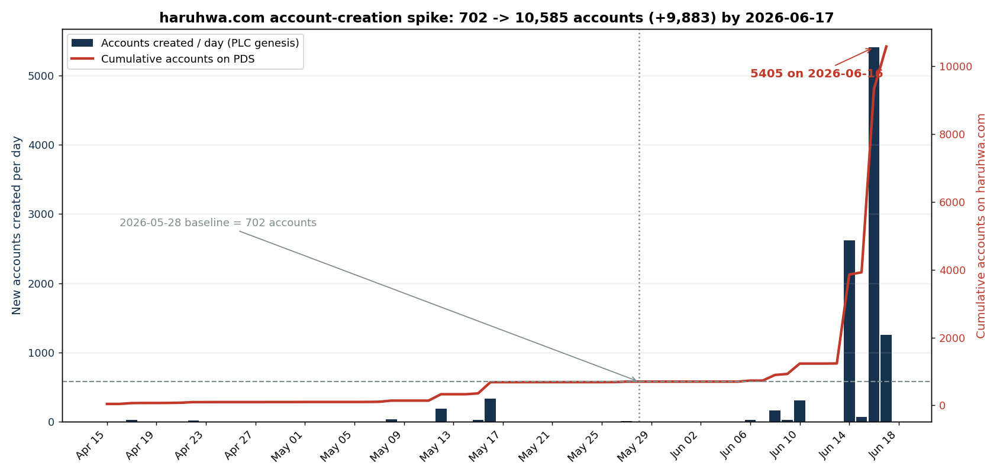
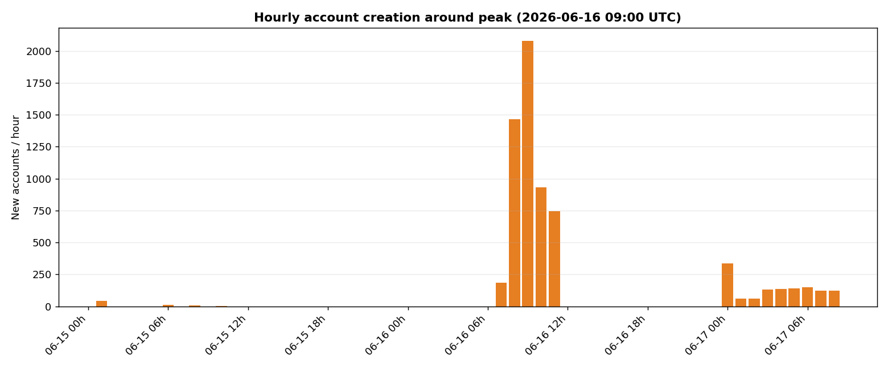
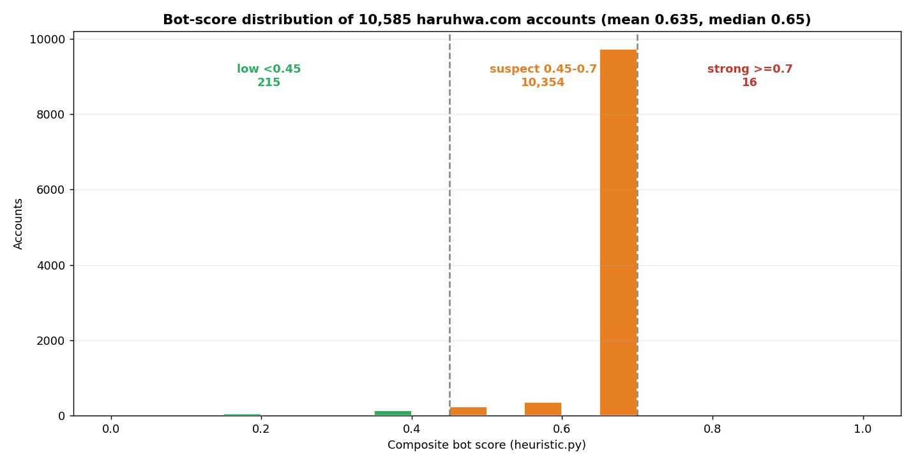
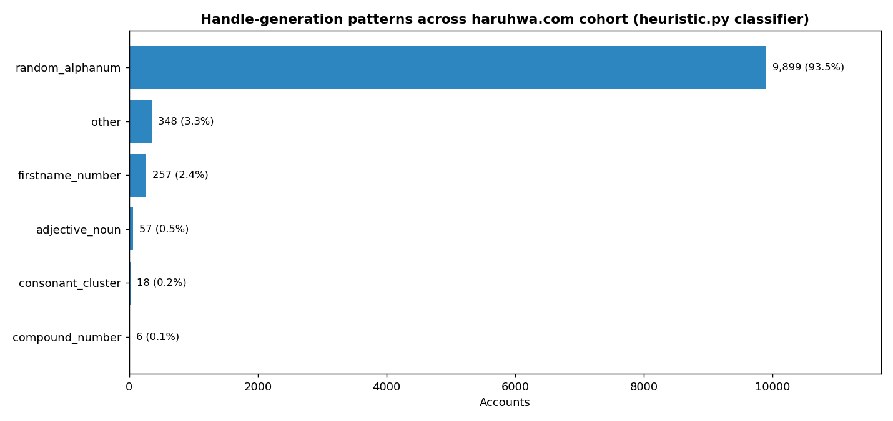

# haruhwa.com Sleeper-Account Surge: 702 -> 10,585 Accounts in 19 Days

**Investigation Date:** 2026-06-17  
**Methodology:** PLC-directory genesis dating (authoritative `createdAt` for all DIDs) + `com.atproto.sync.listRepos` enumeration + KQL analysis of the Bluesky Firehose (follows, posts, profiles) + AppView profile sweep  
**Scope:** 10,585 accounts on `did:web:haruhwa.com` (up from 702 on 2026-05-28)  
**Prior investigation:** [`2026-05-28-louisvillebsky-haruhwa`](../2026-05-28-louisvillebsky-haruhwa/README.md) (pds.louisvillebsky.app + haruhwa.com + tranquil.mosphere.at, same operator)

---

## Executive Summary

Between the 2026-05-28 investigation and today (2026-06-17), the self-hosted PDS
`haruhwa.com` grew from **702** accounts to **10,585** — an increase of **+9,883
accounts (~15x)** in 19 days. The growth is almost entirely a *single* behavior:
**mass account creation**, not follows, likes, or posts.

- **When:** All +9,883 net-new accounts were created in June; **9,347 of them (94.6%)
  in a four-day window, 2026-06-14 -> 2026-06-17**, peaking at **5,405 accounts on
  2026-06-16** — of which **5,405 were all created in a single 5-hour window
  (07:00-11:00 UTC)**, hitting **2,079 accounts in the 09:00 UTC hour alone**
  (~1 account every 1.7 seconds).
- **How big / how fast:** The peak creation rate of **2,079 accounts/hour** is roughly
  **43x** the 48 accounts/hour peak measured on haruhwa in the 2026-05-28 investigation.
- **What kind:** A **dormant sleeper stockpile.** Only **14 of 10,585 accounts (0.13%)**
  have ever emitted *any* firehose event, and every one of those events occurred
  **2026-05-17 -> 2026-06-02 — before the surge.** The ~9,300 accounts created on
  June 14-17 have **zero follows, zero posts, zero likes, zero reposts.** They were
  registered and parked.
- **Who:** The **same operator** as 2026-05-28. All 10,585 accounts are hosted on
  `haruhwa.com` (no new linked PDS found); handle templates, operator name/handle
  signatures (`joud`/`jamil`/`mahmoud`, `HaruhwaTest...`, `rvtest...`, "Om jameel" /
  "Abo jameel"), test accounts, and the targeted progressive/LGBTQ+/literary follow
  community all carry over. All five known 2026-05-28 bot DIDs still exist on the roster.
- **What changed:** (1) scale and creation rate stepped up by an order of magnitude;
  (2) a **new abuse vertical** appears in the active (pre-surge) cohort -- English
  **crypto / WhatsApp "investment plan" pump-and-dump reply-spam** -- running alongside
  the persisting Arabic "Abo jameel" sympathy / mention-spam; (3) the lead follow-bot
  handle `kamsjz` was **reassigned to a fresh DID** (the original DID now holds the bare
  `haruhwa.com` root handle).

This report quantifies the surge, scores and fingerprints the cohort, and lists the
highest-signal DIDs to monitor. **Every figure below is drawn from data actually pulled;
inferred or missing values are flagged as caveats.**

---

## Infrastructure

| Metric | haruhwa.com @ 2026-05-28 | haruhwa.com @ 2026-06-17 |
|--------|--------------------------|--------------------------|
| Total DIDs (listRepos) | 702 | **10,585** |
| Net change | -- | **+9,883 (~15x)** |
| Server DID | `did:web:haruhwa.com` | `did:web:haruhwa.com` |
| Domain handles | `.haruhwa.com` | **`.haruhwa.com` (10,585 / 10,585 = 100%)** |
| Accounts born on this PDS (genesis) | 702 | **10,585 / 10,585 (100%)** |
| Linked PDS servers detected | louisvillebsky.app, tranquil.mosphere.at | none new in window |
| Invite required | No | No |

**Dataset validation.** PLC-directory genesis timestamps were fetched for **all 10,585**
DIDs (every request HTTP 200, 0 corrupt). Counting only accounts created on or before
the prior investigation date yields exactly **702** -- an exact match to the 2026-05-28
baseline, confirming the creation dataset is consistent and that the +9,883 are genuinely
new registrations rather than re-counts.

Every one of the 10,585 accounts has its genesis PDS = `https://haruhwa.com` (no accounts
migrated *in* from another server), and 10,584 of 10,585 have a single PLC operation. The
sole multi-operation account is the handle-reassignment case described under Attribution.

---

## Account Creation at Scale -- The Spike

The cumulative curve sits flat at the 702 baseline through late May, then rises almost
vertically across June 14-17. Daily genesis counts (PLC `createdAt`):

| Date (UTC) | New accounts | Note |
|-----------|-------------:|------|
| 2026-05-12 | 188 | baseline-era bump |
| 2026-05-16 | 331 | baseline-era bump |
| ... | ... | (quiet late May) |
| 2026-06-08 | 167 | pre-surge bump |
| 2026-06-10 | 305 | pre-surge bump |
| 2026-06-13 | 4 | lull |
| **2026-06-14** | **2,622** | **surge day 1** |
| 2026-06-15 | 66 | lull between bursts |
| **2026-06-16** | **5,405** | **surge peak** |
| **2026-06-17** | **1,254** | partial day (ongoing) |

The surge arrives in **two discrete bursts** (June 14 and June 16) separated by a near-silent
June 15 -- a pattern consistent with scripted batch jobs rather than steady organic signup.

The June 16 peak is extraordinarily concentrated. **All 5,405 accounts that day were created
in a single 5-hour window**:

| Hour (UTC) | New accounts |
|-----------|-------------:|
| 2026-06-16 07:00 | 184 |
| 2026-06-16 08:00 | 1,467 |
| **2026-06-16 09:00** | **2,079** |
| 2026-06-16 10:00 | 932 |
| 2026-06-16 11:00 | 743 |

A peak of **2,079 accounts/hour** is ~34.6/minute, i.e. **one new account roughly every
1.7 seconds** -- machine-paced, and about **43x** the 48 accounts/hour peak rate recorded
for haruhwa in the 2026-05-28 investigation. June 14 showed the same shape (1,032 accounts
in its 07:00 UTC hour).

### The Dormancy Finding: A Sleeper Stockpile

The defining characteristic of this surge is that **the accounts do nothing.** Joining the
10,585-DID roster against the firehose tables (`Bluesky.Graph.Follow_v1`,
`Bluesky.Feed.Post_v1`, `Bluesky.Feed.Like_v2`, `Bluesky.Feed.Repost_v1`):

| Population | Count | Share |
|-----------|------:|------:|
| Accounts on roster | 10,585 | 100% |
| Accounts with **any** firehose event ever | **14** | **0.13%** |
| Accounts active **after** 2026-06-02 | **0** | 0% |
| Accounts created June 14-17 with any activity | **0** | 0% |

All observed activity falls in **2026-05-17 -> 2026-06-02** and originates from the older,
pre-surge cohort. The relay continued to ingest haruhwa events through June 2 (so the
post-June-2 silence is genuine dormancy, not de-federation). **The surge is therefore a
pre-positioning event: thousands of accounts registered in batch and left parked**, their
intended use not yet expressed through behavior.

---

## Bot Scoring

Every account was scored with the repository's `scripts/heuristic.py` model (profile
completeness 0-0.30, handle pattern 0-0.25, activity signals 0-0.30, follow-only bonus 0.15;
suspect threshold 0.45, strong-bot threshold 0.70).

| Score band | Accounts | Share |
|-----------|---------:|------:|
| **High (>=0.7) -- strong bot** | 16 | 0.2% |
| **Suspect (0.45-0.7)** | 10,354 | 97.8% |
| **Low (<0.45) -- possibly legitimate** | 215 | 2.0% |
| Mean / median score | 0.635 / 0.65 | |

The distribution collapses onto a single spike at **0.65** -- the exact score of a
template surge account: 0.30 (no avatar + no description + no display name) + 0.20
(`random_alphanum` handle) + 0.15 (zero posts). The 16 "strong" accounts are the
consonant-cluster-handle follow bots (handle pattern 0.25) and/or accounts carrying the
`mass_follow_zero_posts` bonus. The 215 "low" accounts are the most-developed minority
(operator/test/avatar-bearing accounts) whose profile completeness pulls them under 0.45.

**Profile completeness (measured, not inferred).** Only **947 of 10,585 (8.9%)** accounts
are indexed by the public AppView at all. Within that indexed subsample:

| Profile attribute present | Count (of 947 indexed) | Share |
|--------------------------|-----------------------:|------:|
| Avatar | 217 | 22.9% |
| Display name | 158 | 16.7% |
| Description / bio | 4 | 0.4% |
| > 0 posts | 279 | 29.5% |
| > 5 posts | 2 | 0.2% |
| > 0 followers | 281 | 29.7% |
| **> 50 followers** | **0** | **0%** |

Even among the *visible* minority, the overwhelming majority have no avatar, no display
name, effectively no bio, and **not one account has more than 50 followers**. This validates
treating the ~91% non-indexed accounts as empty shells for scoring purposes (see Caveats).

---

## Handle Generation

Classifying all 10,585 local-parts with `heuristic.detect_handle_pattern`:

| Pattern | Count | Share | Examples (`*.haruhwa.com`) |
|---------|------:|------:|----------------------------|
| `random_alphanum` | 9,899 | 93.5% | `kdbxmc`, `mbcfsf`, `vincentevoid`, `kimchiswag` |
| `other` | 348 | 3.3% | `joud`, `jamil`, `mahmoudsfamily`, `kay` |
| `firstname_number` | 257 | 2.4% | `puma37`, `edge15`, `crow14`, `steverolfson53` |
| `adjective_noun` | 57 | 0.5% | `stark-gorge`, `swift-shade`, `mint-gale` |
| `consonant_cluster` | 18 | 0.2% | `vrrr`, `nvmbn`, `mskhd`, `kdbxmc` |
| `compound_number` | 6 | 0.1% | `silentfox4211`, `happyfrost7957`, `pearlglow1909` |

The cohort is dominated by short 7-12 character lowercase strings. Note the classifier's
`random_alphanum` regex (`^[a-z0-9]{7,12}$`) is deliberately broad and also captures
word-like handles (`christian`, `vincentevoid`); manual inspection shows the actual style is
a mix of **keyboard-mash consonant strings** (`kdbxmc`, `mbcfsf`, `msnxb` -- the same family
as the prior investigation's `kamsjz`/`amxnjdb`/`akbxbbc`) and short throwaway tokens. The
hyphenated `adjective-noun` (`stark-gorge`, `swift-shade`) and `word+number` templates are
the **same generators** documented on 2026-05-28. 100% of handles are on `.haruhwa.com`.

---

## Follow-Inflation Layer (pre-surge cohort) -- Target Continuity

The follow-inflation behavior comes entirely from the older cohort and predates the surge.
Three accounts issued bulk follows in **2026-05-17 -> 2026-05-22**:

| DID | Handle | Follows | Posts |
|-----|--------|--------:|------:|
| `did:plc:zdmg3m6wvb6cyrgota5xocmb` | kamsjz.haruhwa.com | 397 | 0 |
| `did:plc:ulpx4hftsxcjowj7fid3l7sv` | amxnjdb.haruhwa.com | 372 | 0 |
| `did:plc:wnrw76ccbkn7tunus3kvgrik` | jfdhkbp.haruhwa.com | 228 | 0 |

Their inter-follow cadence is scripted (median ~0 s, mean ~3-5 s between follows). Together
they touch **767 distinct targets**; **40 targets are followed by all three** and 177 by at
least two. The targets are the **same progressive / LGBTQ+ / literary / activist community**
documented on 2026-05-28 -- three named prior-README targets are still followed
(`sigilynk.bsky.social`, `authorkaraj.bsky.social`, `welldressedbird.bsky.social`).

Highest-reach targets (by follower count) currently receiving follows from this cluster:

| Target | Followers | Followed by (of 3) |
|--------|----------:|:------------------:|
| `nicholehiltz.bsky.social` | 62,873 | 1 |
| `otsumamiboy.blacksky.app` | 47,619 | 1 |
| `rk70534.bsky.social` | 33,757 | 2 |
| `betterworld3.bsky.social` | 33,462 | 1 |
| `thejaklife.bsky.social` | 30,949 | 1 |
| `wilsonsilva.bsky.social` | 24,104 | **3** |
| `kellylink.bsky.social` | 20,465 | 1 |
| `llarisah.bsky.social` | 17,498 | **3** |
| `mediocreindigo.bsky.social` | 7,967 | **3** |
| `verasweet.bsky.social` | 7,365 | **3** |

`wilsonsilva.bsky.social` is notable for appearing **both** as a follow target **and** as a
mention-spam target (below) -- the same "inflate then exploit" pattern identified in the
prior investigation.

---

## Content Layers (pre-surge cohort)

Only 14 accounts ever posted; their content reveals the operation's active abuse verticals.

### NEW: Crypto / WhatsApp "Investment Plan" Pump-Scam (English)

Seven accounts posted **financial pump-and-dump reply-spam** -- a vertical **not present** in
the 2026-05-28 profile. Posts are injected as **replies** into existing threads and carry
`api.whatsapp.com` / `wa.me` embeds funneling victims off-platform. Verbatim samples
(2026-05-20 -> 2026-06-02):

> "I will share my 2026 investment plan on WhatsApp. The first 10 to join get it for free...
> Reply '2026' to WhatsApp: +15516897796  Here's the link: wa.me/15516897796"

> "Many of my Twitter followers have already joined my WhatsApp  FREE TO JOIN  My Real-time
> trading alerts and investment strategies  Market forecast analysis..."

> "I will be sharing my investment strategies for free on WhatsApp (Including buy and sell
> points, investment analysis, etc.)... Reply '1107' to WhatsApp: +14145952837"

> "High risk relying on one market. Global asset allocation = long-term growth.  Free stock
> guide: setup, funding, trading & pitfalls. DM me  ...Disclaimer: For education only, not
> financial advice."

Off-platform contact numbers harvested: **+1 551-689-7796** and **+1 414-595-2837** (US).

### Persisting: Arabic "Abo jameel" Mention-Spam (sympathy layer)

The sympathy / charity-spam layer from the prior investigation persists. DID
`did:plc:uajeauayyacsyn25l33mshdc` (`jidkfgv.haruhwa.com`) posted 3 times (2026-05-29 ->
2026-05-31, `lang=ar`/`en`), each a bulk **@-mention of 8-9 progressive/LGBTQ+ accounts**,
signed **"Abo jameel"** -- the same operator signature ("Abo/Om jameel") as 2026-05-28.
Mention targets include `wilsonsilva.bsky.social` (also a follow target),
`littlestpersimmon.bsky.social`, `gaycannibalism.bsky.social`,
`mom4medicare4all.blacksky.app`, `theblindguy.northsky.social`, `luxalptraum.com`,
`ovaettr.gay`, `caelarue.bsky.social`, and `revbluessusie.bsky.social`. This is the same
mechanism documented before: ride the targeted community's visibility, then pressure its
members with emotional appeals.

**Important framing:** both content layers are produced by the *older* cohort. The June 14-17
surge accounts have posted nothing. The content tells us *who runs the infrastructure*; the
surge itself is silent stockpiling.

---

## Attribution & Evolution

**Same operator -- confirmed by continuity across seven independent signals:**

1. **Identical PDS:** 100% of the 10,585 accounts are hosted on `haruhwa.com`
   (`current_pds` = `https://haruhwa.com` for every account).
2. **Handle templates carry over:** keyboard-mash consonant strings, `adjective-noun`
   (`stark-gorge`), and `word+number` -- the same generators as 2026-05-28.
3. **Operator name/handle signatures persist** across all 10,585 handles: `joud` x8
   (`jamiljoud`, `joud`, `lobnajoud`), `mahmoud` x5 (`mahmoudsfamily`, `mahmoudsfamilyb`),
   `jamil` x3 (`snanjamil`, `jamil`), plus `jood2`, `koudja`.
4. **Test accounts persist:** `rvtest31672.haruhwa.com`, `test796901.haruhwa.com`
   (the `HaruhwaTest796901` family from the prior report), `chktest42e9f5.haruhwa.com`.
5. **Display-name impersonation continues** (among the 947 indexed): **"UnusauI WhaIes"**
   -- an impersonation of the finance account *Unusual Whales* using capital-I for lowercase-l
   -- alongside **"Om jameel"**, **"Eng mohamned"**, and **"Jameeel"**.
6. **All five known 2026-05-28 bot DIDs still exist** on the current roster
   (`jg7vonhdg37iujah5hdmrebb`, `ijugfjbyjeomu6tcsynh757d`, `suvv44lxx4442u2azvdhd74a`,
   `ixxtgxx4equfeckkm7arrvpc`, `ekufkaqd3bhjb4tgjbeasqnm`).
7. **Same target community** for both follow inflation and mention-spam.

**What evolved vs. 2026-05-28:**

- **Scale & rate:** +15x accounts; peak creation rate ~43x faster (2,079/hr vs 48/hr).
- **New vertical:** English crypto / WhatsApp pump-and-dump reply-spam (above), distinct
  from the prior Arabic "sick father / Gaza" charity-fraud narratives.
- **Handle reassignment (track by DID, not handle):** the lead follow-bot handle
  `kamsjz.haruhwa.com` now resolves to a **new** DID `did:plc:zdmg3m6wvb6cyrgota5xocmb`
  (created 2026-04-17), which issued the 397 follows. The **original** `kamsjz` DID
  `did:plc:jg7vonhdg37iujah5hdmrebb` (created 2025-01-25) is the only multi-operation
  account (4 PLC ops) and now holds the **bare `at://haruhwa.com` root handle**. Monitoring
  must key on DIDs -- handles are recycled onto fresh DIDs.

**What did NOT change / not observed:**

- **No new linked PDS server** was detected for this cohort (no `louisvillebsky` /
  `tranquil.mosphere.at` cross-registration is visible in this window; note the firehose
  cannot key follows by PDS, so this is a non-detection, not a disproof).
- The **purpose of the June stockpile is not yet expressed** -- the accounts are dormant.

---

## Key DIDs for Monitoring

Highest-signal accounts from the active cohort (handles resolved via PLC; **monitor by DID**):

| DID | Handle | Role | Signal |
|-----|--------|------|--------|
| `did:plc:zdmg3m6wvb6cyrgota5xocmb` | kamsjz.haruhwa.com | Follow-inflation bot | 397 follows, 0 posts, scripted cadence |
| `did:plc:ulpx4hftsxcjowj7fid3l7sv` | amxnjdb.haruhwa.com | Follow-inflation bot | 372 follows, 0 posts |
| `did:plc:wnrw76ccbkn7tunus3kvgrik` | jfdhkbp.haruhwa.com | Follow-inflation bot | 228 follows, 0 posts |
| `did:plc:uajeauayyacsyn25l33mshdc` | jidkfgv.haruhwa.com | Arabic mention-spam | "Abo jameel", @-mentions progressive accts |
| `did:plc:vy5z5l64gtvxep7eb5ncy6kf` | raven.haruhwa.com | Crypto/WhatsApp pump-scam | "2026 investment plan", wa.me link |
| `did:plc:tvyhgpt2tqnvo4x6lg27xpmg` | noeldrake.haruhwa.com | Crypto/WhatsApp pump-scam | repeat investment-plan reply-spam |
| `did:plc:bagaqnxsqnhsmccsjxga5v43` | cape8.haruhwa.com | Crypto/WhatsApp pump-scam | "My next trade!", api.whatsapp.com |
| `did:plc:snpwfepmyitpfx6jscsxwdou` | haven920.haruhwa.com | Crypto/WhatsApp pump-scam | "FREE TO JOIN... trading alerts" |
| `did:plc:hutrcvokysv6otwab4iun6j4` | task418.haruhwa.com | Crypto/WhatsApp pump-scam | Reply "1107", +14145952837 |
| `did:plc:jjqca2lbgoqezip3augdgmcr` | rift0046.haruhwa.com | Crypto/WhatsApp pump-scam | duplicate investment-strategy text |
| `did:plc:jsqogbpspaqev5mf7uhbi62i` | cora144.haruhwa.com | Crypto/WhatsApp pump-scam | "Free stock guide... DM me" |
| `did:plc:jg7vonhdg37iujah5hdmrebb` | haruhwa.com (bare root) | Server root / reassigned | original `kamsjz` DID, 4 PLC ops |

All five 2026-05-28 known bot DIDs remain on the roster and should stay on watch:
`ijugfjbyjeomu6tcsynh757d`, `suvv44lxx4442u2azvdhd74a`, `ixxtgxx4equfeckkm7arrvpc`,
`ekufkaqd3bhjb4tgjbeasqnm`, and `jg7vonhdg37iujah5hdmrebb`.

The single highest-value monitoring signal, however, is **structural**: any future
follow/post/like activity emanating from the ~9,300 **dormant June DIDs** (full roster in
`data/haruhwa_roster_2026-06-17.json`) would mark the activation of the stockpile.

---

## Conclusion

| Layer | Mechanism | Scale (this investigation) |
|-------|-----------|----------------------------|
| **Sleeper stockpile** | Mass batch account creation, then parked | **9,883 new accounts; 9,347 in 4 days; 0% active** |
| **Follow inflation** | Silent bots inflate progressive/literary followers | 3 active accounts, 997 follows, 767 targets |
| **Crypto pump-scam (NEW)** | WhatsApp "investment plan" reply-spam | 7 accounts, off-platform funnels |
| **Mention-spam (persisting)** | Arabic "Abo jameel" @-spam of activists | 1 account, 8-9 targets/post |

The 2026-05-28 investigation documented a dual-purpose follow-inflation + charity-fraud
operation of ~3,584 accounts across three PDS servers. Nineteen days later, the haruhwa.com
node alone has expanded **15-fold to 10,585 accounts**, almost entirely through a **machine-
paced, two-burst account-creation campaign on June 14 and 16** that left the new accounts
**completely dormant**. The behavioral fingerprint -- handle generators, operator name
signatures, test accounts, impersonations, and the targeted progressive/LGBTQ+/literary
community -- is unchanged, while a **new crypto/WhatsApp pump-scam vertical** has been added
to the active toolkit. This is the same operator **pre-positioning a sleeper army at scale**,
ahead of a use that its behavior has not yet revealed.

---

## Data Sources, Gaps & Caveats

- **PLC directory** (`plc.directory/{did}/log/audit`) supplied authoritative, server-stamped
  genesis timestamps for **all 10,585** DIDs (100% HTTP 200). The accounts-created-by-2026-05-28
  count reproduces the prior baseline of **702 exactly**, validating the dataset.
- **AppView blindness:** only **947 of 10,585 (8.9%)** accounts are indexed by the public
  AppView. For the remaining ~91%, profile completeness is treated as empty in scoring. This
  is well-supported by the indexed subsample (77% no avatar, 83% no display name, 99.6% no
  bio, 0 accounts with >50 followers), but the absolute profile-completeness percentages
  should be read as lower bounds.
- **Firehose limitations:** `Follow_v1` / like / repost records carry no usable PDS or handle
  field, so the cohort is defined strictly by the `listRepos` DID set, and activity counts
  reflect only events the relay ingested (global firehose window 2026-05-16 -> 2026-06-17).
  This is why "no new linked PDS" is a non-detection rather than a disproof.
- **Dormancy = unexpressed intent:** because the June surge accounts have taken no action,
  their classification rests on creation pattern and operator continuity, not on abusive acts
  by those specific accounts. Bot score is an indicator, not proof.
- **Reproducible exports** are saved alongside this report in `data/`:
  `haruhwa_roster_2026-06-17.json` (full listRepos roster),
  `haruhwa_plc_2026-06-17.jsonl` (10,585 genesis records),
  `haruhwa_appview_2026-06-17.jsonl` (AppView sweep),
  `haruhwa_spike_cohort_scored.csv` (per-account scores),
  `haruhwa_spike_aggregates.json` (timeline/score/pattern aggregates),
  `haruhwa_firehose_activity.json` (the 14 active accounts),
  `active_followers_targets.json` (767 follow targets),
  `spike_poster_content.json` (verbatim scam/mention-spam posts).

---

*Investigation conducted via the PLC directory, `com.atproto.sync.listRepos`, the public
Bluesky AppView, and KQL queries against Bluesky Firehose data (Microsoft Fabric Eventhouse).
Follow-up to the 2026-05-28 louisvillebsky/haruhwa investigation.*
