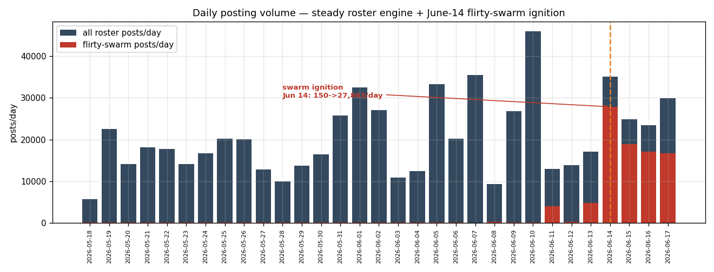
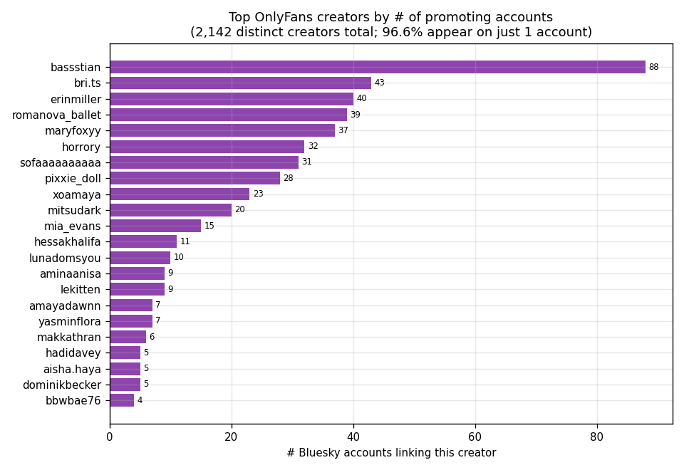
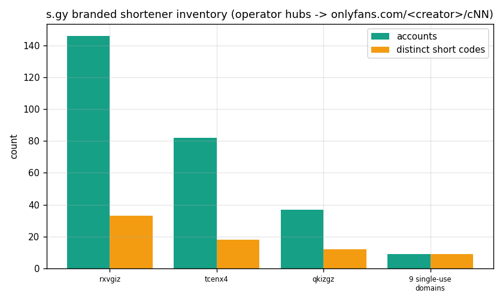
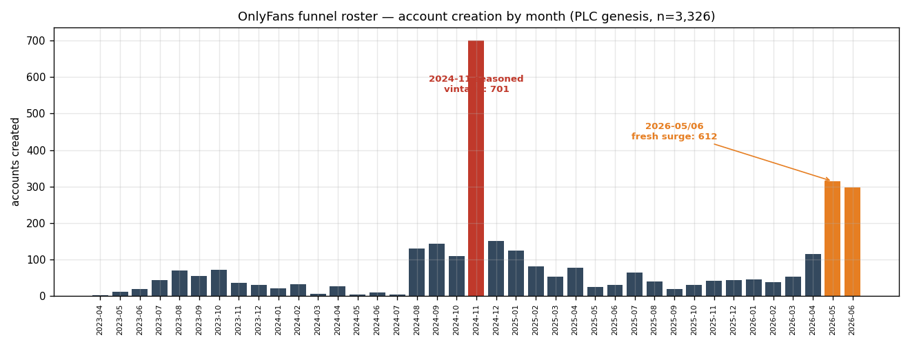
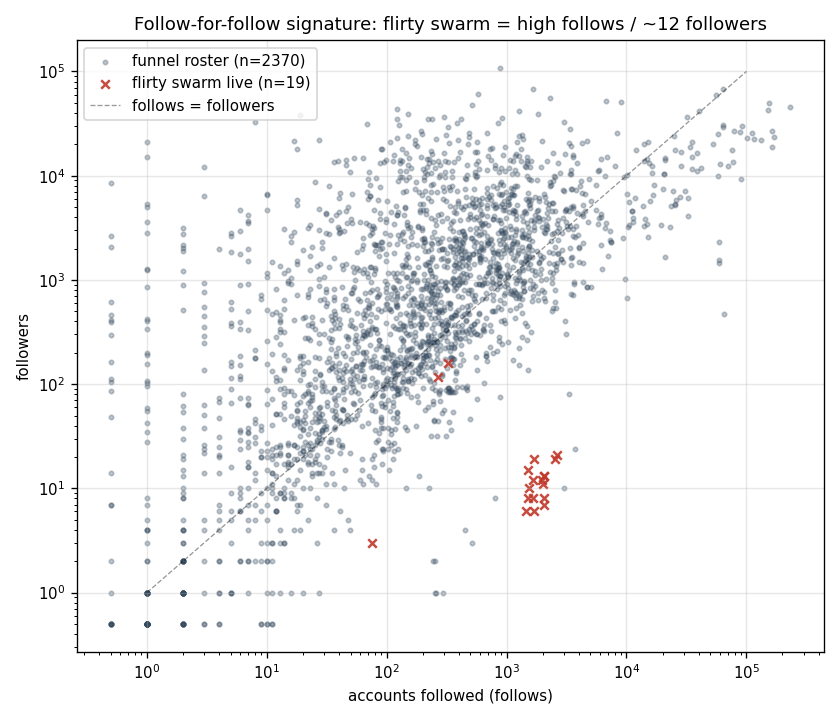
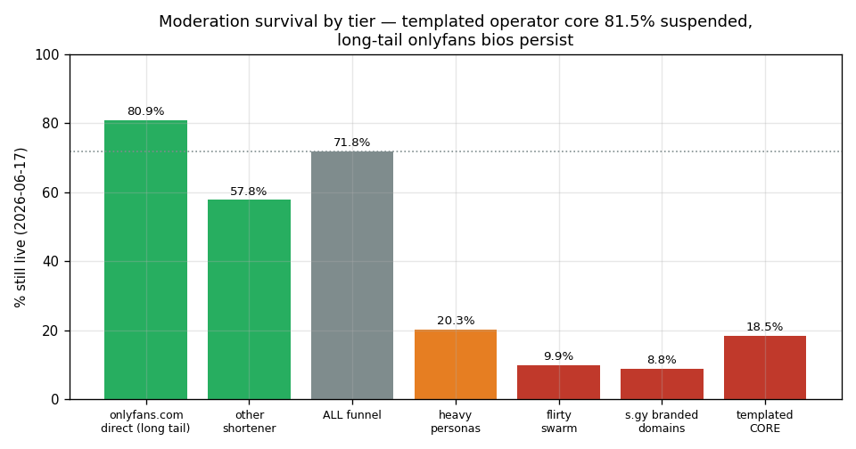

# OnlyFans Affiliate Funnel + LLM-Driven Flirty Reply-Bot Swarm

**Investigation Date:** 2026-06-17
**Analyst:** Bluesky Bot Hunter
**Methodology:** KQL over the Bluesky Firehose (Microsoft Fabric Eventhouse: `Profile_v2`, `Post_v1`) + public AppView (`getProfiles`, `getProfile`, `resolveHandle`) + PLC-directory genesis dating + HTTP redirect-chain resolution of `s.gy` short links (headers only, no media fetched)
**Scope:** **3,326 accounts** carrying templated OnlyFans / `s.gy` bios on standard `bsky.network` shards (no self-hosted PDS — attribution is behavioural), funnelling to **2,142 distinct OnlyFans creators**; **638,650 posts (88.5% replies)** in the 30-day firehose window; a **192-account flirty-template reply swarm** that ignited 2026-06-14.
**Recon source:** [`recon/2026-06-17-suspect-sweep`](../../recon/2026-06-17-suspect-sweep/report.md) Finding #3 (3,083 accounts) — re-derived and confirmed here; the network has **grown +243 accounts** since the recon snapshot.
**Relation to other investigations:** Independent of the haruhwa / louisvillebsky / pds.trump.com operators (different infrastructure, templates, and purpose). Same *playbook family* as the [b-short Japanese ring](../2026-05-27-bshort-japanese-ring/README.md) and [burst-follow spam](../2026-05-28-burst-follow-spam/README.md): off-platform adult-content funnel via link shortener.

---

## Executive Summary

A commercial **OnlyFans affiliate-marketing operation** runs a large, behaviourally-coordinated
account network on Bluesky. Unlike the empty follow-bot rings previously documented, this
operation defeats profile-based bot detection by **seasoning fully-built accounts** (avatar,
persona display name, written bio, real follower counts, hundreds of posts) and driving them
with an **LLM-backed reply generator**.

- **Scale (re-derived):** **3,326 accounts** carry a `s.gy`-shortener or `onlyfans.com` bio
  (recon's 3,083 are a strict subset; +243 created/relabelled since). They produced
  **638,650 posts in 30 days, 88.5% of them replies** — a sustained reply-spam engine
  averaging ~900 active accounts/day.
- **The funnel is an affiliate aggregator, not one creator.** Bios point to **2,142 distinct
  OnlyFans creators**; **96.6% of those creators appear on exactly one account**. A small
  **heavy-persona core** (`bri.ts`/`maryfoxyy`/`katienoir`/`kristy_soul`/`bassstian`) is
  replicated across dozens of accounts each. OnlyFans referral campaign codes (`/c62`,
  `/c133`, `/c2`) and a bio reading **"65% of $7"** confirm a revenue-share/referral model.
- **Three operator-run `s.gy` shorteners** — `rxvgiz` (146 accts), `tcenx4` (82), `qkizgz`
  (37) — `302`-redirect straight to `onlyfans.com/<creator>/c<N>` (verified by header-only
  redirect resolution; no media fetched).
- **The reply swarm is automated and recently ignited.** A 192-account flirty-template cohort
  jumped from ~150 posts/day to **27,863 posts/day on 2026-06-14** (~185x), 96.4% replies. The
  generator's scaffolding **leaked into the posts**: `"here are a few flirty caption options
  for your post…"` (LLM preamble, 13 accounts) and a Python exception `"…object has no
  attribute…"` (**79 accounts share the same buggy code path**) — conclusive shared-infrastructure evidence.
- **Targets = reach, not a community.** Replies hit **110,161 distinct accounts (94.8%
  external, only 5.2% self-network)** — overwhelmingly **high-cadence feed/news/aggregator
  bots** (constant fresh threads) plus a few jackpot real accounts (**The Guardian 779K**,
  **Aaron Rupar 953K**).
- **Moderation is biting the loud tiers hardest.** **28.2% of the roster is already
  suspended/deleted.** Split by tier: the **`s.gy` accounts are 91% gone, the flirty swarm 90%
  gone, heavy personas 80% gone** — but the quieter **`onlyfans.com`-direct long tail is 80.9%
  still live.** The templated operator *core* (545 accts) is **81.5% suspended**.
- **Standard bot score is the wrong tool here.** `heuristic.py` (tuned for empty follow-bots)
  scores this network a **mean 0.232** — precisely because the accounts are seasoned and
  organic-looking. Detection must be **bio-template + `s.gy` domain + reply-behaviour +
  generator-leak**, not profile completeness.

**Confidence:** *Coordinated single-operator infrastructure* — **High** (shared shorteners,
shared buggy generator across 79+ accounts, shared bio templates and personas, synchronized
ignition). *Business model = OnlyFans affiliate/referral aggregation* — **High** (2,142
creators, `/cN` referral codes, "65% of $7" revshare bio). *Whole long-tail is inauthentic* —
**Medium-High** (the leaked generator and 88.5% network-wide reply rate implicate the tail, but
some single-creator accounts may be genuine creators enrolled in the same affiliate tooling).

---

## Key Indicators

| Signal | Value |
|--------|-------|
| Funnel-bio accounts (re-derived) | **3,326** (recon 3,083 + 243 grown) |
| Distinct OnlyFans creators referenced | **2,142** (96.6% on a single account) |
| Posts in 30-day window | **638,650** |
| Reply share (roster) | **88.5%** (565,224 replies) |
| Active posters | 3,132 / 3,326 (94%) |
| Flirty reply swarm | **192 seeds** (185 with funnel bios) |
| Swarm posts / reply rate | **92,814 / 96.4%** |
| Swarm ignition date | **2026-06-14** (~150 → 27,863 posts/day) |
| Distinct reply targets (12d) | **110,161** (94.8% external) |
| `s.gy` branded shorteners | `rxvgiz` 146, `tcenx4` 82, `qkizgz` 37 (+9 single-use) |
| Funnel destination | `onlyfans.com/<creator>/c<N>` (referral codes) |
| Shared buggy generator (Python-exception leak) | **79 accounts** |
| Live-survival (whole roster) | **71.8% live / 28.2% suspended** |
| Live-survival (templated core) | **18.5% live / 81.5% suspended** |
| Heuristic bot score (mean / median) | **0.232 / 0.200** (seasoning defeats it) |
| PDS infrastructure | standard `bsky.network` shards (no self-hosted PDS) |
| Dominant language | English (98.1%) |

---

## 1. Network Overview & Scale

A single Profile_v2 scan (`description contains "s.gy" or "onlyfans"`, deduped to the latest
snapshot per DID) returns **3,326 distinct accounts**. The recon roster of 3,083 is a **strict
subset** (all 3,083 present); the extra **243** are accounts created or re-bio'd since the
recon snapshot — i.e. the network is **still growing**, consistent with the two live anchors
(`woo-30`/BrrriSecret and `jbaily`/MaryFFFFoxy) whose post counts grew between the recon and
this report.

| Metric | Value | Source |
|--------|-------|--------|
| Funnel-bio accounts | 3,326 | `Profile_v2` scan |
| — with `onlyfans.com/<creator>` link | 2,599 | bio parse |
| — with `*.s.gy/<code>` link | 274 | bio parse |
| — "onlyfans" word but link to other host | 453 | bio parse |
| Posts (2026-05-18 → 06-17) | 638,650 | `Post_v1` |
| Replies | 565,224 (**88.5%**) | `Post_v1` |
| Top-level posts | 73,426 | `Post_v1` |
| Accounts that posted | 3,132 (94%) | `Post_v1` |
| Mean active accounts/day | ~900 | `Post_v1` daily bins |

No account uses **both** `s.gy` and `onlyfans.com` (the two mechanisms are mutually exclusive
per account — a routing choice by the operator). The 453 "other-host" accounts point to
`bit.ly` (138), `linktr.ee` (43), `allmylinks.com`, `tinyurl`, `beacons.ai`, `fansly.com`,
`throne.com`, `t.me` — a mix of operator templates (e.g. the duplicated "Emma Wilson" `bit.ly`
bios) and a minority of plausibly-genuine creators (caveat in §9).

**The whole roster is a steady reply engine, not just the swarm.** Daily posting held at
~10,000–46,000 posts/day across the full 30 days (see chart), 85–90% replies, *before* the
192-account flirty swarm ignited on June 14. The swarm is an additional high-volume layer on
top of an already-mature operation.



---

## 2. Persona & Bio-Template Analysis

### 2.1 Two persona layers

**(a) A heavy-persona core** — a handful of personas replicated across dozens of accounts each,
every copy given a **unique repeated-letter misspelling** to defeat exact-match display-name
dedup:

| Persona (repeat-collapsed) | Accounts | Distinct spellings | OnlyFans creator | Sample spellings |
|---|---:|---:|---|---|
| BriSecret | 93 | **43** | `bri.ts` | BriSeecret, BriSSecret, BriiSecret, BriSecrret, BrriSecret |
| Kristisha | 69 | **33** | `kristy_soul` | KKristisha, Kriistisha, Kristissha, Kristishha |
| MaryFoxy | 68 | **30** | `maryfoxyy` | MaryFooxy, MarryFoxy, MaaryFoxy, MaryFoxxy |
| KateNoir | 36 | **23** | `katienoir` | KateNoir, Kaatenoir, Kateenoir, Katenoiir |
| "Emma Wilson" | 133 | 1 | *(multiplexer — many creators)* | Emma Wilson |
| 🔞DomKing🔥 / "Follow My Daddy +18" | 53 | — | `bassstian` (male) | — |

**(b) A long tail** — **2,142 distinct OnlyFans creators**, of which **2,070 (96.6%) appear on
exactly one account**. Only 13 creators have ≥10 accounts. Top creators: `bassstian` (88),
`bri.ts` (43), `erinmiller` (40), `romanova_ballet` (39), `maryfoxyy` (37), `horrory` (32),
`sofaaaaaaaaaa` (31), `pixxie_doll` (28), `xoamaya` (23), `mitsudark` (20).



The **"Emma Wilson" shell** is a multiplexer: a single generic display name spread across
accounts that each push a *different* creator (`romanova_ballet`, `mitsudark`, `horrory`,
`pixxie_doll`, `erinmiller`, `sofaaaaaaaaaa` …) — the classic aggregator signature, one
template shell servicing many affiliate creators.

**Repeated-letter evasion is overt:** 288 accounts (9.0%) carry a 3+ identical-letter run in
the display name; the four heavy personas alone span 129 distinct spellings of four names.

### 2.2 Bio-template families

Two bio registers coexist, both templated:

- **Innocuous "cover" bios** (no adult wording, just a link): `"here for good energy and real
  connections"` (42), `"living my best life come say hi"` (38), `"new to bluesky… my profiles
  some[where]"` (35), `"creative soul sharing daily vibes"` (30), plus 119 accounts with a
  bare link only.
- **Overt flirty bios:** `"too hot for your standard feed…"` (15), `"if you only knew how badly
  I want you…"` (14), and the persona scripts (`"Hey there! I'm a 21-year-old blonde
  bombshell…"`, `"…22 y/o redhead…"`).

---

## 3. Funnel & Shortener Mapping

### 3.1 `s.gy` branded-shortener inventory

`s.gy` is a public link-shortener service that supports **branded subdomains**. This operator
controls (at least) three branded hubs, each holding many per-creator short codes:

| `s.gy` hub | Accounts | Distinct codes | Resolves to (302, header-only) |
|---|---:|---:|---|
| `rxvgiz.s.gy` | 146 | 33 | `onlyfans.com/katienoir/c62`, `onlyfans.com/maryfoxyy/…` |
| `tcenx4.s.gy` | 82 | 18 | `onlyfans.com/bri.ts/c133` |
| `qkizgz.s.gy` | 37 | 12 | `onlyfans.com/kristy_soul/c2` |
| 9 single-use domains | 9 | 9 | (1 sampled returned 404) |
| **Total** | **274** | **72** | all live ones → `onlyfans.com` |



**Redirect resolution (evidence):** every sampled `rxvgiz/tcenx4/qkizgz` short link returns a
single `302` straight to `onlyfans.com/<creator>/c<N>`. The redirect chain was walked with
HTTP **HEAD/Location only — the OnlyFans landing page was never fetched** (saved in
`data/sgy_redirect_resolution.json`). The `/c<N>` suffix is OnlyFans' own **referral-tracking
campaign code**, attributing traffic per source — the technical fingerprint of affiliate
marketing.

### 3.2 One operator, many creators (affiliate aggregator)

The combination of (a) **2,142 distinct creators**, (b) **96.6% single-account creators**,
(c) operator-controlled shared `s.gy` hubs routing to *different* creators per code,
(d) a generic "Emma Wilson" shell multiplexing creators, and (e) the **"65% of $7"** revshare
string in a `bassstian` persona bio, all point to an **affiliate/referral aggregator**: one
operator runs the spam infrastructure and earns OnlyFans referral commissions across a large
roster of creators — *not* a single creator self-promoting.

---

## 4. Account Creation Timeline — Seasoned Core + Fresh Surge

PLC-directory genesis timestamps (authoritative) for all 3,326 accounts:



| Cohort | Accounts | Reading |
|---|---:|---|
| 2023 | 334 | scattered aged accounts (possibly recycled/purchased) |
| 2024 (full year) | 1,333 | the seasoned core |
| — **2024-11 vintage** | **701** | single largest creation month — ~19-month-aged "seasoning" |
| 2025 | 620 | steady trickle |
| 2026 (to date) | 862 | — |
| — **2026-05 + 2026-06 surge** | **612** | fresh deployment (314 + 298) |

This is a deliberate **two-phase stockpile**: a large block of accounts registered in late
2024 and aged for ~19 months (so they read as "old, established" accounts), supplemented by a
fresh 2026-05/06 surge. Aged accounts are harder to dismiss as throwaway bots and carry
accumulated follower counts — directly explaining why the standard heuristic underscores them.

---

## 5. Reply-Swarm Target Analysis

### 5.1 The June-14 ignition

The 192-account flirty cohort was near-dormant (3–5 accounts, ~150 posts/day) from mid-May
until **2026-06-14**, when it ignited to **27,863 posts/day across 104 accounts** and has run
hot since (18,898 → 17,115 → 16,758/day). **87% of all 92,814 swarm posts fall in the last
4 days.** Reply rate **96.4%** (vs 88.5% roster-wide).

### 5.2 Who they reply to

Over a 12-day window the roster issued **292,421 replies to 110,161 distinct targets** —
**94.8% external, only 5.2% inside the network** (so this is *not* a self-reply / mutual-boost
ring; it sprays onto real threads). Resolving the top-60 targets:

| Target type | Examples (handle, followers, replies-received) | Why targeted |
|---|---|---|
| High-cadence **feed/aggregator bots** | `nowbreezing.ntw.app` (14k, 724), `bot-tan.suibari.com` (10k, 341), `babygoldie` "News" (357, 1379), `longtail-news` (320), `rotowire` (3k), `raw NFL/NBA`, `factsf1` | post constantly → endless fresh threads to reply under |
| **`bs247.net` sales-bot family** | UK/US Classic Cars, Boat Sales, Harley Sales | another high-frequency bot network = reply bait |
| **Jackpot real accounts** | **`theguardian.com` (779k, 193)**, **`atrupar.com` / Aaron Rupar (954k, 184)** | maximum reply visibility |
| Other spam bots | `553eofo…` & `ja5wzhrx…` (the recon's crypto reply-bots) | high post volume |

The strategy is **reach maximisation, not community targeting**: pile context-free flirty
one-liners under whatever posts most often. 13 of the top-60 targets are themselves already
suspended.

### 5.3 The flirty template generator

The swarm's replies are short, context-free compliments usable under any post:
`"stop it youre making me blush"`, `"instant favorite no notes"`, `"youre trouble i can tell"`,
`"now im curious about you"`, `"careful i might start following you"` — ~20 fixed templates
each used ~2,600× in 7 days. The broader long-tail uses a **more varied LLM generator** (top-50
templates cover only 8% of replies) producing flirty pickup lines (`"hey you, something about
your energy just pulled me in…"`) interleaved with **camouflage affirmations** (`"makes
sense"`, `"true"`, `"fair point"`, `"love this so inspiring"`) to look like a real engaged user.

---

## 6. Tradecraft

1. **Repeated-letter display-name evasion.** Each copy of a persona gets a unique misspelling
   (`MaryFFFFoxy`, `MMMMMaryFoxy`, `MaaryFoxy` …). 4 heavy personas → 129 spellings; 9.0% of
   all accounts carry an overt 3+ letter run. Defeats exact-string display-name clustering.
2. **Persona reuse across many accounts** tied to **one OnlyFans creator** (e.g. 93 "BriSecret"
   accounts → `onlyfans.com/bri.ts`), plus a generic shell ("Emma Wilson") multiplexing many
   creators.
3. **Link-shortener rotation & routing.** Per-account choice of `s.gy` hub vs direct
   `onlyfans.com` vs `bit.ly`/`linktr.ee`; three operator-branded `s.gy` hubs each fan out to
   per-creator referral codes. Rotating short domains evades simple bio-URL blocklists.
4. **Aged "seasoning" + fresh creation.** A 701-account 2024-11 vintage aged ~19 months,
   topped up by a 612-account 2026-05/06 surge — manufacturing "established account" credibility.
5. **Profile completeness as camouflage.** Avatar + persona + written bio + accumulated
   followers + hundreds of posts → the accounts read as real, and **standard profile-based bot
   scoring fails** (mean 0.232).
6. **LLM-generated reply content** to evade template-matching: varied flirty pickup lines +
   camouflage affirmations. The generator occasionally **leaks its own scaffolding** (see §7).
7. **Follow-for-follow on the active layer.** The flirty swarm runs high follows / ~12
   followers (median 1,686 follows); the aged tail instead shows accumulated followers
   (median 616) — two engagement tactics for two account ages.



---

## 7. Coordination Evidence (Shared Generator)

Searching the roster's June posts for generator scaffolding that should never appear in human
text:

| Leaked string | Posts | Distinct accounts | Meaning |
|---|---:|---:|---|
| `…object has no attribute…` (Python exception, HTML-rendered) | 920 | **79** | the **same buggy code path** failed across 79 accounts |
| `here are a few flirty caption options for your post…` | 259 | 13 | **LLM wrapper preamble** leaked verbatim |
| `as an AI` / `language model` | 6 | 6 | model disclaimer leak |
| `I cannot assist` / refusal | 1 | 1 | model refusal leak |

**79 accounts emitting the identical Python traceback is conclusive proof of shared automation
infrastructure** — independent human creators do not all surface the same `NoneType` error.
This is the single strongest coordination signal in the dossier.

---

## 8. Live Survival / Moderation Rate

A full AppView sweep of all 3,326 DIDs on 2026-06-17:

| Tier | n | Live now | % live |
|---|---:|---:|---:|
| **Whole roster** | 3,326 | 2,389 | **71.8%** |
| `onlyfans.com`-direct (long tail) | 2,599 | 2,103 | 80.9% |
| other-shortener bios | 453 | 262 | 57.8% |
| heavy personas | 399 | 81 | 20.3% |
| flirty reply swarm | 192 | 19 | **9.9%** |
| `s.gy` branded-domain accounts | 274 | 24 | **8.8%** |
| **Templated operator core** (s.gy ∪ heavy persona ∪ swarm ∪ shared-template) | 545 | 102 | **18.5%** |



**28.2% of the roster is already suspended/deleted**, but moderation is strongly
**tiered by loudness**: the operator's most-templated, highest-volume layers (`s.gy` accounts,
the flirty swarm, the heavy personas) are **80–91% removed**, while the quieter
`onlyfans.com`-direct long tail **persists at ~81% live**. Bluesky's content labels on
surviving accounts are mostly adult-content (`porn` 371, `sexual` 108, `nudity` 82,
`!no-unauthenticated` 307) rather than spam/bot (`spam` 2, `bot` 1) — i.e. the network is being
caught as *adult content*, not yet as *coordinated spam*, leaving the behavioural layer
under-addressed. The operation remains **active and growing** (the two anchors are live and
gained posts/follows since the recon snapshot).

---

## 9. Attribution

- **Coordinated single-operator infrastructure — High confidence.** Shared `s.gy` hubs,
  **79 accounts sharing one buggy generator** (identical Python traceback), shared bio-template
  families, shared replicated personas with systematic letter-evasion, and a synchronized
  June-14 swarm ignition.
- **Business model = OnlyFans affiliate/referral aggregation — High confidence.** 2,142
  distinct creators, OnlyFans `/c<N>` referral codes on every resolved short link, a "65% of
  $7" revshare bio, and a generic shell multiplexing many creators. This is **not one creator**
  self-promoting; it is an operator monetising referral commissions across many creators.
- **The entire long tail is inauthentic — Medium-High confidence.** The network-wide 88.5%
  reply rate and the leaked generator implicate the tail, but a minority of single-creator
  `onlyfans.com` accounts (median 616 followers, 141 posts) could be **genuine creators
  enrolled in / imitating the same affiliate tooling**. The **high-confidence core is the 545
  templated/s.gy/swarm accounts**, not all 3,326.
- **Not linked** to haruhwa/louisvillebsky/pds.trump.com: different infrastructure (no
  self-hosted PDS), different templates, different purpose. Same generic *playbook* as prior
  adult-funnel rings (b-short, watchmelive) but an independent operator.

---

## 10. Detection Signatures & Key DIDs

These accounts season their profiles, so **profile-completeness bot scoring is ineffective**
(mean 0.232). Use **behavioural + infrastructure signatures** instead:

```
# S1 — operator shortener (deterministic, highest precision)
bio matches  /(rxvgiz|tcenx4|qkizgz)\.s\.gy\//        -> confirmed operator account
bio matches  /[a-z0-9]+\.s\.gy\//                       -> operator account (any s.gy branded hub)

# S2 — heavy persona + letter-evasion
display_name (repeat-collapsed) in {brisecret, kristisha, maryfoxy, katenoir}
   AND bio references onlyfans.com or s.gy                -> persona clone
display_name has 3+ repeated-letter run AND bio has onlyfans/s.gy

# S3 — shared generator leak (behavioural, deterministic)
post text contains "object has no attribute"  (NoneType traceback)   -> generator-driven
post text contains "here are a few flirty caption options"           -> LLM preamble leak

# S4 — reply-spam behaviour
>= 85% of posts are replies  AND  bio references onlyfans.com/<creator> or *.s.gy
   AND replies are context-free compliments (see data/swarm_templates.json)

# S5 — affiliate referral target
bio/redirect resolves to onlyfans.com/<creator>/c<N>   (referral campaign code)
```

**Recommended moderation-list scope:** the **545-DID templated core**
(`data/detection_core_dids.csv`) as Tier-A (high confidence), plus any account matching **S1 or
S3** (deterministic). Treat the broader 3,326 (`data/funnel_profiles.jsonl`) as Tier-B watch
with the §9 false-positive caveat.

**Key DIDs / handles to monitor** (live as of 2026-06-17; full list in
`data/key_monitor_dids.csv`):

```
did:plc:w6xohmchp4kvepqrcd2ezx4d  woo-30.bsky.social   BrrriSecret  bio=tcenx4.s.gy/bIT82I  ->302->  onlyfans.com/bri.ts/c133  (verified 2026-06-17)
did:plc:adp7fkk6zrun5zds4z3n5wdu  jbaily.bsky.social   MaryFFFFoxy  bio=onlyfans.com/maryfoxyy/c37  (direct referral link, verified 2026-06-17)
```

s.gy operator hubs to blocklist: `rxvgiz.s.gy`, `tcenx4.s.gy`, `qkizgz.s.gy`
→ `onlyfans.com/{katienoir, maryfoxyy, bri.ts, kristy_soul}`.

---

## 11. Conclusion

This is a **mature, commercially-motivated OnlyFans affiliate-spam operation** that has
out-evolved empty-bot detection. It seasons aged accounts, dresses them with real personas and
bios, and drives them with an LLM reply generator that sprays context-free compliments onto the
busiest threads on Bluesky to funnel clicks — through operator-branded `s.gy` shorteners and
direct links carrying OnlyFans referral codes — to **2,142 creators** for referral commission.
A 192-account flirty swarm ignited on **2026-06-14** as a high-volume amplification layer.
Bluesky T&S has removed the loudest tiers (80–91%) but the quiet long tail persists at ~81%,
and the network is still growing. Because there is **no PDS to block**, mitigation must be the
**behavioural/infrastructure signatures in §10**, anchored on the deterministic `s.gy`-hub and
generator-leak signals.

---

## 12. Data Sources, Gaps & Caveats

**Sources.** KQL over Fabric Eventhouse `bluesky` DB (`Bluesky.Actor.Profile_v2`,
`Bluesky.Feed.Post_v1`); public AppView (`getProfiles`/`getProfile`/`resolveHandle`); PLC
directory genesis timestamps (via recon CSV + AppView `createdAt`); HTTP redirect-chain
resolution of `s.gy` links (headers only). All figures are from queries/fetches actually run;
raw exports and scripts are in `data/`.

**Budget discipline.** Shared 5 GB cluster: one filtered `Profile_v2` scan, one full filtered
`Post_v1` totals scan, the rest **windowed** (12-day / 7-day / pre-ignition) and **DID-filtered**
group-bys. **No temp tables or server-side objects created** (client-side queries only) → no
cluster cleanup required.

**Gaps & caveats.**
- **31-day firehose window** (2026-05-18 → 06-17). Pre-window posting/behaviour is invisible;
  the 638,650 post count is a 30-day figure, not all-time.
- **Roster definition is bio-based** (`s.gy`/`onlyfans` substring). It will **miss** funnel
  accounts that currently hide the link, and may **include** a minority of **genuine OnlyFans
  creators** in the long tail — hence the §9 confidence split and the 545-DID high-confidence
  core. Numbers will drift as moderation removes accounts and the operator adds more.
- **`heuristic.py` score (0.232) is intentionally reported as a negative result** — it
  demonstrates that this network defeats profile-completeness scoring; it is *not* evidence the
  accounts are benign.
- **Attribution is behavioural** (no self-hosted PDS, no operator login). "Coordinated" = the
  measurable shared generator/shorteners/templates, not asserted identity. Affiliate-aggregator
  inference is strong but the operator's identity is not established.
- **No media fetched**; explicit content summarised clinically; `s.gy` links inspected by
  redirect headers only.

---

### Files

- `assets/` — `creation_timeline.png`, `persona_distribution.png`, `sgy_distribution.png`,
  `follow_vs_follower.png`, `swarm_ignition.png`, `survival_by_segment.png`
- `data/` — `funnel_profiles.jsonl` (3,326 scanned bios), `appview_roster.jsonl` (live sweep),
  `scored_cohort.csv`, `detection_core_dids.csv` (545), `key_monitor_dids.csv`,
  `onlyfans_creator_tally.csv`, `sgy_code_tally.csv`, `sgy_redirect_resolution.json`,
  `reply_targets_resolved.json`, `reply_split.json`, `swarm_daily_timeline.json`,
  `roster_daily_timeline.json`, `lang_distribution.json`, `swarm_templates.json`,
  `nonswarm_templates.json`, `generator_leak_fingerprint.json`, `post_totals.json`,
  `segment_summary.json`, `survival_summary.json`, `creation_timeline.json`,
  `findings_summary.json`, and scripts `kql.py`, `01_profile_scan.py`, `02_funnel_analysis.py`,
  `03_redirect_resolve.py`, `04_post_kql.py`, `05_survival_score.py`, `plot.py`.

*Investigation conducted via KQL against the Bluesky Firehose (Microsoft Fabric Eventhouse) and
the public AT-Protocol AppView. 2026-06-17.*
