# Auffällige Follow-Muster auf Bluesky: Vier deutsche Accounts im Datenvergleich

> **Stand:** Mai 2026 · **Datenquelle:** Bluesky-Firehose (letzte 7 Tage) + Bluesky-API · **Methodik:** siehe [Abschnitt 8](#8-methodik)
>
> 🔄 **Nachtrag vom 20. Juni 2026 (sechs Wochen später):** erneute Überprüfung von Moderationsstatus und laufender Aktivität — siehe [Abschnitt 10](#10-nachtrag--sechs-wochen-später-20-juni-2026).

---

## Inhaltsverzeichnis

1. [Zentrale Messwerte auf einen Blick](#1-zentrale-messwerte-auf-einen-blick)
2. [Untersuchungsrahmen und Begriffe](#2-untersuchungsrahmen-und-begriffe)
3. [Befund 1 — Basiswerte der vier Ankerkonten](#3-befund-1--basiswerte-der-vier-ankerkonten)
4. [Befund 2 — Zeitliche und verhaltensbezogene Muster](#4-befund-2--zeitliche-und-verhaltensbezogene-muster)
5. [Befund 3 — Skript-Fingerabdruck: Warum „automatisiert"?](#5-befund-3--skript-fingerabdruck-warum-automatisiert)
6. [Befund 4 — Co-Follow-Netzwerke im Vergleich](#6-befund-4--co-follow-netzwerke-im-vergleich)
7. [Befund 5 — Like-Netzwerke im Vergleich](#7-befund-5--like-netzwerke-im-vergleich)
8. [Methodik](#8-methodik)
9. [Datenquellen](#9-datenquellen)
10. [Nachtrag — Sechs Wochen später (20. Juni 2026)](#10-nachtrag--sechs-wochen-später-20-juni-2026)

---

## 1. Zentrale Messwerte auf einen Blick

| Merkmal | NIUS | AfD | SPD | Grüne |
|---|---:|---:|---:|---:|
| Account erstellt | 4. Mai 2026 | 6. Mai 2026 | Okt. 2023 | Okt. 2023 |
| Aktuelle Follower (ca.) | ~2.100 | ~700 | >5.000 | >5.000 |
| **Analysiert gesamt** | **2.162** | **2.135**† | **5.000*** | **5.000*** |
| Mittlerer Bot-Score | 0,49 | 0,49 | 0,38 | 0,39 |
| Accounts mit Bot-Score ≥ 0,7 | 10 | 13 | 0 | 0 |
| Knoten im Co-Follow-Graph | 465 | 425 | 154 | 222 |
| Kanten im Co-Follow-Graph | 37.924 | 34.936 | 6.477 | 7.333 |
| Kern-Anteil (dicht vernetzt) | 88 % | 87 % | 28 % | 29 % |
| Überlappung NIUS ↔ AfD | 91 % | — | — | — |

*\*Stichprobe: Ab 5.000 Followern wird eine Stichprobe aus der Gesamtheit gezogen.*
*†Enthält Follows an den aktuellen und einen früheren Account mit demselben Handle (siehe [Hinweis](#warum-unterscheiden-sich-die-analysierten-follower-zahlen-von-den-aktuellen-follower-zahlen)).*

Diese Tabelle fasst die wichtigsten Messwerte zusammen. Die folgenden Abschnitte erklären, was diese Zahlen bedeuten und wie sie zustande kommen.

---

## 2. Untersuchungsrahmen und Begriffe

### Was wurde untersucht?

Für vier öffentliche Bluesky-Accounts — **@niusde.bsky.social** (Nachrichtenmedium NIUS), **@alternativefuerde.bsky.social** (AfD-Bundespartei), **@spd.de** (SPD-Bundespartei) und **@gruene.de** (Bündnis 90/Die Grünen) — wurden die Follower-Listen ausgewertet. Die Analyse sucht nach messbaren Auffälligkeiten in den Follow-Mustern.

**Alle vier Ankerkonten wurden mit exakt denselben Analysescripten, denselben Schwellenwerten und denselben Methoden ausgewertet.** Es gibt keine unterschiedlichen Regeln oder Parameter für verschiedene Accounts. Die Unterschiede in den Ergebnissen ergeben sich ausschließlich aus den Daten selbst.

### Warum unterscheiden sich die analysierten Follower-Zahlen von den aktuellen Follower-Zahlen?

Die Analyse kombiniert zwei Datenquellen:

1. **Bluesky-API:** Die aktuelle Follower-Liste zum Zeitpunkt der Erhebung.
2. **Bluesky-Firehose:** Sämtliche Follow-Events der letzten 7 Tage — einschließlich Accounts, die in diesem Zeitraum gefolgt und anschließend wieder *entfolgt oder gelöscht* wurden.

| Ankerkonto | Erstellt auf Bluesky | Aktuelle Follower (ca.) | Analysiert gesamt | Anmerkung |
|---|---|---:|---:|---|
| @niusde | 4. Mai 2026 | ~2.100 | 2.162 | API + Firehose |
| @alternativefuerde | 6. Mai 2026 | ~700 | 2.135 | ⚠ Siehe Hinweis |
| @spd.de | Okt. 2023 | >5.000 | 5.000* | Stichprobe |
| @gruene.de | Okt. 2023 | >5.000 | 5.000* | Stichprobe |

Die Analyse erfasst Follower aus zwei Quellen, die sich gegenseitig ergänzen:

1. **Bluesky-Firehose:** Zeichnet sämtliche Follow-Events in Echtzeit auf. Das Beobachtungsfenster umfasst die letzten 7 Tage. Alle Accounts, die dem Ankerkonto in diesem Zeitraum neu gefolgt sind, werden erfasst — einschließlich solcher, die anschließend wieder entfolgt oder gelöscht wurden.
2. **Bluesky-API:** Liefert die aktuelle Follower-Liste. Nach Abzug der bereits im Firehose-Fenster erfassten Accounts bleiben Follower übrig, die dem Ankerkonto vor dem Beobachtungsfenster gefolgt sind und noch aktuell folgen.

Beide Quellen werden über die eindeutige Account-ID (DID) dedupliziert.

**Hinweis @alternativefuerde (AfD):** Der aktuelle AfD-Account (@alternativefuerde.bsky.social) wurde am 6. Mai 2026 erstellt. Der Handle wurde zuvor von einem anderen Account genutzt. Die Firehose-Daten im Beobachtungsfenster enthalten daher sowohl Follows an den aktuellen als auch an den früheren Account mit demselben Handle. In der Analyse werden die Daten zusammen ausgewertet — die Co-Follow- und Bot-Score-Ergebnisse beziehen sich auf die Gesamtheit der Accounts, die dem Handle `alternativefuerde.bsky.social` im Beobachtungszeitraum gefolgt sind.

**@niusde** wurde am 4. Mai 2026 erstellt. Innerhalb von 3 Tagen wurden 1.440 Follow-Events im Firehose erfasst und 722 weitere aktuelle Follower über die API.

Bei @spd.de und @gruene.de ist die Follower-Zahl deutlich größer. Ab 5.000 Followern wird eine Stichprobe aus der Gesamtheit gezogen, um die Analyse handhabbar zu halten. Die hier gezeigten 5.000 Follower pro Account sind daher eine Stichprobe, nicht die vollständige Liste. Die Firehose-Daten wurden zusätzlich für die Co-Follow- und Quorum-Analyse herangezogen.

### Wichtige Begriffe

- **Bot-Score:** Ein rechnerischer Indikator, der Merkmale wie zeitliche Nähe aufeinanderfolgender Follows, Kontoalter, Profilgestaltung und Follow-Überlappung kombiniert. Ein hoher Bot-Score zeigt automatisierungsähnliche Messwerte — er ist kein Beweis dafür, dass ein Account technisch automatisiert betrieben wird.

- **Co-Follow-Graph:** Ein Netzwerkbild, das *ausschließlich auf Basis der auffälligen Follower* erstellt wird — also nur der Follower, deren Bot-Score ≥ 0,45 liegt. Für diese Teilgruppe wird ermittelt, welchen *weiteren* Accounts sie ebenfalls folgen. Je mehr auffällige Follower zwei Ziel-Accounts gemeinsam haben, desto enger sind diese im Graphen verbunden. Normale Follower (Bot-Score < 0,45) fließen nicht in den Co-Follow-Graphen ein.

- **Kern und Peripherie:** Im Co-Follow-Graphen bilden Accounts, die stark untereinander vernetzt sind (viele gemeinsame Follower), den *Kern*. Accounts mit weniger Verbindungen bilden die *Peripherie* (am Rand der Grafik).

- **Quorum-Gruppe:** Accounts, die in einem definierten Zeitfenster denselben Satz von Zielkonten in derselben Reihenfolge verfolgen. Die Gleichförmigkeit dieses Musters ist der Messwert.

- **Kadenz:** Der zeitliche Abstand (in Sekunden) zwischen aufeinanderfolgenden Follow-Ereignissen eines Accounts. Eine regelmäßige Kadenz von z. B. 12 Sekunden deutet auf gleichförmiges Verhalten hin.

### Was diese Analyse ausdrücklich *nicht* tut

Diese Analyse trifft keine Aussage über:
- wer hinter den Accounts steht,
- ob Accounts absichtlich gesteuert werden,
- die politische Motivation hinter den Mustern,
- ob diese Muster rechtswidrig sind.

Die folgenden Befunde präsentieren ausschließlich Messwerte. Die Interpretation bleibt der Leserin und dem Leser überlassen.

---

## 3. Befund 1 — Basiswerte der vier Ankerkonten

### NIUS (@niusde.bsky.social)

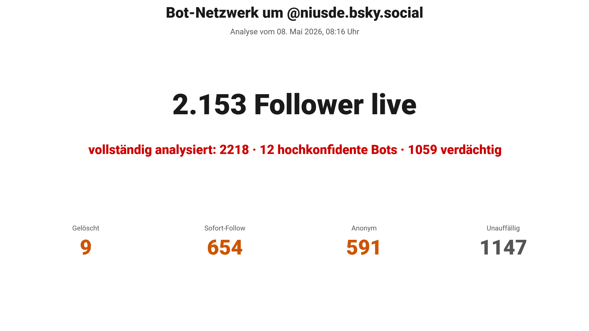

### AfD (@alternativefuerde.bsky.social)

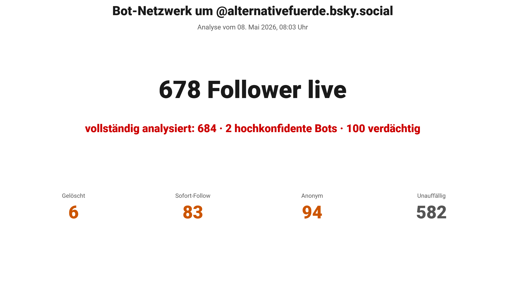

### SPD (@spd.de)

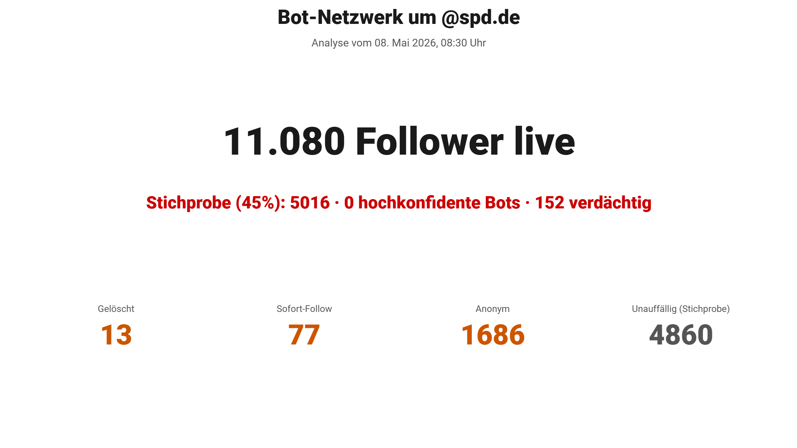

### Grüne (@gruene.de)

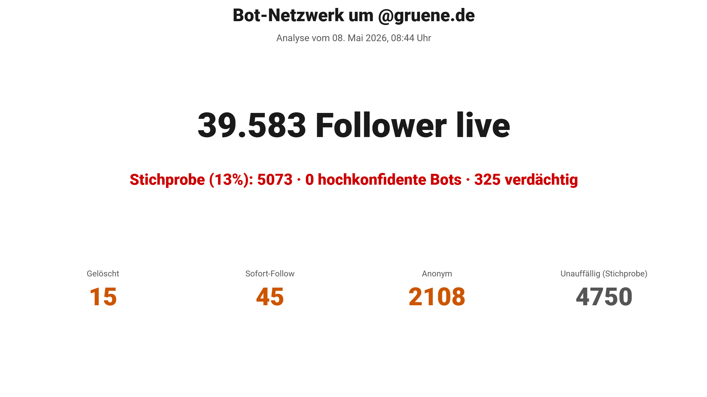

> **So liest man diese Grafiken:** Jedes Dashboard zeigt die Grunddaten eines Ankerkontos: Anzahl der Follower, Bot-Score-Verteilung, Kontoalter und Profilmerkmale. Die Balken und Zahlen sind direkt beschriftet.

### Was fällt auf?

- NIUS und AfD haben ähnliche mittlere Bot-Scores (0,49). Bei SPD und Grüne liegt der Mittelwert niedriger (0,38–0,39).
- Bei NIUS und AfD gibt es jeweils Accounts mit Bot-Score ≥ 0,7 (10 bzw. 13). Bei SPD und Grüne ist dieser Wert null.
- SPD und Grüne haben in den Daten deutlich mehr Follower (5.000 gegenüber ~2.150). Trotz der höheren Grundgesamtheit findet sich dort kein Account oberhalb der 0,7-Schwelle.

---

## 4. Befund 2 — Zeitliche und verhaltensbezogene Muster

### Follow-Zeitverlauf (alle Follows aus dem Firehose)

Die folgenden Grafiken zeigen den vollständigen Follow-Zeitverlauf: Wie viele Accounts haben dem jeweiligen Ankerkonto pro Stunde gefolgt? Die Daten stammen direkt aus dem Bluesky-Firehose und umfassen *alle* Follows, nicht nur die als auffällig eingestuften.

> **So liest man die Grafik:** Obere Hälfte: Balkendiagramm der Follows pro Stunde. Untere Hälfte: kumulierte Gesamtzahl über die Zeit. Hohe Balken zeigen Zeiträume mit vielen Follows in kurzer Zeit.

**NIUS** (erstellt am 4. Mai 2026):

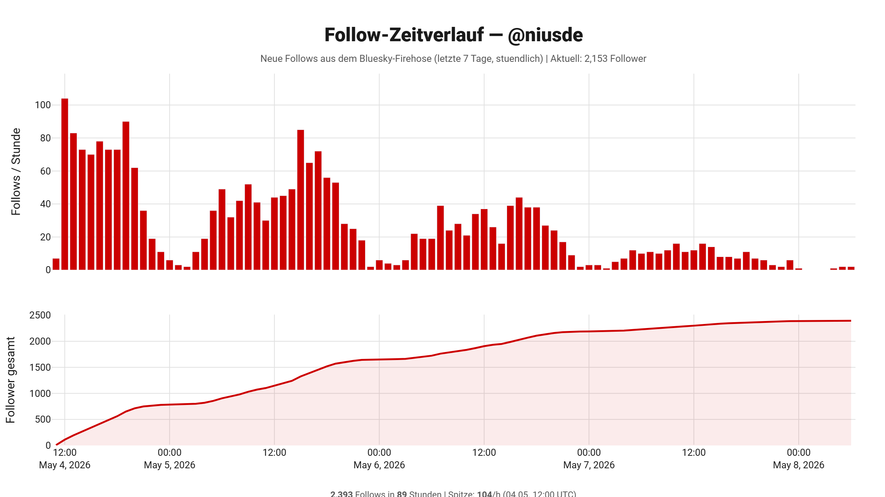

**AfD** (erstellt am 6. Mai 2026):

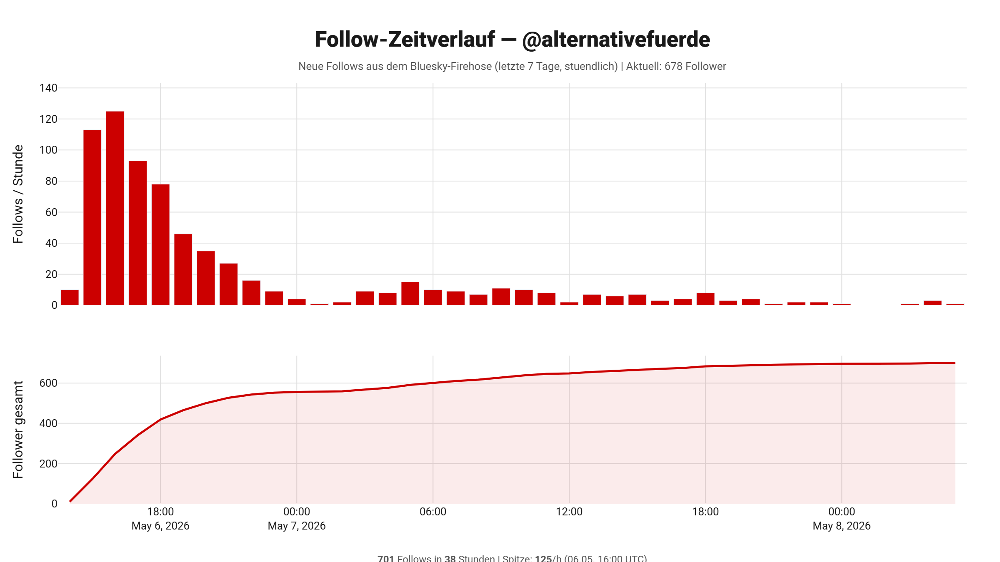

**SPD:**

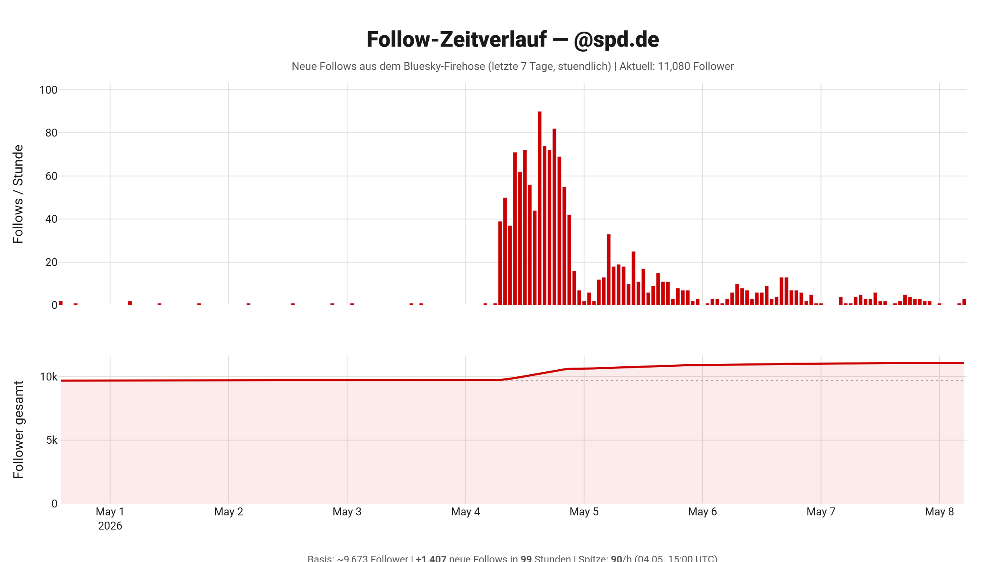

**Grüne:**

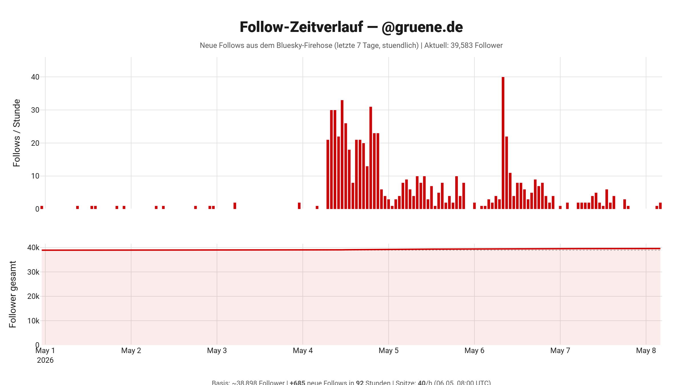

### Was fällt auf?

- **NIUS**: ~2.345 Follows in 78 Stunden. Neuer Account (4. Mai), daher keine Basis — der Graph startet bei null. Starker Burst in den ersten Stunden (bis 104 Follows/h), dann abflachend, aber über 3 Tage anhaltend.
- **AfD**: ~671 Follows in 27 Stunden. Ebenfalls neuer Account (6. Mai), Start bei null. Sehr steiler Burst direkt nach Erstellung (125 Follows/h), dann rapider Abfall auf unter 10/h.
- **SPD**: ~1.382 neue Follows in 90 Stunden — auf einer bestehenden Basis von rund 9.700 Followern. Das Wachstum beträgt etwa 14 % in einer Woche. Ein Burst um den 4. Mai korreliert zeitlich mit der Erstellung des NIUS-Accounts.
- **Grüne**: ~1.559 neue Follows in 96 Stunden — auf einer bestehenden Basis von rund 38.000 Followern. Das Wachstum beträgt etwa 4 %. Ähnlicher zeitlicher Burst wie bei SPD.

### Kontoalter beim Follow

Die folgenden Grafiken zeigen für jeden Follower: Wann wurde der Account erstellt (X-Achse) und wie viele Minuten danach hat er dem Ankerkonto gefolgt (Y-Achse)?

**NIUS:**

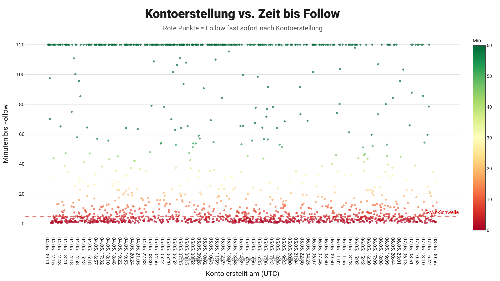

**AfD:**

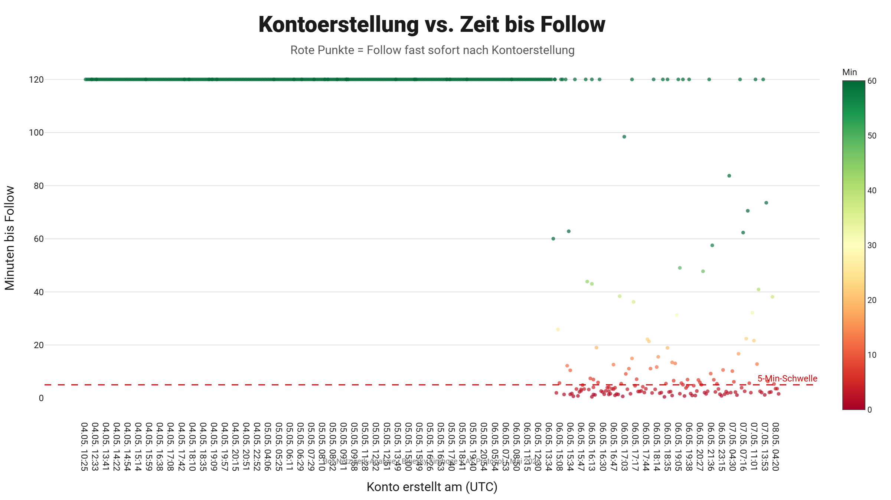

> **So liest man die Grafik:** Jeder Punkt ist ein Follower-Account. Rote Punkte (unterer Rand, unter 5 Minuten) sind Accounts, die fast sofort nach ihrer Erstellung dem Ankerkonto gefolgt sind. Ein dichter roter Streifen über den gesamten Zeitraum bedeutet: Immer wieder werden neue Accounts erstellt, die innerhalb von Minuten folgen.

### Verhaltensindikatoren

Die folgenden Grafiken vergleichen mehrere Verhaltensmerkmale der Follower.

**NIUS:**

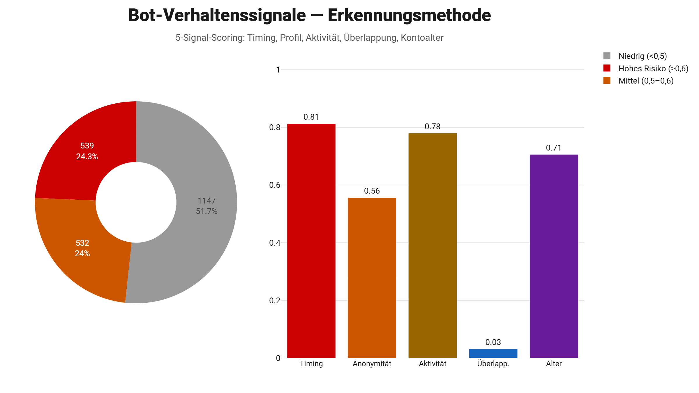

**SPD:**

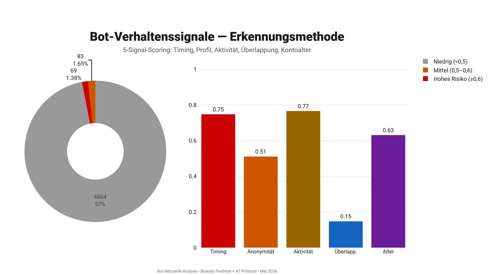

> **So liest man die Grafik:** Jeder Balken oder Messpunkt zeigt einen Verhaltensindikator — z. B. wie viele Follower ein eigenes Profilbild haben, wie viele eigene Beiträge gepostet haben oder wie alt die Accounts zum Zeitpunkt des Follows waren. Die Grafiken zeigen Verteilungen, keine Einzelbewertungen.

### Was fällt auf?

- Bei NIUS zeigen sich ausgeprägte zeitliche Häufungen: viele Follows in sehr kurzen Zeitfenstern.
- Bei SPD und Grüne verteilen sich die Follows gleichmäßiger über den Beobachtungszeitraum.
- Die Verhaltensprofile der NIUS-Follower zeigen häufiger Merkmale, die in den Bot-Score einfließen: junges Kontoalter, fehlendes Profilbild, geringe eigene Aktivität.

---

## 5. Befund 3 — Skript-Fingerabdruck: Warum „automatisiert"?

Die bisherigen Befunde zeigen zeitliche Häufungen und auffällige Bot-Scores. Dieser Abschnitt erklärt, *warum* die Analyse von skriptgesteuertem Verhalten ausgeht — und was dieses Muster von normalem Nutzerverhalten unterscheidet.

### Die Follow-Sequenz

Wenn ein normaler Nutzer einem neuen Account folgt, geschieht das in der Regel einzeln und zu unregelmäßigen Zeiten. Folgt ein Nutzer mehreren Accounts nacheinander, variieren die Abstände stark — man liest eine Bio, überlegt, scrollt weiter.

Bei einem erheblichen Teil der auffälligen Follower zeigt sich ein anderes Muster:

1. **Erster Follow: Das Ankerkonto** (z. B. @niusde) — sofort, ohne Verzögerung.
2. **Danach folgen weitere Accounts** in einer festen Reihenfolge, mit regelmäßigen Abständen von 5–15 Sekunden — wie eine Liste, die automatisiert abgearbeitet wird.

Die folgende Grafik zeigt die Geschwindigkeit, mit der auffällige Follower nach dem Follow des Ankerkontos weiteren Accounts folgen:

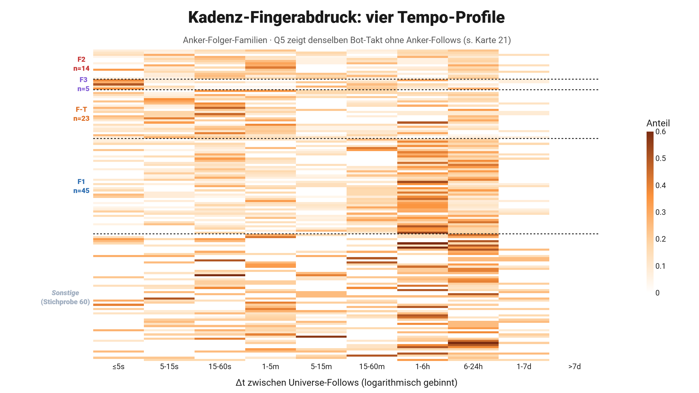

> **So liest man die Grafik:** Jede Zeile ist ein Account. Die Spalten zeigen Zeitabstände zwischen aufeinanderfolgenden Follows — von „unter 5 Sekunden" (links) bis „über 7 Tage" (rechts), logarithmisch skaliert. Je dunkler ein Feld, desto größer der Anteil der Follows dieses Accounts, die in dieses Zeitfenster fallen. Ein Account, der seine Follows im 5–15-Sekunden-Takt abarbeitet, hat einen dunklen Streifen in der Spalte „5–15s" und helle Felder überall sonst. Ein normaler Nutzer zeigt eine breitere Verteilung über viele Spalten. Die Gruppen (F1, F2, F3, F-T) sind nach Familienzugehörigkeit sortiert; unten steht eine Stichprobe sonstiger Follower zum Vergleich.

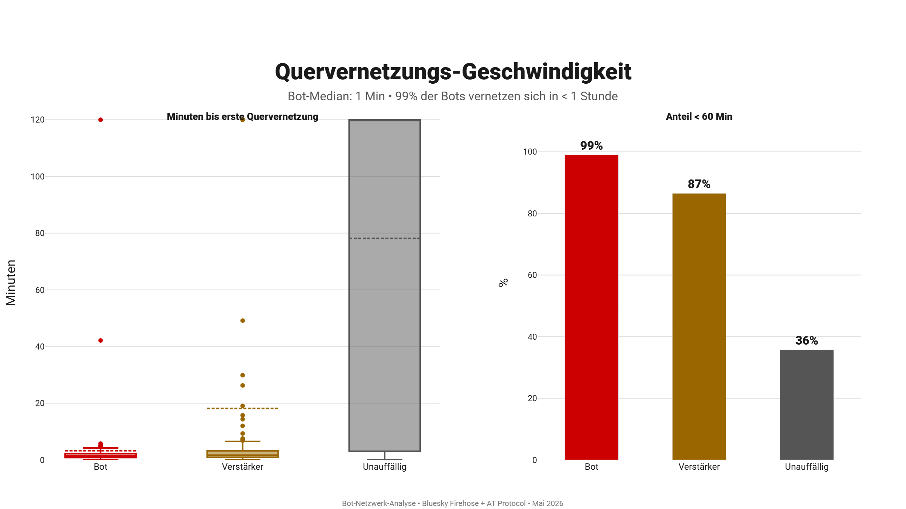

> **So liest man die Grafik:** Die Grafik zeigt, wie schnell die auffälligen Follower nach dem Follow des Ankerkontos auch anderen Accounts folgen. Jeder Punkt ist ein Follow-Ereignis. Häufungen in kurzen Zeitabständen zeigen systematisches Abarbeiten.

### Die Quorum-Analyse: Gleiche Ziele, gleicher Takt

In der Quorum-Analyse werden Accounts verglichen, die denselben Satz von Zielkonten in ähnlicher Reihenfolge und ähnlichem Tempo verfolgen. Drei Familien wurden identifiziert:

| Familie | Mitglieder | Median-Kadenz | Folgt Ankerkonto? | Follow-Ziele |
|---|---:|---:|---|---|
| Q1 | 18 | 30 s | 13 ohne Anker | Grüne-Ökosystem (@gruene.de, @katharinadroege, @britta-hasselmann) |
| Q2 | 7 | 5.140 s | Alle folgen beiden Ankern | NIUS + AfD + SPD |
| Q3 | 121 | **12 s** | **107 ohne Anker** | @die-linke.de, @gruene.de, @spd.de, @spdfraktion.de |

Die größte Familie (Q3) umfasst 121 Accounts mit einer Kadenz von 12 Sekunden — das heißt, diese Accounts folgen alle 12 Sekunden einem neuen Zielkonto. 107 dieser 121 Accounts folgen dabei keinem der vier Ankerkonten (NIUS, AfD, SPD, Grüne) direkt, sondern nur den umliegenden Accounts im Ökosystem.

### Die Follow-Listen sind nahezu identisch

Die folgende Matrix zeigt für jede Skript-Familie, welchen Zielkonten die einzelnen Accounts folgen:

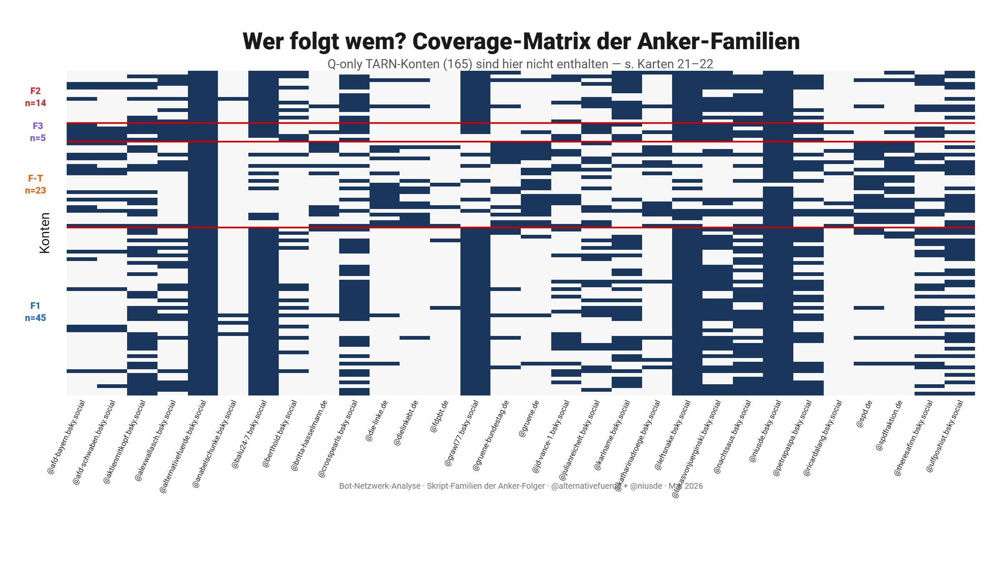

> **So liest man die Grafik:** Jede Zeile ist ein Account, jede Spalte ein Zielkonto. Blau bedeutet: dieser Account folgt diesem Ziel. Accounts innerhalb einer Familie (durch Linien getrennt) zeigen nahezu identische Muster — fast alle Spalten sind entweder komplett blau oder komplett weiß. Das bedeutet: Diese Accounts arbeiten dieselbe Follow-Liste ab.

### Zusammengesetzter Bot-Likelihood-Score

Um zu quantifizieren, wie viele dieser Accounts tatsächlich automatisierungsähnliche Merkmale aufweisen, wurde ein zusammengesetzter Indikator berechnet:

| Signal | Gewicht | Was es misst |
|---|---:|---|
| Kadenz | 35 % | Regelmäßigkeit der Follow-Abstände (12 s = maximal auffällig) |
| Kontoalter | 25 % | Wie jung war der Account beim ersten Follow? |
| Anonymität | 20 % | Fehlendes Profilbild, fehlende Beschreibung, generischer Handle |
| Burst-Signal | 20 % | Wie viele Follows in den ersten 30 Sekunden? |

Ergebnis: **171 von 341** untersuchten Quorum-Accounts (50 %) erreichen einen Bot-Likelihood-Wert von ≥ 0,7. In der Familie Q3 sind es **94 von 121** (78 %).

### Was unterscheidet dieses Muster von normalem Verhalten?

| Merkmal | Beobachtetes Muster | Normales Nutzerverhalten | Starter-Pack-Effekt |
|---|---|---|---|
| Follow-Kadenz | 5–15 s, gleichmäßig | 30–120 s, unregelmäßig | <1 s (sofort alle) |
| Follow-Reihenfolge | Feste Sequenz, bei vielen Accounts identisch | Individuell verschieden | Alphabetisch/Liste |
| Tageszeit-Verteilung | Konzentrierte Bursts | Über den Tag verteilt | Einmaliger Block |
| Accounts im Zeitfenster | Nur 2 von 165 zeigen Starter-Pack-Timing | — | Alle unter 1 s |

Die beobachtete Kadenz von 5–15 Sekunden mit einer Standardabweichung von 7,3 Sekunden ist das klassische Muster eines Skripts mit eingebautem Zufalls-Jitter — schnell genug, um effizient zu sein, aber langsam genug, um einfache Rate-Limits zu umgehen.

### Ankerfreie Quorum-Accounts: Die „Tarnkonten"

107 der 121 Accounts in der größten Quorum-Familie (Q3) folgen keinem der vier Ankerkonten direkt. Sie folgen ausschließlich den umliegenden Accounts (@die-linke.de, @gruene.de, @spd.de, @spdfraktion.de) — mit derselben 12-Sekunden-Kadenz wie die Accounts, die den Ankern folgen.

Diese Accounts werden in der Analyse als „Tarnkonten" bezeichnet — nicht als Behauptung über Absicht, sondern als beschreibende Kategorie: Es sind Accounts, die das gleiche Skript-Muster zeigen wie die Anker-Follower, aber den Ankerkonten selbst nicht folgen. Stattdessen folgen sie ausschließlich Accounts des politischen Gegenspektrums.

**Welche Funktion haben diese Accounts?** Die Follow- und Like-Daten zeigen ein konsistentes Bild:

- Die Tarnkonten folgen SPD, Grüne, Linke und deren Politikern — aber nicht NIUS oder AfD.
- Von 107 Tarnkonten haben 61 (57 %) Likes vergeben — insgesamt 5.337 Likes.
- Diese Likes gehen **nahezu ausschließlich** an linke/progressive Accounts:

| Gelikter Autor | Likes | Liker (verschiedene Accounts) |
|---|---:|---:|
| @realalbundy | 48 | 8 |
| @melaura | 43 | 9 |
| @volksverpetzer.de | 35 | 7 |
| @holgertiedemann | 34 | 3 |
| @sixtus.net | 30 | 4 |
| @sachlichepolitik | 26 | 4 |
| @denniskberlin | 19 | 8 |
| @der-postillon.com | 18 | 5 |

- An das NIUS/AfD-Ökosystem (@niusde, @julius-boehm, @julian-reichelt) gehen insgesamt **6 von 5.337 Likes** (0,1 %).

Die Tarnkonten erzeugen damit den Anschein organischer, links-orientierter Bluesky-Nutzer. Sie folgen linken Parteien, liken linke Inhalte — zeigen aber exakt dieselbe maschinelle Follow-Kadenz von 12 Sekunden wie die Accounts, die NIUS und AfD folgen. In den Co-Follow-Graphen von SPD und Grüne (Befund 4) bilden sie die Verbindung zwischen dem linken Ökosystem und den NIUS-Accounts, die dort im Kern erscheinen.

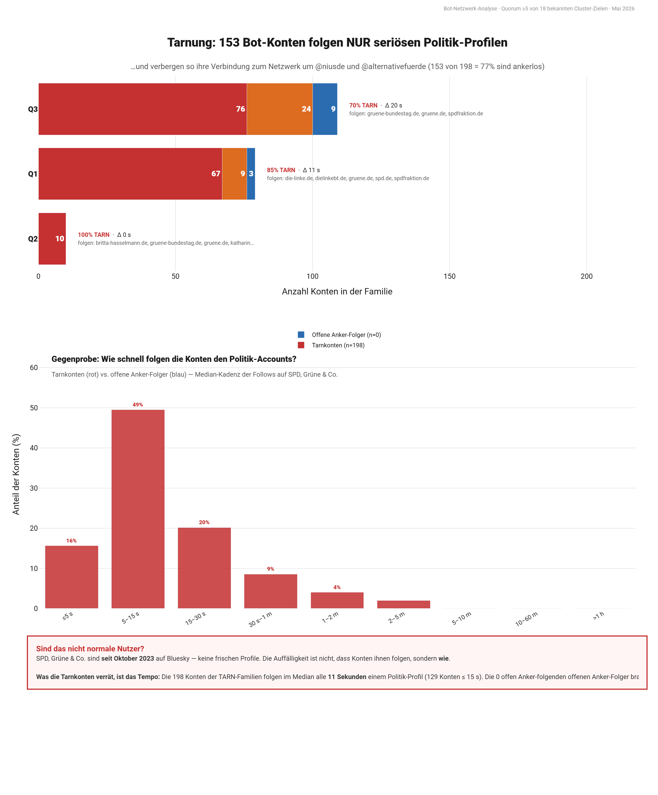

> **So liest man die Grafik:** Die obere Hälfte zeigt die Quorum-Familien als gestapelte Balken: der Anteil der Accounts, die den Ankerkonten direkt folgen (offen), gegenüber denen, die keinem Ankerkonto folgen (ankerfrei). Die untere Hälfte zeigt die Kadenz — den zeitlichen Abstand zwischen aufeinanderfolgenden Follows — für verschiedene Gruppen im Vergleich.

### Gegenproben

Um alternative Erklärungen zu prüfen, wurden drei Gegenproben durchgeführt:

**1. Starter-Pack-Prüfung:** Bluesky bietet sogenannte Starter Packs an — vorgefertigte Listen, denen man mit einem Klick folgen kann. Starter-Pack-Follows erzeugen Zeitabstände von unter 1 Sekunde. Von den 165 untersuchten ankerfreien Quorum-Accounts zeigen nur 2 solche Zeitabstände. Die übrigen 163 zeigen Abstände von 5–15 Sekunden mit einer Standardabweichung von 7,3 Sekunden. In den untersuchten Daten wurde kein Starter Pack gefunden, der die beobachteten parteiübergreifenden Follow-Muster erklärt.

**2. Aktivitätsanalyse:** Von 120 untersuchten ankerfreien Quorum-Accounts sind:
- 48 vollständig inaktiv (keine eigenen Beiträge, keine Likes, keine Reposts),
- 32 nur als „Liker" aktiv (Likes, aber keine eigenen Beiträge),
- 40 auch als Poster aktiv (eigene Beiträge vorhanden).

Alle drei Gruppen zeigen dieselbe gleichförmige Follow-Kadenz von 12–13 Sekunden.

**3. Bot-Likelihood-Score:** 94 der 121 Accounts in Q3 erreichen einen Bot-Likelihood-Wert von ≥ 0,7. In der Vergleichsgruppe Q2 (Accounts, die allen vier Ankerkonten folgen) erreicht kein Account diesen Wert.

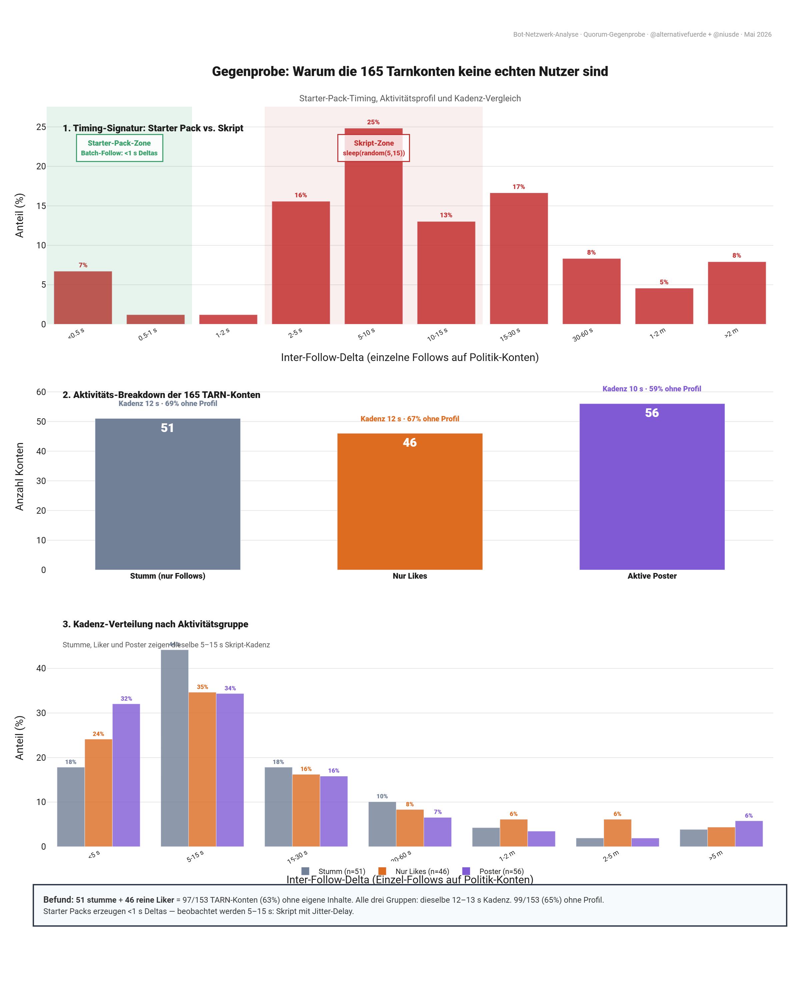

> **So liest man die Grafik:** Drei Panels — links der Vergleich von Starter-Pack-Timing und beobachtetem Timing, Mitte die Aktivitätsverteilung, rechts die Kadenz-Verteilung nach Aktivitätsgruppe.

---

## 6. Befund 4 — Co-Follow-Netzwerke im Vergleich

Dieser Abschnitt ist das Kernstück der Analyse. Er zeigt, welchen anderen Accounts die auffälligen Follower *außerdem* folgen — und wie stark sich diese Muster zwischen den vier Ankerkonten unterscheiden.

**Wichtig für die Einordnung:** Der Co-Follow-Graph bildet nur Follower ab, deren Bot-Score ≥ 0,45 liegt — also Accounts mit messbaren Auffälligkeiten. Bei NIUS und AfD sind das über 1.100 Follower (53 % aller analysierten). Bei SPD sind es 265 (5 %) und bei Grüne 436 (9 %). Die Graphen von SPD und Grüne sind daher kleiner, weil dort wesentlich weniger Follower die Auffälligkeits-Schwelle überschreiten.

### Die vier Co-Follow-Graphen

> **So liest man die Grafiken:** Jeder Punkt steht für einen Account, dem die *auffälligen* Follower (Bot-Score ≥ 0,45) des jeweiligen Ankerkontos ebenfalls folgen. Die Größe eines Punktes zeigt, wie viele dieser auffälligen Follower dem Account folgen. Linien verbinden Accounts, die häufig dieselben auffälligen Follower teilen. Punkte im dichten Kern in der Mitte haben viele Verbindungen untereinander; Punkte am Rand (Peripherie) sind loser angebunden. Normale Follower (ohne Auffälligkeiten) sind in diesem Graphen nicht enthalten.

**NIUS:**

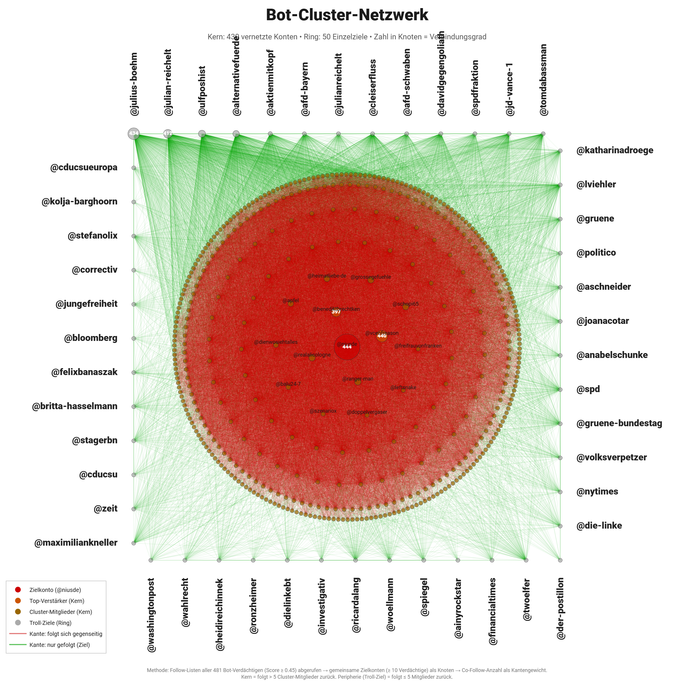

**AfD:**

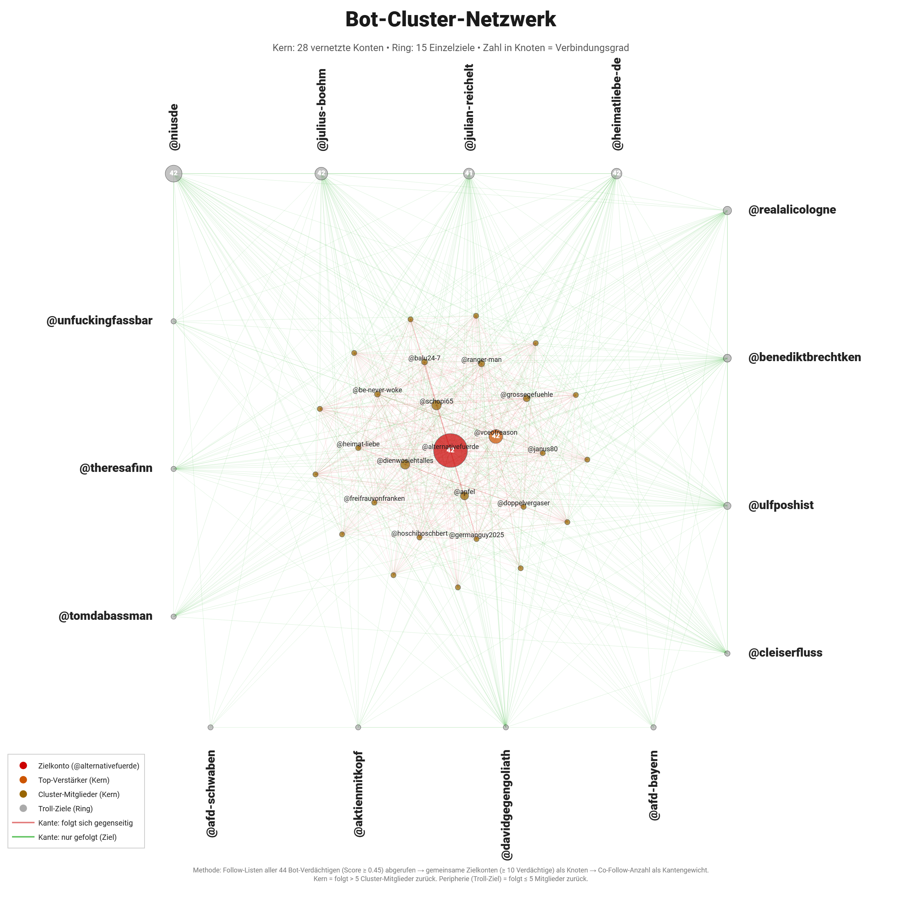

**SPD:**

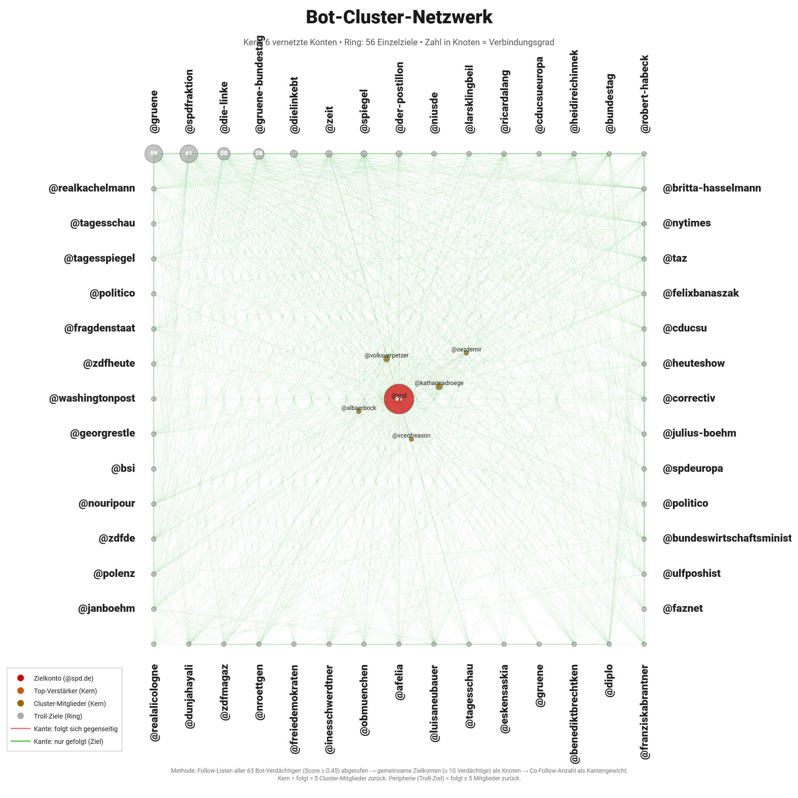

**Grüne:**

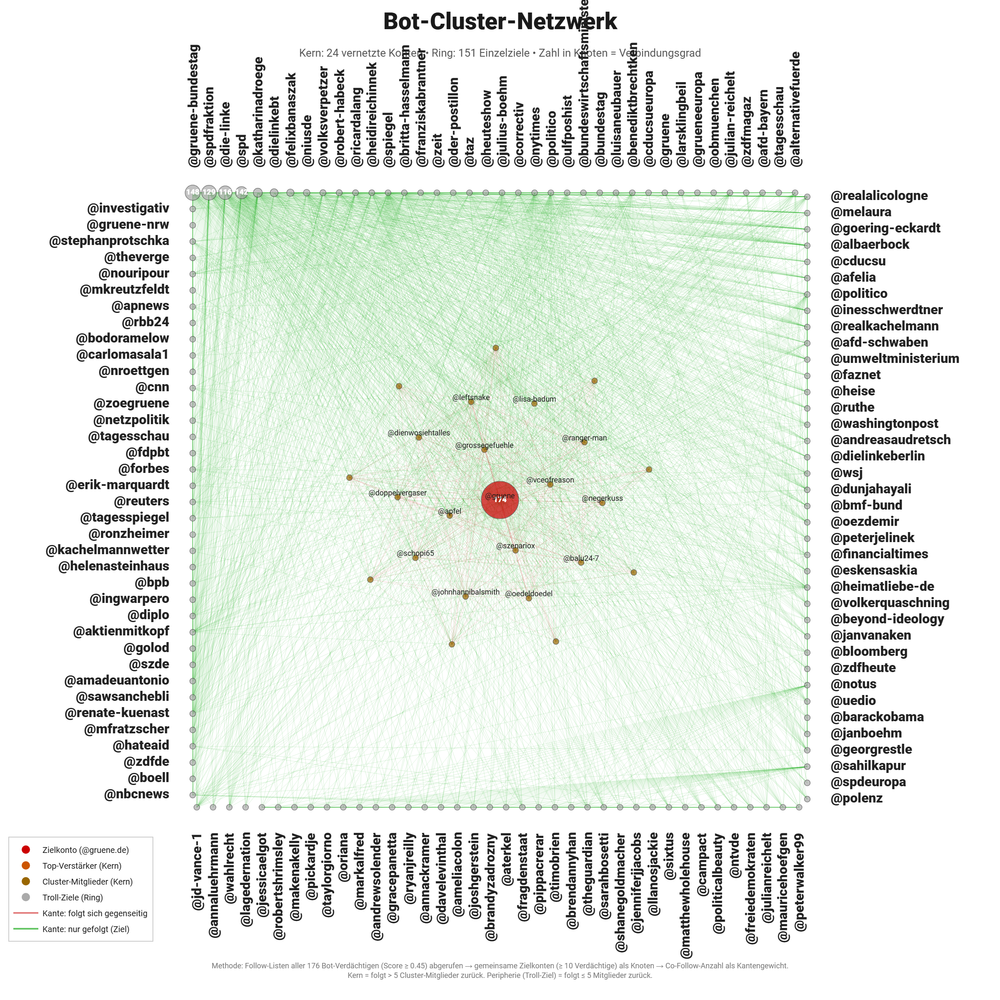

### Strukturvergleich

| Messwert | NIUS | AfD | SPD | Grüne |
|---|---:|---:|---:|---:|
| Follower mit Bot-Score ≥ 0,45 (Suspect-Pool) | 1.151 (53 %) | 1.133 (53 %) | 265 (5 %) | 436 (9 %) |
| Accounts im Graphen (≥ 10 auffällige Follower) | 465 | 425 | 154 | 222 |
| Kanten (gemeinsame Follower-Verbindungen) | 37.924 | 34.936 | 6.477 | 7.333 |
| Davon im dichten Kern | 410 (88 %) | 370 (87 %) | 43 (28 %) | 64 (29 %) |
| Graphdichte | 0,35 | 0,39 | 0,55* | 0,30 |

*\*Die hohe Dichte bei SPD (0,55) erklärt sich durch den kleinen Kern von nur 43 Accounts — wenige Punkte mit vielen Verbindungen.*

### Überlappung zwischen den Graphen

Wie viele Accounts tauchen in mehreren Co-Follow-Graphen auf?

| Vergleich | Gemeinsame Accounts | Anteil am jeweils kleineren Graphen |
|---|---:|---:|
| NIUS ↔ AfD | 423 | 91 % (von 465) |
| NIUS ↔ SPD | 121 | 26 % (von 465) |
| NIUS ↔ Grüne | 124 | 27 % (von 465) |
| SPD ↔ Grüne | 141 | 92 % (von 154) |
| Nur in NIUS/AfD-Graphen | 334 | — |
| Nur in SPD/Grüne-Graphen | 102 | — |
| In allen vier Graphen | 109 | — |

### Die meistgefolgten Accounts im jeweiligen Graphen

**Im NIUS- und AfD-Graphen** (die 10 meistgefolgten Accounts nach Anzahl auffälliger Follower):

| Account | Auffällige Follower (NIUS) | Öffentliche Rolle |
|---|---:|---|
| @julius-boehm | 477 | Journalist |
| @vceofreason | 453 | Politischer Kommentator |
| @benediktbrechtken | 388 | Politischer Kommentator |
| @julian-reichelt | 349 | Journalist, ehem. BILD-Chefredakteur |
| @ulfposhist | 280 | Politischer Kommentator |
| @alternativefuerde | 259 | AfD-Bundespartei |
| @realalicologne | 258 | Politischer Kommentator |
| @ranger-man | 247 | Politischer Kommentator |
| @grossegefuehle | 243 | Politischer Kommentator |
| @schopi65 | 240 | Politischer Kommentator |

**Im SPD- und Grüne-Graphen** (die 10 meistgefolgten Accounts nach Anzahl auffälliger Follower):

| Account | Auffällige Follower (Grüne) | Öffentliche Rolle |
|---|---:|---|
| @gruene-bundestag.de | 176 | Bundestagsfraktion Bündnis 90/Die Grünen |
| @spdfraktion.de | 161 | Bundestagsfraktion SPD |
| @die-linke.de | 150 | Die Linke — Bundespartei |
| @spd.de | 140 | SPD-Bundespartei |
| @katharinadroege | 101 | MdB, Fraktionsvorsitzende Grüne |
| @dielinkebt.de | 96 | Bundestagsfraktion Die Linke |
| @robert-habeck.de | 75 | Bundesminister, Grüne |
| @britta-hasselmann.de | 74 | MdB, Fraktionsvorsitzende Grüne |
| @volksverpetzer.de | 71 | Faktencheck-Blog |
| @franziskabrantner.de | 69 | Bundesministerin, Grüne |

### Asymmetrie bei gemeinsamen Accounts

133 Accounts erscheinen sowohl in den NIUS/AfD-Graphen als auch in den SPD/Grüne-Graphen. Die Verteilung der auffälligen Follower ist dabei asymmetrisch:

| Account | Auffällige Follower bei NIUS | bei SPD | bei Grüne |
|---|---:|---:|---:|
| @niusde | 1.034 | 60 | 69 |
| @julius-boehm | 477 | 44 | 46 |
| @gruene.de | 52 | 150 | 429 |
| @spd.de | 47 | 260 | 140 |
| @benediktbrechtken | 388 | 39 | 36 |
| @spdfraktion.de | 84 | 154 | 161 |
| @katharinadroege | 62 | 61 | 101 |

Die auffälligen Follower von NIUS und AfD folgen SPD- und Grüne-Accounts in deutlich geringerer Zahl als umgekehrt. Zum Beispiel: 1.034 auffällige Follower bei @niusde, aber nur 60 derselben Accounts bei @spd.de.

### Was zeigen diese Messwerte?

- Die Co-Follow-Graphen von NIUS und AfD überschneiden sich zu 91 %. Die auffälligen Follower beider Accounts folgen weitgehend denselben weiteren Accounts.
- Die Co-Follow-Graphen von SPD und Grüne überschneiden sich ebenfalls stark (92 % der SPD-Accounts erscheinen auch bei Grüne), aber in einem deutlich kleineren und weniger dicht vernetzten Netzwerk.
- 334 Accounts erscheinen ausschließlich in den NIUS/AfD-Graphen, 102 ausschließlich bei SPD/Grüne.
- Bei NIUS und AfD bilden 88 % der Accounts einen dichten Kern. Bei SPD und Grüne sind es unter 30 %. Ein großer, dichter Kern bedeutet, dass viele Accounts gleichförmige Follow-Muster aufweisen.

### Auffälligkeit in den SPD- und Grüne-Kernen

Im dichten Kern der SPD- und Grüne-Graphen finden sich Accounts, die zum NIUS/AfD-Ökosystem gehören:

| Account | Im SPD-Kern (Suspects) | Im Grüne-Kern (Suspects) | Im NIUS-Kern (Suspects) |
|---|---:|---:|---:|
| @vceofreason | 37 | 40 | 453 |
| @benediktbrechtken | 39 | — | 388 |
| @grossegefuehle | 27 | 27 | 243 |
| @szenariox | 27 | 25 | 173 |
| @doppelvergaser | 27 | 21 | 169 |
| @schopi65 | 26 | 19 | 240 |
| @ranger-man | 25 | 19 | 247 |
| @apfel | 24 | 24 | 220 |
| @dienwosiehtalles | 21 | 20 | 190 |
| @balu24-7 | 20 | 15 | 172 |
| @leftsnake | 19 | 19 | 143 |

Insgesamt befinden sich **11 Accounts aus dem NIUS-Ökosystem im Kern des SPD-Graphen** (25,6 % des 43-köpfigen Kerns) und **11 im Kern des Grüne-Graphen** (17,2 % des 64-köpfigen Kerns).

Das bedeutet: Ein Teil der Accounts, die SPD und Grüne als auffällige Follower haben, folgt gleichzeitig denselben Accounts, denen auch die NIUS/AfD-Follower folgen. Diese Teilgruppe erzeugt die Verbindung zwischen den sonst getrennten Ökosystemen — und platziert NIUS-Ökosystem-Accounts im Kern des SPD/Grüne-Graphen.

---

## 7. Befund 5 — Like-Netzwerke im Vergleich

Neben Follows zeigt auch das Like-Verhalten der Follower, welches Ökosystem sie bevorzugen. Die folgenden Grafiken zeigen, welche Post-Autoren von den Followern des jeweiligen Ankerkontos am häufigsten geliked werden.

> **So liest man die Grafik:** Jeder Balken zeigt einen Post-Autor, dessen Beiträge von den Followern des Ankerkontos geliked wurden. Je länger der Balken, desto mehr Likes hat dieser Autor von den Followern erhalten. Die Reihenfolge zeigt die meistgelikeden Autoren ganz oben.

**NIUS:**

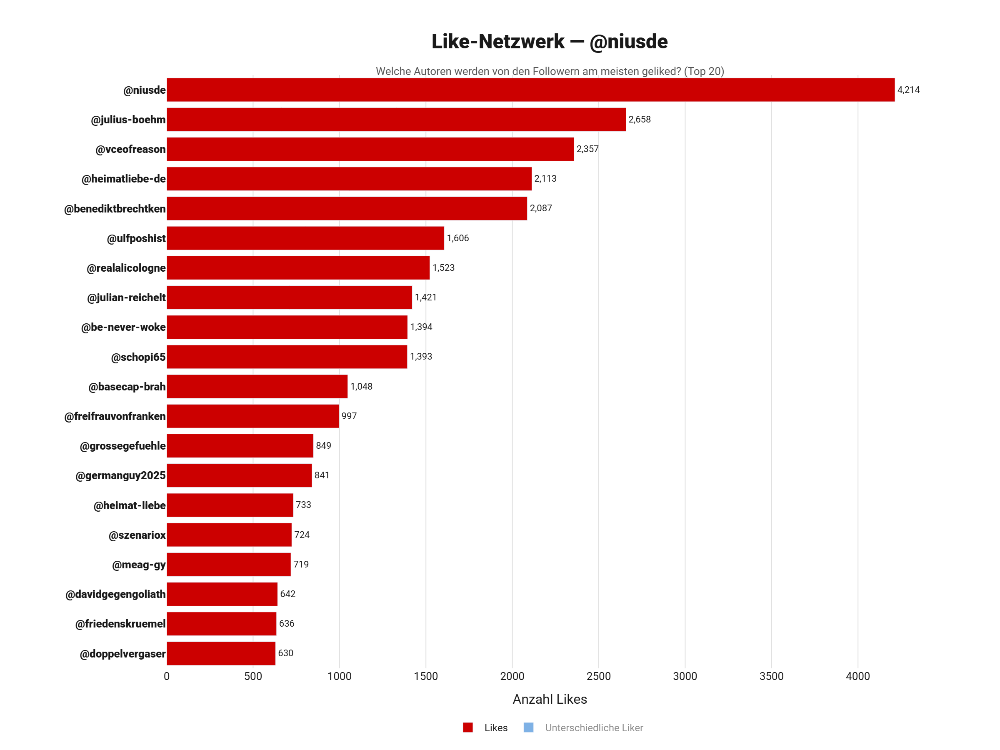

**AfD:**

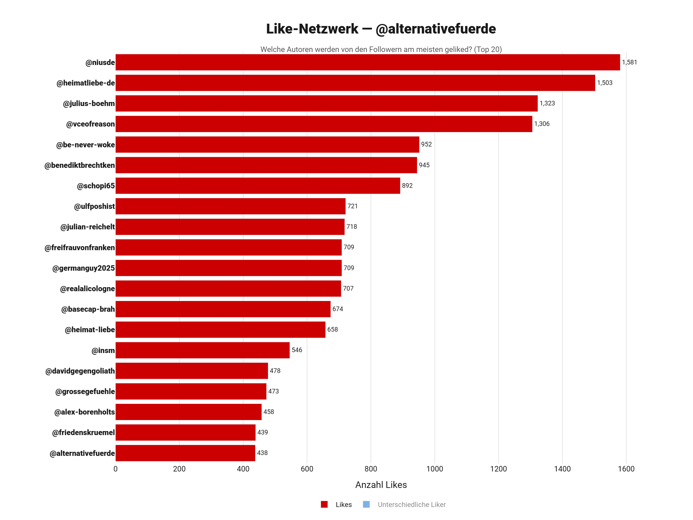

**SPD:**

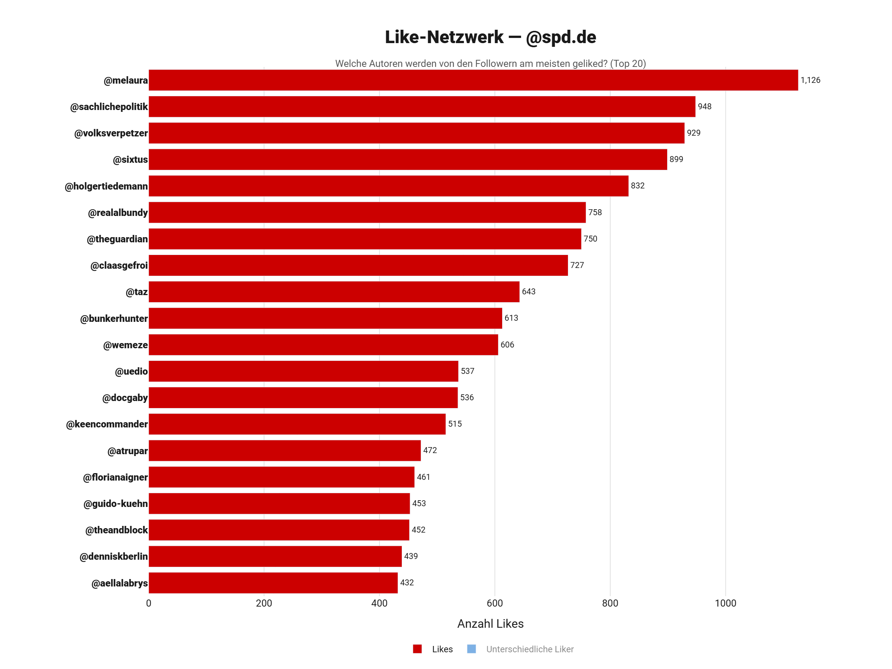

**Grüne:**

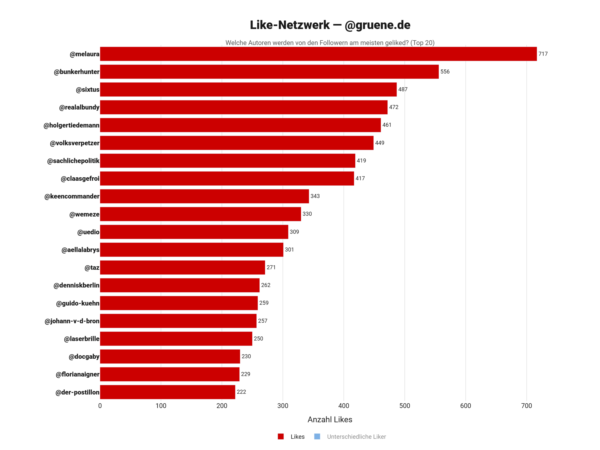

### Was fällt auf?

Die Like-Netzwerke bestätigen und verstärken die Befunde aus den Co-Follow-Graphen:

- **NIUS-Follower** liken am meisten Beiträge von: @niusde (3.919), @julius-boehm (2.466), @vceofreason (2.212), @benediktbrechtken (2.066), @heimatliebe-de (1.924), @ulfposhist (1.430), @realalicologne (1.423), @julian-reichelt (1.337).
- **AfD-Follower** zeigen ein nahezu identisches Muster: @niusde (1.464), @heimatliebe-de (1.381), @julius-boehm (1.229), @vceofreason (1.200), @benediktbrechtken (924).
- **SPD-Follower** liken: @melaura (1.012), @sachlichepolitik (903), @volksverpetzer (823), @sixtus (801), @holgertiedemann (728), @theguardian (717), @taz (609), @der-postillon (394).
- **Grüne-Follower** zeigen ein sehr ähnliches Muster wie SPD: @melaura (808), @holgertiedemann (684), @sachlichepolitik (666), @theguardian (645), @sixtus (586), @volksverpetzer (584).

**Es gibt null Überlappung** zwischen den Top-20-Like-Zielen von NIUS/AfD einerseits und SPD/Grüne andererseits. Kein einziger Account erscheint in beiden Listen. Die Follower-Gruppen bewegen sich in vollständig getrennten Ökosystemen — nicht nur bei den Follows, sondern auch bei der Interaktion mit Inhalten.

---

## 8. Methodik

### Datenerhebung

Die Analyse basiert auf dem öffentlichen Bluesky-Firehose, der sämtliche Netzwerkaktivitäten (Follows, Posts, Likes, Reposts, Blocks) in Echtzeit liefert. Die Daten der letzten 7 Tage werden indiziert und abgefragt. Ergänzend wird die Bluesky-API genutzt, um die aktuelle Follower-Liste abzurufen und so auch Follows zu erfassen, die vor dem Firehose-Fenster stattfanden.

### Bot-Score-Berechnung

Der Bot-Score setzt sich aus fünf Einzelindikatoren zusammen:
- **Zeitliche Nähe** (temporal proximity): Wie nah liegen die Follow-Zeitpunkte beieinander?
- **Anonymität** (anonymity): Hat der Account ein Profilbild, eine Beschreibung, einen individuellen Handle?
- **Aktivitätsmuster** (activity pattern): Postet, liked oder repostet der Account eigene Inhalte?
- **Follow-Überlappung** (follow overlap): Folgt der Account denselben Accounts wie andere auffällige Follower?
- **Kontoalter** (account age): Wie alt war der Account zum Zeitpunkt des Follows?

Jeder Indikator wird auf eine Skala von 0 bis 1 normiert. Der Gesamt-Score ist ein gewichteter Durchschnitt.

### Co-Follow-Graph

Für jeden Anker-Account werden alle Follower mit auffälligen Messwerten identifiziert. Dann wird ermittelt, welchen weiteren Accounts diese Follower ebenfalls folgen. Zwei Ziel-Accounts werden mit einer Kante verbunden, wenn sie mindestens eine definierte Anzahl gemeinsamer auffälliger Follower haben. Accounts mit ≥ 10 auffälligen Followern werden als Knoten aufgenommen. Die Kern-/Peripherie-Klassifizierung basiert auf der Anzahl der Verbindungen zu anderen Kern-Accounts.

### Quorum-Clustering

Accounts werden anhand ihrer Follow-Sequenzen verglichen: Welche Accounts folgen denselben Zielen in ähnlicher Reihenfolge und ähnlichem Tempo? Die Ähnlichkeit wird über Set-Überlappung und Tempo-Korrelation berechnet. Accounts mit hoher Ähnlichkeit in beiden Dimensionen werden zu Quorum-Familien zusammengefasst.

### Bot-Likelihood

Der Bot-Likelihood-Score ist ein separater, zusammengesetzter Indikator, der für die Quorum-Analyse verwendet wird. Er gewichtet: Kadenz (35 %), Kontoalter (25 %), Anonymitätsmerkmale (20 %) und Burst-Signale (20 %).

### Einschränkungen

- Die Analyse erfasst nur öffentlich zugängliche Daten innerhalb des Beobachtungsfensters.
- Bot-Scores und Bot-Likelihood-Werte sind statistische Indikatoren, keine technischen Nachweise für Automatisierung.
- Die Quorum-Analyse zeigt gleichförmige Muster, kann aber deren Ursache nicht bestimmen.
- Die Klassifizierung der öffentlichen Rolle der meistgefolgten Accounts basiert auf deren öffentlicher Selbstbeschreibung und Organisationszugehörigkeit, nicht auf einer inhaltlichen Bewertung durch diese Analyse.

---

## 9. Datenquellen

| Datenquelle | Beschreibung |
|---|---|
| Bluesky Firehose | Öffentliche AT-Protocol-Events der letzten 7 Tage (Follows, Posts, Likes, Reposts, Blocks, Profiles) |
| Bluesky API | Aktuelle Follower-Listen, Profildaten, Handle-Auflösung |
| Analysezeitraum | 7-Tages-Fenster, zuletzt abgerufen Mai 2026 |
| Analysewerkzeuge | Python (pandas, networkx, plotly) |

---

*Diese Analyse wurde maschinell unterstützt erstellt. Sie präsentiert Messwerte und erhebt keinen Anspruch auf Vollständigkeit.*

---

## 10. Nachtrag — Sechs Wochen später (20. Juni 2026)

Sechs Wochen nach dem Lagebericht vom 9. Mai 2026 wurde das dort dokumentierte koordinierte Bot-Netz erneut überprüft — zum einen der **Moderationsstatus** (ist der Account noch online? via Bluesky-API), zum anderen die **laufende Aktivität** (folgt das Netz noch koordiniert? via Firehose). Geprüft wurden die 195 Hardcore-Bots aus `moderation_list_strict.csv` (Welle A), die 7 „Stillen Köder" (Welle B) sowie die vier Ankerkonten. Es ergeben sich zwei klare Befunde.

### 10.1 Das Netz ist fast unangetastet

Die Plattform-Moderation hat den im Mai dokumentierten Schwarm bis heute **kaum berührt**:

- **181 von 195 Hardcore-Bots (93 %) sind weiterhin aktiv** — nur 14 Konten (7 %) wurden gesperrt oder gelöscht.
- **Alle 7 „Stillen Köder" sind weiterhin online.** `@julianreichelt.bsky.social` zeigt unverändert das Köder-Muster: rund 780 Follower bei **0 eigenen Beiträgen**.
- Die Ankerkonten `@niusde.bsky.social`, `@alternativefuerde.bsky.social` und `@spd.de` sind aktiv. Verschwunden sind lediglich zwei im Mai frisch erstellte AfD-Zielkonten (`hoschihoschbert`, `balu24-7`).
- **Hinweis zu `@gruene.de`:** Das Handle ist nicht mehr erreichbar, der Account wurde aber nur **umbenannt** (die zugehörige DID gehört heute zu `@felixbanaszak.bsky.social`, aktiv) — **keine Sperrung**.

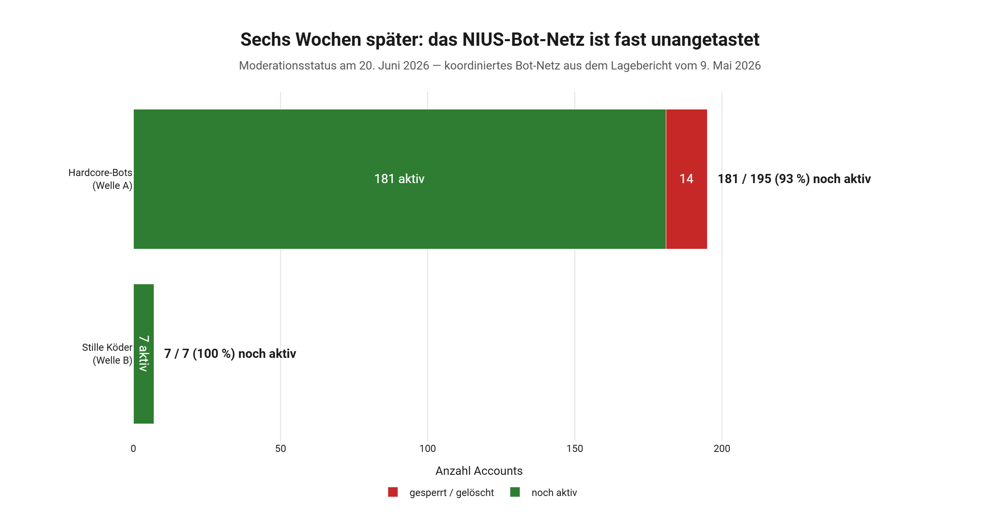

> **So liest man die Grafik:** Jeder Balken steht für eine im Mai klassifizierte Account-Gruppe. Der grüne Anteil zeigt die Konten, die am 20. Juni 2026 weiterhin abrufbar (aktiv) waren, der rote Anteil die gesperrten oder gelöschten. Je länger der grüne Balken, desto weniger hat die Moderation eingegriffen.

### 10.2 Die Operation ist eingeschlafen

Überleben bedeutet jedoch nicht Aktivität. Die koordinierten Follow-Wellen, die im Mai den Schwarm ausmachten, sind weitgehend **zum Erliegen gekommen**:

- Im gemessenen Firehose-Fenster (letzte ~30 Tage) entfallen auf den gesamten 195-Konten-Cluster nur noch **1–10 koordinierte Follows pro Tag**, getragen von **1–6 aktiven Bots** — gegenüber **867 koordinierten Follows in 48 Stunden** auf dem Mai-Höhepunkt.
- **Kein einziges Zielkonto** erhielt in den letzten 14 Tagen ≥ 3 Follows aus dem Hardcore-Cluster. Die im Mai dominante „Adopt-on-Birth"-Mechanik (frisches Konto → sofortiger Schwarm-Follow) **feuert nicht mehr**.
- Auch inhaltlich sind die Konten überwiegend ruhig: in 14 Tagen zusammen 209 Posts (von 17 der 195 Konten), 71 Reposts (von 10), 479 Likes (von 27).

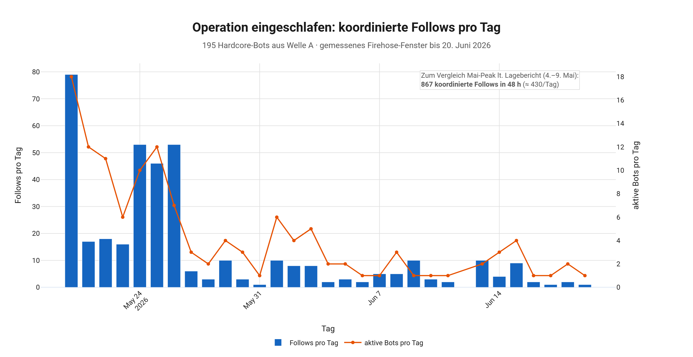

> **So liest man die Grafik:** Die blauen Balken zeigen die Zahl der koordinierten Follows pro Tag aus dem 195-Konten-Cluster, die orange Linie die Zahl der an diesem Tag aktiven Bots (rechte Achse). Der gemessene Zeitraum beginnt am Ausläufer der Mai-Welle und fällt über den Juni auf einen Bruchteil ab. Der Kasten oben rechts nennt zum Vergleich den Spitzenwert aus dem Lagebericht. *Hinweis: Der Firehose hält Follow-Events nur rund 30 Tage vor; der eigentliche Mai-Peak liegt außerhalb des heute abrufbaren Fensters und wird daher als Kennzahl zitiert, nicht als Balken dargestellt.*

### 10.3 Einordnung

Das Bild ist das **Spiegelbild kurzlebiger Spam-Ringe**: Statt rasch gesperrt zu werden, besteht dieses Netz als **ruhender Bestand** fort — 181 etablierte, alternde Konten mit echter Follower-Historie, die jederzeit reaktiviert werden könnten. Die Moderation hat den Schwarm bislang kaum angetastet; abgeklungen ist er weitgehend aus eigenem Antrieb. Genau diese Persistenz unterscheidet ein politisches Amplifikations-Netz von den schnell verbrannten Wegwerf-Konten anderer Kampagnen.

> **Datengrundlage Nachtrag:** Bluesky-API (Moderationsstatus, abgerufen 20. Juni 2026) und Bluesky-Firehose (Follow-/Post-/Like-/Repost-Events, Fenster bis 20. Juni 2026). Roster: `output/moderation_list_strict.csv` (n = 195). Auswertungsskripte: `scripts/recheck_status.py`, `scripts/recheck_firehose.py`, `scripts/addendum_charts.py`.
